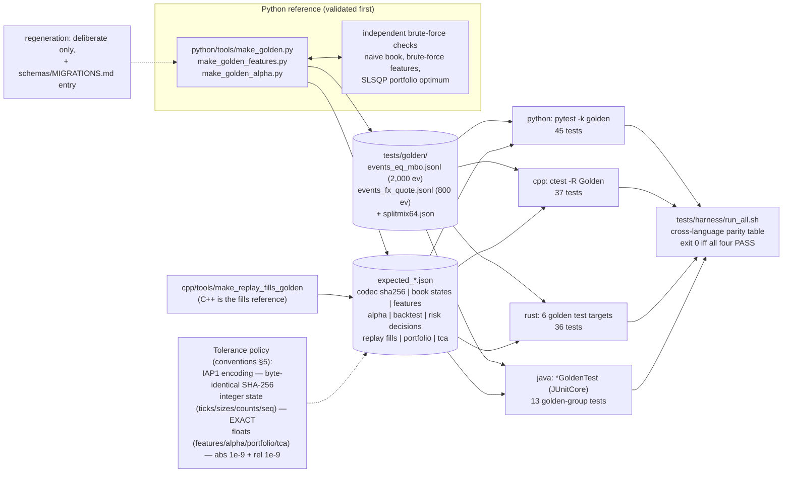
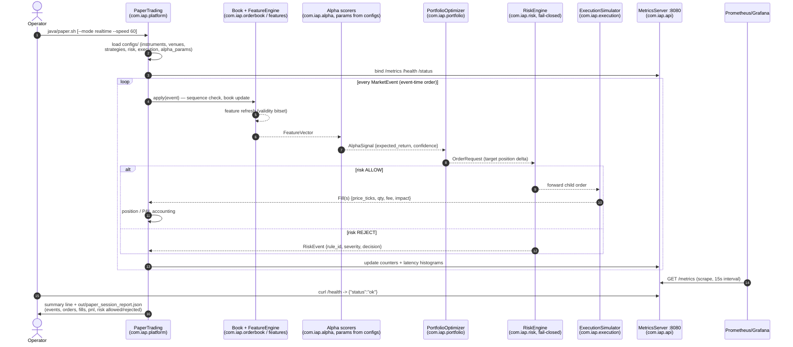

# ARCHITECTURE — how the platform is actually built

This document describes the system as it exists in this repository: which
responsibilities live in which language tree, how data flows, what the
contracts and versioning rules are, how determinism and cross-language parity
are enforced, and how the thing is observed and deployed. The governing
design is [SPECIFICATION.md](SPECIFICATION.md); the binding low-level
decisions are [../PLATFORM_CONVENTIONS.md](../PLATFORM_CONVENTIONS.md).
Diagram sources live in [diagrams/](diagrams/) (identical to the embedded
versions below).

## 1. Design principles (spec §1, condensed)

1. **Separate concerns, explicit contracts.** Alpha, portfolio, risk,
   execution and TCA are independent components joined only by the seven
   canonical contracts (§4 below).
2. **One semantics, four implementations.** Python is the validated
   reference; C++/Rust/Java ports must match it exactly, proven by golden
   tests (§6), not by review.
3. **Determinism everywhere it matters.** Same seed + config + inputs ⇒
   bit-identical outputs across runs (and, for integer paths, across
   languages). No wall clock, no unordered iteration, one pinned RNG.
4. **Fail closed.** Unknown or degraded state — sequence gap, stale book,
   invalid feature input, disconnected venue — produces no signal and no
   order, never a wrong one.
5. **Research truth over backtest cosmetics** (spec §32). Costs, decay,
   multiple-testing counts and failed hypotheses are first-class outputs.

## 2. Layer responsibilities per language (spec §3, as realized)

The spec's responsibility matrix, mapped to what actually lives in this
repository:

| subsystem | Python (`python/src/iap`) | C++ (`cpp/`) | Rust (`rust/`) | Java (`java/` `com.iap.*`) |
|---|---|---|---|---|
| Events / codec (JSONL + IAP1) | `core` (reference) | `marketdata` | `marketdata` crate | `core`, `codec` |
| Synthetic generator + normalize/QC | `marketdata` (sole owner) | — | — | — |
| Order book (L1/L2/MBO, consolidated) | `orderbook` (reference) | `orderbook` | `orderbook` crate | `orderbook` |
| Deterministic replay | `replay` | `replay` | `replay` crate (+ demo bin) | `replay` (+ Demo) |
| Feature engine (native 40 / registry 205) | `features` (all 205, reference) | `features` | `features` crate | `features` |
| Labels (event-time, 11 horizons) | `labels` (sole owner) | — | — | — |
| Alpha library / scoring | `alpha` (all 24, fitting) | `alpha` (6 golden, scoring) | `alpha` crate (6 golden, scoring) | `alpha` (6 golden, scoring) |
| Validation framework, experiment ledger | `validation`, `experiment` (sole owner) | — | — | — |
| ML + meta-labeling | `models` (sole owner) | — | — | — |
| Portfolio optimizer | `portfolio` (reference) | — | — | `portfolio` (production service) |
| Hard risk engine | — | — | `risk` crate (**reference**) | `risk` (orchestration port) |
| Execution algos + event-driven simulator | — | `execution` (**reference**) | — | `execution` |
| SOR / venue adapters | — | `sor` | `venue` crate (protocol codec + sim venue) | `sor` |
| Research backtester | `backtest` (reference) | — | — | `backtest` |
| TCA | `tca` (reference + report) | — | — | `tca` (service) |
| Event bus / threading | — | — | `eventbus` crate (SPSC ring) | — |
| Telemetry / metrics | — | — | `telemetry` crate (sets the metric-name contract) | `monitoring` + `api` (MetricsServer) |
| Paper trading / platform loop | — | — | — | `platform` (PaperTrading), `config`, `api` |

Notes on the realized shape (deviations from the spec's idealized matrix are
called out in §10):

- **Python** is both the research monopoly (generator, labels, validation,
  ML, reports) and the reference for everything portable. Reference means:
  validated first (against brute-force implementations), then frozen into
  golden files that the other languages must match.
- **Rust owns the hard risk engine** — the safety-critical component — and
  the golden risk decision vector is generated from it (every rule
  unit-tested first). Java ports it for platform orchestration; C++ and
  Python do not implement risk at all.
- **C++ owns execution** — the fill-model reference
  (`cpp/include/iap/execution/execution.hpp` is the normative text for the
  queue-position and latency rules) — plus the fastest codec/book/feature/
  alpha hot path and the benchmark suite.
- **Java owns the platform**: the only language with the full vertical
  (book → features → alpha → portfolio → risk → execution → TCA → backtest →
  monitoring → paper trading) wired into one process (`PaperTrading`), which
  is what replay/paper/production sharing one contract set looks like in
  practice.

## 3. Data flow

The spec §4 pipeline as realized (source:
[diagrams/pipeline.mmd](diagrams/pipeline.mmd)):

```mermaid
flowchart TD
    subgraph GEN["Synthetic venues — seeded generator (SplitMix64, seed 20260829)"]
        V1["Equity MBO streams<br/>11 instruments @ venue XV1<br/>regimes, self-exciting flow, halt, auctions"]
        V2["FX QUOTE+TRADE streams<br/>8 G10 pairs @ LP1/LP2/PRI<br/>venue latency profiles"]
    end
    V1 --> RAW["data/raw/*.jsonl<br/>immutable raw feed files"]
    V2 --> RAW
    RAW --> NORM["Normalization + sequence validation<br/>python iap.marketdata.normalize<br/>gaps / dups / out-of-order / invalid counted -> qc_report.json"]
    NORM --> CANON["Canonical event stream<br/>JSONL + IAP1 binary (72-byte LE records)<br/>+ Parquet research dataset — schemas x-version 1"]
    CANON --> BOOK["Order-book reconstruction<br/>Python ref / C++ / Rust / Java<br/>MBO FIFO, marketable ADDs, dup-drop, gap->stale, SNAPSHOT recovery"]
    BOOK --> FEAT["Feature engine<br/>205-feature registry (hash = feature_version)<br/>native 40 in C++/Rust/Java — validity bitset, NaN never valid"]
    FEAT --> LBL["Event-time labels (Python-owned)<br/>11 horizons, mid-to-mid + cost-adjusted<br/>at-or-before rule, no lookahead"]
    FEAT --> ALPHA["Alpha ensemble<br/>24 flagship alphas (EQ01-FX12)<br/>linear_z_v1 scoring; 6 golden alphas ported"]
    ALPHA --> PORT["Portfolio construction<br/>PGD + prox, 7 constraint families, EWMA cov<br/>Python reference, Java production service"]
    PORT --> RISK["Hard risk engine — FAIL-CLOSED<br/>Rust reference, Java orchestration<br/>limits, throttles, gap/stale gates, kill switches"]
    RISK --> EXEC["Execution algos + event-driven simulator<br/>VWAP / TWAP / POV / IS; deterministic queue model<br/>C++ reference, Java port"]
    EXEC --> SOR["SOR / venue adapters<br/>cpp/sor, rust venue protocol + sim"]
    SOR --> FILLS["Executions (fills, fees, rebates, impact)"]
    FILLS --> TCA["TCA + attribution<br/>Perold IS = delay + trading + opportunity (exact)<br/>Python reference, Java service"]
    LBL --> RESEARCH
    TCA --> RESEARCH["Research feedback / alpha factory<br/>REPORT.md, ML_REPORT.md, experiments ledger,<br/>model manifests, promotion gates"]
    RESEARCH -. "promotion gates (spec §20)<br/>PROMOTE / ITERATE / REJECT" .-> ALPHA
```

Storage tiers along the flow (spec §24, realized without external services):
immutable raw JSONL → normalized JSONL + IAP1 binary + Parquet
(`data/normalized/`, with `qc_report.json` as the data-version anchor) →
per-instrument feature/label Parquet (`data/features/`) → research artifacts
(`research/`). Everything generated is seeded and reproducible; nothing
generated is committed except research reports and golden files.

## 4. Contracts and schema versioning

The seven canonical contracts (spec §6) are pinned as JSON Schema in
`schemas/` — `market_event`, `book_update`, `feature_vector`,
`alpha_signal`, `order_request`, `execution_report`, `risk_event` — each
carrying `"x-version": 1`. The rules (`schemas/MIGRATIONS.md`):

- **Any field change bumps the schema's x-version** and adds a MIGRATIONS
  entry (what changed, why, migration path).
- **Physical formats**: canonical JSONL (exact key order, integers only) and
  IAP1 binary (16-byte header + 72-byte little-endian records) are normative
  in `schemas/FORMAT.md`; the golden codec test requires **byte-identical**
  IAP1 encodings across all four languages (SHA-256 comparison).
- **Version identity propagates**: the feature registry's canonical-JSON
  hash is `FeatureVector.feature_version` and appears in feature output,
  golden files and every model manifest; the data version is the hash of
  `qc_report.json`; model runs pin git commit + data + feature + model
  versions + hyperparameters + windows + hardware
  (`research/models/*/manifest.json`). A change anywhere in the chain is
  visible everywhere downstream.
- **Prices and quantities are integers on every contract** (`price_ticks`,
  `qty`; conventions §1). Floats appear only in research quantities
  (expected returns, P&L) with pinned 1e-9 tolerances.

## 5. Determinism strategy

Determinism here is a designed property with named mechanisms, not an
aspiration:

| mechanism | rule |
|---|---|
| One RNG | SplitMix64 only, implemented identically 4× and known-answer-tested (`tests/golden/splitmix64.json`); explicit seeds from configs |
| No wall clock | on any deterministic path — replay, features, fills; wall time appears only in throughput printouts and report headers |
| No unordered iteration | sorted keys everywhere state is serialized (books, consolidated views, feature emission, venue merging in ascending venue_id) |
| Integer arithmetic | ticks/qty/window sums stay integer end-to-end; float creep is confined to genuinely real-valued inputs |
| Pinned algorithms | not just results: PGD projection order and passes, EWMA initialization, queue-model tie-breaks, latency draw order, fold boundaries are all specified |
| Checkpoint/restore | book and replay checkpoints resume bit-identically (tested) |
| Seeded simulation | generator, backtester fills, execution sim, TCA parent-order set: same seed ⇒ same bytes |

The payoff is compounding: because the generator is deterministic, the whole
research stack is a regression test; because fills are deterministic, the
execution golden can pin exact timestamps and quantities; because reports are
deterministic, an honest rerun reproduces every published number.

## 6. Golden-test topology

Source: [diagrams/golden_topology.mmd](diagrams/golden_topology.mmd).

Reference ownership is per-domain: Python generates most goldens (after
brute-force cross-validation), but the **fills golden comes from C++** (the
execution reference) and the **risk golden from Rust** (the risk reference) —
each domain's owning language pins the truth, and everyone else matches it.
The harness (`tests/harness/run_all.sh`, with `run_golden.sh` as the
golden-only alias) runs every suite with the canonical commands and prints
the parity table; a full harness run passes 443/175/181/291 tests
(45/37/36/13 golden) across python/cpp/rust/java.

## 7. Hot-path engineering notes per language

All measured on the stated 2-CPU Xeon container (methodology caveats in
`benchmarks/results_cpp.md`; never quote these numbers without them).

**C++** (`cpp/`): fixed-layout structs mirroring the 72-byte IAP1 record
(decode 3.5 ns/event); order book on pooled nodes with free lists and
intrusive per-level FIFO lists — **no allocation in book/feature hot loops
after warmup**, enforced by tests (conventions §8); book update 17.4 ns,
replay 37.1M events/s, 48-feature engine ~450 ns/event, alpha scoring
32.3 ns/row. `-Wall -Wextra -Werror`, C++17, Release `-O3`.

**Rust** (`rust/`): nine-crate workspace; same pooling/intrusive-structure
discipline expressed through ownership — the entire workspace confines
`unsafe` to the five sites of one SPSC ring-buffer file (`eventbus`), with
everything else in safe Rust at zero warnings; `Result<_, IapError>`
end-to-end, no panics on input. Demo-scale replay ≈ 6.9M events/s. Dev/test
profiles build at opt-level 2 to keep `cargo test` inside the < 120 s budget.

**Java** (`java/`): Java 21, plain `javac` (no Maven — Maven Central is
unreachable in the build environment; `docs/BUILD_NOTES.md` is the normative
pom-equivalent, JUnit4 vendored from `/usr/share/java`). Hot paths are
allocation-conscious by construction: primitive `long[]`/`int[]` structures,
hand-rolled open-addressing maps, no boxing on the event path; GC metrics
are exported so pauses are observable rather than assumed away. Demo-scale
replay ≈ 3.5M events/s.

**Python** (`python/`): correctness-first reference; vectorized
(NumPy/pandas) where it matters — the 205-feature × 310k-event pipeline runs
in under a minute, the full 24-alpha promotion pipeline in ~16 s. Speed is a
convenience here, not a contract; the contract is that Python's semantics
are the ones everyone else must reproduce.

The honest engineering conclusion (paper 6): at this platform's feed rates
every port is overprovisioned by orders of magnitude; the languages were
chosen for correctness leverage and engineering cost, and the golden suite —
not the benchmark table — is what keeps them interchangeable.

## 8. Observability wiring

Spec §25, realized as a Prometheus/Grafana stack with the **metric-name
contract set by the Rust telemetry crate** and binding on Java
(`deployment/grafana/README.md`): snake_case, counters end `_total`, latency
histograms end `_ns` with fixed log2 buckets, gauges are bare nouns.

- **Producers**: `rust/telemetry` (Registry → Prometheus text exposition)
  and Java's `com.iap.monitoring` registry (counters, gauges, histograms, GC
  metrics) served by `com.iap.api.MetricsServer` on
  `GET /metrics | /health | /status` (port from `configs/execution.json`
  `monitoring.port`, default 8080).
- **Scrape**: `deployment/prometheus/prometheus.yml` — jobs `java-platform`
  (:8080) and `rust-telemetry` (file-based target list), plus recording
  rules and alerts (`recording.yml`, `alerts.yml`: SignalRateCollapse,
  FillRateDrop, LossLimitUtilizationHigh, KillSwitchEngaged, GcPauseHigh —
  each with a runbook anchor in `docs/runbooks/`; LiveVsBacktestDrift and
  QueueDepthHigh are explicitly marked PLACEHOLDER, since no producer emits
  `alpha_live_vs_backtest_drift` or `eventbus_queue_depth` yet — see
  `deployment/grafana/README.md`).
- **Dashboards**: two provisioned Grafana dashboards — *Market Data &
  Latency* (events/sec, gaps/dups, decode/book/order-path p50/p99/p999, GC)
  and *Trading & Risk* (signal rate, fills, slippage, exposure and limit
  utilization, P&L, drawdown, kill-switch status).
- **What is watched** maps 1:1 to spec §25: market-data health (gap/dup
  counters exist because the normalizer and books count them anyway), alpha
  health (signal rate + live-vs-backtest drift), execution (order/fill/
  slippage), risk (utilization, rejections, kill switches), infrastructure
  (latency histograms, GC pauses).

## 9. Deployment topology

`deployment/docker/docker-compose.yml` composes the full stack:
`data-generator` (Python image; runs the seeded pipeline into a shared
volume — data is never baked into images) → `cpp-replay` + `rust-replay`
(+ `rust-telemetry-exporter`) and `java-platform` (the paper-trading
vertical: `com.iap.platform.PaperTrading` paced in realtime over the golden
vector, serving `/metrics`, `/health` and `/status` on :8080, with a real
HTTP healthcheck against `/health`) → `prometheus` → `grafana` (:3000,
admin password from the environment, never committed). `deployment/k8s/` carries the equivalent
manifests (namespace, ConfigMaps generated from `configs/` by
`generate_configmaps.py`, PVC, network policy, CronJob for the data
pipeline, Deployments for the platform, Prometheus and Grafana).

The paper-trading loop itself (source:
[diagrams/paper_trading_sequence.mmd](diagrams/paper_trading_sequence.mmd)):

The same contracts drive replay, paper and (hypothetically) production —
spec §1's core requirement — which is why the paper session over the golden
vector is also a smoke test (`PaperTradingSmokeTest`) and why its honest
summary line (`events=2000 orders=405 fills=600 pnl=-634420.053607
risk[allowed=405 rejected=33]`) is reproducible bit-for-bit.

## 10. Known deviations from the spec blueprint (documented, not hidden)

- **Rust workspace membership** differs from the conventions §0 sketch: the
  realized workspace is `marketdata, orderbook, replay, eventbus, telemetry,
  features, alpha, risk, venue` — a `features` and an `alpha` crate were
  added (needed for golden parity of the native 40 and the golden alphas),
  and there is **no `execution` crate**: execution simulation is owned by
  C++ (reference) and Java, with Rust's `venue` crate covering the
  venue-side protocol/sim role.
- **C++ has no risk module** and Python has no hard-risk implementation:
  hard risk is Rust (reference) + Java (orchestration), which satisfies the
  spec matrix's "Primary" cells; the "Support/Research" cells were
  deliberately not built.
- **Java uses no Maven/Gradle** (spec §7 mentions Maven): Maven Central is
  unreachable from the build environment, so the build is plain `javac`
  driven by `build.sh`/`test.sh` with JUnit4 vendored locally.
  `docs/BUILD_NOTES.md` is the normative pom-equivalent dependency list.
- **FX05's golden cases** deviate from the two-vector pattern (the golden
  vectors carry one FX pair; FX05 is inherently cross-pair) — its cases pin
  bundled-frame rows and embed all inputs; documented in API_ALPHA.md §6.
- **Data is synthetic** end-to-end (spec Phase 1's licensed-data acquisition
  is out of scope for this build); the QC/normalization machinery runs for
  real against injected anomalies.
- **Single-machine scale**: PostgreSQL/kdb+/Aeron-class infrastructure from
  spec §§23-24 is not present; storage is files + Parquet, IPC is in-process,
  and the deployment stack is compose/k8s manifests sized for the 2-CPU
  reference environment.
