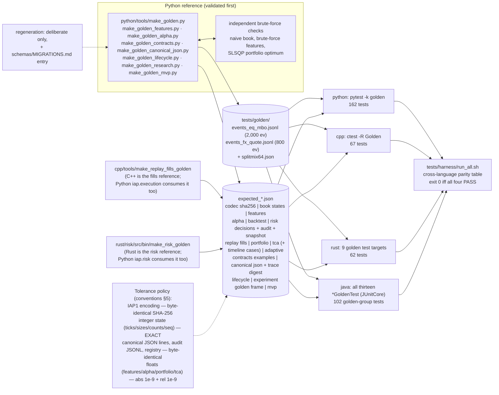
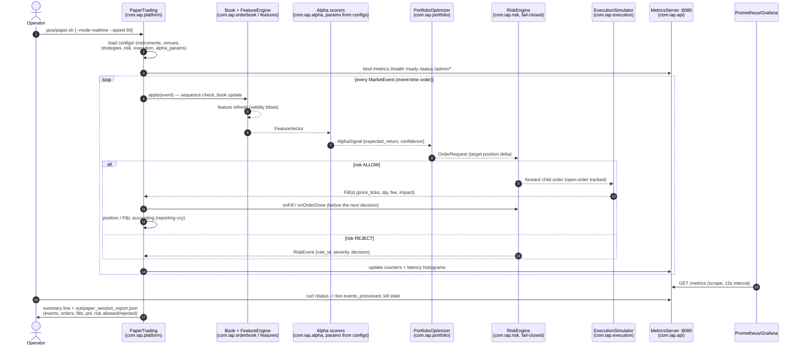

# ARCHITECTURE — how the platform is actually built

This document describes the system as it exists in this repository: which
responsibilities live in which language tree, how data flows, what the
contracts and versioning rules are, how determinism and cross-language parity
are enforced, and how the thing is observed and deployed. The governing
design is [SPECIFICATION.md](SPECIFICATION.md); the binding low-level
decisions are [../PLATFORM_CONVENTIONS.md](../PLATFORM_CONVENTIONS.md).
Diagram sources live in [diagrams/](diagrams/) (identical to the embedded
versions below).

## 1. Design principles (spec §1, condensed)

1. **Separate concerns, explicit contracts.** Alpha, portfolio, risk,
   execution, TCA, research and the lifecycle are independent components
   joined only by the seventeen canonical contracts (§4 below) and the
   Protocols that type them (`iap.contracts.protocols`).
2. **One semantics, four implementations.** Python defines the semantics,
   C++/Rust/Java implement them, golden tests prove equivalence (§6), not
   review. Two components qualify this honestly: the hard-risk rule text is
   owned by Rust and the execution rule text by C++, and Python holds a
   reference-equivalent port of each proven by the same goldens
   (`API_TRADING.md`) — so the loop the MVP runs is the reference loop.
3. **Determinism everywhere it matters.** Same seed + config + inputs ⇒
   bit-identical outputs across runs (and, for integer paths, across
   languages). No wall clock, no unordered iteration, one pinned RNG.
4. **Fail closed.** Unknown or degraded state — sequence gap, stale book,
   invalid feature input, disconnected venue — produces no signal and no
   order, never a wrong one.
5. **Research truth over backtest cosmetics** (spec §32). Costs, decay,
   multiple-testing counts and failed hypotheses are first-class outputs.

## 2. Layer responsibilities per language (spec §3, as realized)

The spec's responsibility matrix, mapped to what actually lives in this
repository:

| subsystem | Python (`python/src/iap`) | C++ (`cpp/`) | Rust (`rust/`) | Java (`java/` `com.iap.*`) |
|---|---|---|---|---|
| Events / codec (JSONL + IAP1) | `core` (reference) | `marketdata` | `marketdata` crate | `core`, `codec` |
| Synthetic generator + normalize/QC | `marketdata` (sole owner) | — | — | — |
| Order book (L1/L2/MBO, consolidated) | `orderbook` (reference) | `orderbook` | `orderbook` crate | `orderbook` |
| Deterministic replay | `replay` | `replay` | `replay` crate (+ demo bin) | `replay` (+ Demo) |
| Feature engine (native 40 / registry 205) | `features` (all 205, reference) | `features` | `features` crate | `features` |
| Labels (event-time, 11 horizons) | `labels` (sole owner) | — | — | — |
| Alpha library / scoring | `alpha` (all 24, fitting) | `alpha` (6 golden, scoring) | `alpha` crate (6 golden, scoring) | `alpha` (6 golden, scoring) |
| Validation framework, experiment ledger, ExperimentRunner | `validation`, `experiment`, `research` (sole owner) | — | — | — |
| ML + meta-labeling | `models` (sole owner) | — | — | — |
| Portfolio optimizer | `portfolio` (reference) | — | — | `portfolio` (production service) |
| Hard risk engine | `risk` (reference-equivalent port, same goldens) | — | `risk` crate (**reference**: rule text + golden generator) | `risk` (orchestration port) |
| Execution algos + event-driven simulator | `execution` (reference-equivalent port, same golden) | `execution` (**reference**: rule text + golden generator) | — | `execution` |
| SOR / venue adapters | `execution.sor` (port) | `sor` | `venue` crate (protocol codec + sim venue) | `sor` |
| Research backtester | `backtest` (reference) | — | — | `backtest` |
| Adaptability (drift / refit / live lifecycle) | `adaptive` + `backtest.adaptive` (reference) | — | — | `adaptive` (live monitors) |
| TCA | `tca` (reference + report) | — | — | `tca` (service) |
| Contracts / canonical JSON / decision trace | `contracts`, `trace` (reference: 22 typed contracts, 18 Protocols, `canonical_json`, `TraceDigest`, `explain`, attribution) | `contracts` (`iap::contracts::{Value, DecisionTrace, TraceDigest}` — byte-identical canonical lines; `ExecutionReplay` emits one trace per parent order) | `contracts` crate (canonical JSON + SHA-256 + `DecisionTrace` + JSONL sink / digest + `explain`; `telemetry::trace` re-exports the sink with `trace_records_total`) | `contracts`, `trace` (`PaperTrading` emits `decision_traces.jsonl`) |
| Alpha promotion lifecycle (7 states) | `lifecycle` (reference; wraps `adaptive.lifecycle`) | — (by design) | `lifecycle` crate (gate table, 17-edge machine, live rolling-IC rules, byte-identical `alpha_registry.json`) | `lifecycle` (+ `ConfigService.LIFECYCLE`) |
| Data model / store | `store` (SQLite over `schemas/sql/iap_v1.sql`; importers for every research artefact) | — | — | — |
| The traced end-to-end loop (MVP) | `mvp` (`python -m iap.mvp run / replay / verify / explain`) | — | — | `platform` (the paper vertical) |
| Event bus / threading | — | — | `eventbus` crate (SPSC ring) | — |
| Telemetry / metrics | — | — | `telemetry` crate (sets the metric-name contract) | `monitoring` + `api` (MetricsServer) |
| Paper trading / platform loop | — | — | — | `platform` (PaperTrading), `config`, `api` |

Notes on the realized shape (deviations from the spec's idealized matrix are
called out in §10):

- **Python** is both the research monopoly (generator, labels, validation,
  ML, reports) and the reference for everything portable. Reference means:
  validated first (against brute-force implementations), then frozen into
  golden files that the other languages must match.
- **Rust owns the hard risk engine** — the safety-critical component — and
  the golden risk decision vector is generated from it (every rule
  unit-tested first). Java ports it for platform orchestration; Python
  ports it as `iap.risk` (`API_TRADING.md` §1: exact decisions,
  byte-identical audit JSONL and snapshot, restore continuation — the same
  files the Java port is proven by); C++ does not implement risk.
- **C++ owns execution** — the fill-model reference
  (`cpp/include/iap/execution/execution.hpp` is the normative text for the
  queue-position and latency rules) — plus the fastest codec/book/feature/
  alpha hot path, the benchmark suite, and the canonical-JSON / decision-trace
  contract for that hot path. Java and Python (`iap.execution`,
  `API_TRADING.md` §2: `expected_replay_fills.json` bit-identical) port it.
- **Python owns the contract layer and the loop.** `iap.contracts` types
  every hop, `iap.trace` records it, `iap.lifecycle` decides promotion,
  `iap.store` indexes it, `iap.research` produces the ledgered evidence, and
  `iap.mvp` composes the reference components over the Protocols into one
  deterministic, traced session (§9.1).
- **Java owns the platform**: the only language with the full vertical
  (book → features → alpha → portfolio → risk → execution → TCA → backtest →
  monitoring → paper trading) wired into one process (`PaperTrading`), which
  is what replay/paper/production sharing one contract set looks like in
  practice.

## 3. Data flow

The spec §4 pipeline as realized (source:
[diagrams/pipeline.mmd](diagrams/pipeline.mmd)):

```mermaid
flowchart TD
    subgraph GEN["Synthetic venues — seeded generator (SplitMix64, seed 20260829)"]
        V1["Equity MBO streams<br/>11 instruments @ venue XV1<br/>regimes, self-exciting flow, halt, auctions"]
        V2["FX QUOTE+TRADE streams<br/>8 G10 pairs @ LP1/LP2/PRI<br/>venue latency profiles"]
    end
    V1 --> RAW["data/raw/*.jsonl<br/>immutable raw feed files"]
    V2 --> RAW
    RAW --> NORM["Normalization + sequence validation<br/>python iap.marketdata.normalize<br/>gaps / dups / late / resets / ts-regressions / invalid counted -> qc_report.json"]
    NORM --> CANON["Canonical event stream<br/>JSONL + IAP1 v2 binary (72-byte LE records + CRC-32 trailer)<br/>+ Parquet research dataset — schemas x-version 1"]
    CANON --> BOOK["Order-book reconstruction<br/>Python ref / C++ / Rust / Java<br/>MBO FIFO, status-gated matching, synthetic ids, dup-drop,<br/>gap->stale, reorder window, sequence resets, SNAPSHOT recovery"]
    BOOK --> FEAT["Feature engine<br/>205-feature registry (hash = feature_version)<br/>native 40 in C++/Rust/Java — validity bitset, NaN never valid"]
    FEAT --> LBL["Event-time labels (Python-owned)<br/>11 horizons, mid-to-mid + cost-adjusted<br/>at-or-before rule, no lookahead"]
    FEAT --> ALPHA["Alpha ensemble<br/>24 flagship alphas (EQ01-FX12)<br/>linear_z_v1 scoring; 6 golden alphas ported"]
    ALPHA --> PORT["Portfolio construction<br/>PGD + prox, 7 constraint families, EWMA cov<br/>Python reference, Java production service"]
    PORT --> RISK["Hard risk engine — FAIL-CLOSED<br/>Rust reference, Java orchestration, Python reference port<br/>limits, throttles, gap/stale gates, kill switches"]
    RISK --> EXEC["Execution algos + event-driven simulator<br/>VWAP / TWAP / POV / IS; deterministic queue model<br/>C++ reference, Java + Python ports"]
    EXEC --> SOR["SOR / venue adapters<br/>cpp/sor, rust venue protocol + sim"]
    SOR --> FILLS["Executions (fills, fees, rebates, impact)"]
    FILLS --> TCA["TCA + attribution<br/>Perold IS = delay + trading + opportunity (exact)<br/>Python reference, Java service"]
    TCA --> TRACE["Decision trace — one DecisionTrace per decision<br/>signal · portfolio · risk · orders · routing · fills · TCA · attribution<br/>canonical JSONL + stream digest + SQLite index (iap.store); explain()"]
    LBL --> RESEARCH
    TRACE --> RESEARCH["Research feedback / alpha factory<br/>ExperimentRunner -> research/experiments/ID/ + the ledger (865 looks / 70 configs)<br/>REPORT.md, ML_REPORT.md, model manifests"]
    RESEARCH --> LIFE["Alpha promotion lifecycle (iap.lifecycle)<br/>RESEARCH -> CANDIDATE -> VALIDATING -> PAPER -> ACTIVE <-> WATCH -> RETIRED<br/>18 gates, 17 edges; bundled data: 24 CANDIDATE / 0 beyond"]
    LIFE -. "gated, ledgered transitions<br/>(research/alpha_registry.json)" .-> ALPHA
```

Storage tiers along the flow (spec §24, realized without external services):
immutable raw JSONL → normalized JSONL + IAP1 binary + Parquet
(`data/normalized/`; the data version is the sha256 over the IAP1 bytes) →
per-instrument feature/label Parquet (`data/features/`) → research artifacts
(`research/`: reports, `experiments.json`, `experiments/<id>/`, model
manifests, baselines, `alpha_registry.json`, `lifecycle_transitions.jsonl`) →
per-session decision-trace JSONL + risk audit (`data/mvp/<run_id>/`,
`<state-dir>/`) → the SQLite index over all of it (`data/store/`,
`python -m iap.store build`; `docs/DATA_MODEL.md`). Everything generated is
seeded and reproducible; nothing generated is committed except research
reports, research documents and golden files.

**The loop closes twice.** Research → trading: an alpha reaches the trading
path only through the promotion lifecycle (`iap.lifecycle`,
`docs/LIFECYCLE.md`) — RESEARCH → CANDIDATE needs a ledger entry and a clean
leakage test, CANDIDATE → VALIDATING the nine research gates (IC, NW t, fold
consistency, hypothesis sign, net P&L after costs, capacity, stability),
VALIDATING → PAPER a reproducible replay and cross-language parity, PAPER →
ACTIVE paper sessions whose realized IC tracks research, and ACTIVE ⇄ WATCH
→ RETIRED the live rolling-IC rules of the adaptability layer (§8.1). On
the bundled data every alpha stops at CANDIDATE. Trading → research: every
decision cycle is one `DecisionTrace` (`docs/DECISION_TRACE.md`) whose fills
and TCA feed the paper evidence the lifecycle's PAPER gates read
(`paper_evidence.json`), whose attribution separates model-explained P&L
from the residual, and whose stream digest is what an incident replay must
reproduce (`docs/runbooks/RUNBOOK_incident_replay.md`).

## 4. Contracts and schema versioning

Seventeen contracts are pinned as JSON Schema in `schemas/<domain>/` — the
seven canonical ones of spec §6 (`market_event`, `book_update`,
`feature_vector`, `alpha_signal`, `order_request`, `execution_report`,
`risk_event`) and the ten loop contracts of 2026-09-19 (`portfolio_target`,
`risk_decision`, `parent_order`, `child_order`, `venue_decision`,
`tca_result`, `experiment_spec`, `experiment_result`,
`lifecycle_transition`, `decision_trace`) — each carrying `"x-version": 1`
(`schemas/README.md` is the index). On the Python side every schema is one
frozen, validated dataclass in `iap.contracts.types` (22 types including
the nested records), every loop interface is a `runtime_checkable` Protocol
in `iap.contracts.protocols` (18: `MarketDataSource`, `OrderBookLike`,
`FeatureEngineLike`, `Alpha`, `PortfolioConstructor`, `RiskEngineLike`,
`ExecutionAlgorithm`, `SmartOrderRouterLike`, `ExecutionSimulatorLike`,
`TCAEngine`, `ExperimentRunner`, `LifecycleGate`, `AlphaLifecycle`,
`TraceSink`, …), and `iap.contracts.validate` validates any document
offline against the schema set (`API_CONTRACTS.md`). The rules
(`schemas/MIGRATIONS.md`):

- **Any field change bumps the schema's x-version** and adds a MIGRATIONS
  entry (what changed, why, migration path); the Python type, the
  `SCHEMA_VERSIONS` inventory and the golden
  `expected_contracts_examples.json` move in the same commit, and every port
  is re-matched in the same PR.
- **Physical formats**: canonical JSONL (exact key order, integers only,
  domain-strict decoders pinned by a shared reject/accept fixture) and IAP1
  binary (16-byte header + 72-byte little-endian records + a version-2
  CRC-32 integrity trailer) are normative in `schemas/FORMAT.md`; the golden
  codec test requires **byte-identical** IAP1 encodings across all four
  languages (SHA-256 comparison). Book and replay checkpoints are a
  cross-language JSON document (x-version 2) pinned by
  `expected_checkpoint_eq_1000.json`. Contract documents (traces, lifecycle
  transitions, experiment specs/results, the registry) are **canonical
  JSON** — sorted keys, compact separators, ASCII, Python float repr,
  NaN rejected — reproduced byte for byte by Java, Rust and C++
  (`PLATFORM_CONVENTIONS.md` §13.1, `expected_canonical_json.json`).
- **Version identity propagates**: the feature registry's canonical-JSON
  hash is `FeatureVector.feature_version` and appears in feature output,
  golden files, every model manifest and every decision trace; the data
  version is the sha256 over the normalized IAP1 bytes; `config_version` is
  the content hash of the configuration documents in force;
  `model_version` the hash of the model definition; `experiment_id` the
  first 16 hex of the spec's content hash; the trace id the hash of
  `session|instrument|event_ts|sequence`. A change anywhere in the chain is
  visible everywhere downstream.
- **Prices and quantities are integers on every contract** (`price_ticks`,
  `qty`; conventions §1). Floats appear only in research quantities
  (expected returns, P&L, bps) with pinned 1e-9 tolerances.
- **The relational projection** of all of the above is
  `schemas/sql/iap_v1.sql` (24 tables, 3 views, SQLite + PostgreSQL), applied
  by `iap.store`: a derived, rebuildable index of the flat-file artefacts,
  never their replacement (`docs/DATA_MODEL.md`).

## 5. Determinism strategy

Determinism here is a designed property with named mechanisms, not an
aspiration:

| mechanism | rule |
|---|---|
| One RNG | SplitMix64 only, implemented identically 4× and known-answer-tested (`tests/golden/splitmix64.json`); explicit seeds from configs |
| No wall clock | on any deterministic path — replay, features, fills; wall time appears only in throughput printouts and report headers |
| No unordered iteration | sorted keys everywhere state is serialized (books, consolidated views, feature emission, venue merging in ascending venue_id) |
| Integer arithmetic | ticks/qty/window sums stay integer end-to-end; float creep is confined to genuinely real-valued inputs |
| Pinned algorithms | not just results: PGD projection order and passes, EWMA initialization, queue-model tie-breaks, latency draw order, fold boundaries are all specified |
| Checkpoint/restore | book and replay checkpoints resume bit-identically (tested), across languages (golden) |
| Feed anomalies | gaps, duplicates, late retransmissions (bounded reorder window), venue sequence resets, broken/interrupted SNAPSHOT bursts, id-less L2 feeds, malformed payloads and auction call phases are pinned by `expected_anomaly_states.json` in all four languages; `docs/SCENARIOS.md` maps scenario → rule → tests |
| Seeded simulation | generator, backtester fills, execution sim, TCA parent-order set: same seed ⇒ same bytes |

The payoff is compounding: because the generator is deterministic, the whole
research stack is a regression test; because fills are deterministic, the
execution golden can pin exact timestamps and quantities; because reports are
deterministic, an honest rerun reproduces every published number.

## 6. Golden-test topology

Source: [diagrams/golden_topology.mmd](diagrams/golden_topology.mmd).

Reference ownership is per-domain: Python generates most goldens (after
brute-force cross-validation), but the **fills golden comes from C++** (the
execution reference) and the **risk golden from Rust** (the risk reference) —
each domain's owning language pins the truth, and everyone else matches it,
Python included since 2026-09-19 (`iap.execution`, `iap.risk`). The
contract goldens (`expected_contracts_examples.json`,
`expected_canonical_json.json`, `expected_lifecycle.json`,
`expected_experiment_golden_frame.json`, `expected_mvp.json`) are Python's
and are matched by Java, Rust and C++ (the trace and canonical-JSON ports)
and by Java and Rust (the lifecycle ports). The harness
(`tests/harness/run_all.sh`, with `run_golden.sh` as the golden-only alias)
runs every suite with the canonical commands and prints the parity table; a
full harness run (2026-09-20) passes 1352/266/298/475 tests (162/67/62/102
golden) across python/cpp/rust/java, plus the repo-level `integration` (13)
and `replay` (4) rows — the same counts the README parity table records.

## 7. Hot-path engineering notes per language

All measured on the stated 2-CPU Xeon container (methodology caveats in
`benchmarks/results_cpp.md`; never quote these numbers without them).

**C++** (`cpp/`): fixed-layout structs mirroring the 72-byte IAP1 record
(decode 184.1 ns/event, of which the great majority is the IAP1 v2 CRC-32
integrity check over the record body — a byte-serial table CRC at
~5 cycles/byte; the pre-round-3 unchecked decode was 3.5 ns/event); order
book on pooled nodes with free lists and intrusive per-level FIFO lists —
**no allocation in book/feature hot loops after warmup**, enforced by tests
(conventions §8); book update 26.4 ns, replay 27.2M events/s, 48-feature
engine 514.1 ns/event, alpha scoring 33.6 ns/row (the 2026-09-19
regeneration of `benchmarks/results_cpp.md`; the previous table read
174.4 / 25.7 / 28.1M / 530.4 / 38.5 — within the stated few-percent
cross-run variance, and the docs follow the table, not the other way round).
`-Wall -Wextra -Werror`, C++17, Release `-O3`.

**Decision trace (`cpp/include/iap/contracts/`)**: the C++ hot path (book →
features → alpha → execution → SOR) is explainable through the same
`DecisionTrace` record the other languages produce. `iap::contracts::Value`
+ `canonical_json()` reproduce Python's `json.dumps(sort_keys=True,
separators=(",", ":"), ensure_ascii=True)` byte for byte (shortest
round-trip floats laid out as `float.__repr__` via `std::to_chars`, exact
i64/u64 integers, code-point key order = bytewise UTF-8 order),
`TraceDigest` is sha256 over `line + "\n"` per trace, and
`ExecutionReplay::set_trace_sink` emits one trace per parent order (parent,
children, the SOR's candidate table per child, one `ExecutionReport` per
fill) AFTER the replay — never inside the event loop. Cost, measured: 31.7 µs
per 5.6 KB trace to serialise (+ ~30 µs to hash), i.e. ~37 ns/event
amortised on the 2,000-event golden replay (`benchmarks/results_cpp.md`,
trace-path table).

**Rust** (`rust/`): eleven-crate workspace; same pooling/intrusive-structure
discipline expressed through ownership — the entire workspace confines
`unsafe` to the five sites of one SPSC ring-buffer file (`eventbus`), with
everything else in safe Rust at zero warnings; `Result<_, IapError>`
end-to-end, no panics on input. Demo-scale replay ≈ 6.9M events/s. Dev/test
profiles build at opt-level 2 to keep `cargo test` inside the < 120 s budget.
The `contracts` crate writes canonical JSON with its own writer over
`serde_json::Value` and the workspace enables serde_json's `float_roundtrip`
feature (correctly rounded parsing) — without it the registry byte parity
broke by 1 ulp on 17-digit decimals.

**Java** (`java/`): Java 21, plain `javac` (no Maven — Maven Central is
unreachable in the build environment; `docs/BUILD_NOTES.md` is the normative
pom-equivalent, JUnit4 vendored from `/usr/share/java`). Hot paths are
allocation-conscious by construction: primitive `long[]`/`int[]` structures,
hand-rolled open-addressing maps, no boxing on the event path; GC metrics
are exported so pauses are observable rather than assumed away. Demo-scale
replay ≈ 3.5M events/s.

**Python** (`python/`): correctness-first reference; vectorized
(NumPy/pandas) where it matters — the 205-feature × 310k-event pipeline runs
in under a minute, the full 24-alpha promotion pipeline in ~16 s, the MVP
session (16,578 events through simulator, risk, features, three alphas,
optimizer, TCA and traces) in ~7 s. Speed is a convenience here, not a
contract; the contract is that Python's semantics are the ones everyone
else must reproduce — and, for risk and execution, that Python reproduces
the Rust and C++ goldens statement for statement.

The honest engineering conclusion (paper 6): at this platform's feed rates
every port is overprovisioned by orders of magnitude; the languages were
chosen for correctness leverage and engineering cost, and the golden suite —
not the benchmark table — is what keeps them interchangeable.

## 8. Observability wiring

Spec §25, realized as a Prometheus/Grafana stack with the **metric-name
contract set by the Rust telemetry crate** and binding on Java
(`deployment/grafana/README.md`): snake_case, counters end `_total`, latency
histograms end `_ns` with fixed log2 buckets, gauges are bare nouns.

- **Producer**: exactly one — Java's `com.iap.monitoring` registry (lock-free
  counters, gauges, histograms, GC metrics; `PLATFORM_CONVENTIONS.md` §12.4)
  served by `com.iap.api.MetricsServer` on
  `GET /metrics | /health | /ready | /status` plus
  `POST /admin/{kill,clear,override,roll}` (port from
  `configs/execution/execution.json` `monitoring.port`, default 8080). `rust/telemetry`
  remains the reference for the exposition FORMAT and is unit-tested there,
  but no deployed Rust binary writes metrics anywhere Prometheus can read —
  so round 3 removed the `rust-telemetry` scrape job, the exporter sidecar and
  every rule and panel built on `venue_*` rather than leave a permanently-down
  target and an always-firing `TargetDown` (§12.7 "no aspirational targets").
- **Scrape**: `deployment/prometheus/prometheus.yml` — jobs `java-platform`
  (:8080) and Prometheus's self-scrape, plus recording rules and alerts
  (`recording.yml`, `alerts.yml`: SequenceGapDetected, BookStale, StaleFeed,
  FeedWallClockStall, SignalRateCollapse, LiveVsBacktestDrift,
  AlphaLifecycleRetired, FillRateDrop, PreTradeRejectRatioHigh,
  LossLimitUtilizationHigh, KillSwitchEngaged, GrossNotionalUtilizationHigh,
  GcPauseHigh, PlatformSessionFailed, SessionRestartsClimbing, TargetDown —
  each with a runbook anchor in `docs/runbooks/`). Staleness is judged on the
  EVENT-time gap so a historical replay does not page; limit-utilization rules
  divide by the exported `risk_limit{limit=...}` gauges, never a copied
  constant. `eventbus_queue_depth` and `md_out_of_order_total` remain
  PLACEHOLDER **names** in `deployment/grafana/README.md` — with no rule and
  no panel until a producer exists. Everything is validated in CI by
  `promtool check rules/config`, `promtool test rules` and
  `tests/harness/check_deployment.py`.
- **Dashboards**: two provisioned Grafana dashboards — *Market Data &
  Latency* (events/sec, session state, event-time gap, gaps/dups,
  decode/book/order-path p50/p99/p999, book-stale + restarts, GC) and
  *Trading & Risk* (signal rate, order/fill flow, fill rate, execution
  slippage, exposure and limit utilization, daily P&L, drawdown, kill-switch
  status, live-vs-backtest drift PSI, rolling realized IC, alpha lifecycle
  state). Every panel expression names a metric a producer actually exports;
  `check_deployment.py` fails the build otherwise.
- **State and the shape of the deployment**: the paper-trading vertical is a
  SINGLETON with durable state (`PLATFORM_CONVENTIONS.md` §12.3) — risk
  snapshot, session accounting and the risk/config/admin audit JSONL are
  checkpointed to `$IAP_STATE_DIR` every 1,024 events, at session end and from
  a shutdown hook, and `--resume` restores positions, realized P&L and every
  latched kill switch. A session is FINITE and exits 0 (`restart: on-failure`
  in compose, a single-replica `Recreate` Deployment in k8s), so "daily"
  limits are daily rather than per-restart.
- **What is watched** maps 1:1 to spec §25: market-data health (gap/dup
  counters exist because the normalizer and books count them anyway), alpha
  health (signal rate + live-vs-backtest drift), execution (order/fill/
  slippage), risk (utilization, rejections, kill switches), infrastructure
  (latency histograms, GC pauses).
- **The decision trace joins the metrics and the audit** (`docs/DECISION_TRACE.md`).
  Metrics say *how many* and *how fast*; `risk_audit.jsonl` says *what the
  risk engine decided and why*; `decision_traces.jsonl` says *why we traded*
  — one record per pre-trade decision in the Java paper loop
  (`com.iap.platform.PaperTraces`: signal, portfolio target, risk decision,
  parent, child, every venue scored, fills, TCA over the paper timeline,
  attribution), fsynced with the audit at every checkpoint, counted by
  `trace_records_total` / `trace_tca_skipped_total`, summarised on
  `/status` (`trace_count`, `trace_digest`) and in the session report
  (`trace: {count, digest, jsonl}`). The three are joined by ids (risk
  order id = `parent_order_id`), and the trace file is the one artefact an
  incident replay must reproduce byte for byte. Surfacing the trace on the
  Grafana dashboards is backlog (EPICS O06); the metrics exist today.

### 8.1 Adaptability layer (spec §20 steps 12-13)

The monitoring loop is closed by the adaptability layer, contract-pinned
in [/API_ADAPTIVE.md](../API_ADAPTIVE.md):

- **Reference** (`python/src/iap/adaptive`): `drift.py` (the pinned PSI
  formula + diagnostic two-sample KS), `refit.py` (static / scheduled /
  drift-triggered refit policies as pure functions of event time and
  monitor values), `lifecycle.py` (the IC-gated ACTIVE → WATCH → RETIRED
  state machine with consecutive-breach hysteresis).
  `iap.backtest.adaptive` replays a deployment: warmup fit + baseline
  capture, block-wise evaluation, refits on trailing purged/embargoed
  windows (no-lookahead asserted at runtime and shift-tested), retirement
  forcing positions flat while shadow scoring continues.
- **Serialized expectations**: research baselines (decile edges, expected
  fractions, IC statistics) are written to `research/baselines/*.json` and
  consumed unchanged by the live side — the studied numbers and the
  monitored numbers are the same files.
- **Live port** (`com.iap.adaptive`): BaselineLoader/Psi/DriftMonitor/
  RollingIc/LifecycleGauge feed the three per-alpha gauges named above
  (`alpha_live_vs_backtest_drift`, `alpha_rolling_ic`,
  `alpha_lifecycle_state`) from inside `PaperTrading` — observational
  only, never feeding back into an in-session trading decision, so
  determinism is untouched.
- **Parity**: `tests/golden/expected_adaptive.json` pins PSI/KS at 1e-10,
  refit decisions as exact booleans and lifecycle sequences as exact
  states (generated by `python/tools/make_golden_adaptive.py`,
  brute-force validated first).
- **Evidence**: the policy-comparison study lives in
  `research/adaptive_reports/ADAPTIVE_REPORT.md` — reported honestly:
  on two synthetic sessions no refit policy demonstrably beats static;
  what is established is that the machinery is deterministic, leak-free
  and behaves exactly as pinned, with every look counted in
  `research/experiments.json` and every lifecycle transition logged to
  `research/lifecycle_log.jsonl`.

## 9. Deployment topology

`deployment/docker/docker-compose.yml` composes the full stack:
`data-generator` (Python image; runs the seeded pipeline into a shared
volume — data is never baked into images) → `cpp-replay` + `rust-replay` and
`java-platform` (the paper-trading vertical: `com.iap.platform.PaperTrading`
paced in realtime over the golden vector, serving `/metrics`, `/health`,
`/ready`, `/status` and the kill-switch admin API on :8080, with a real HTTP
healthcheck against `/health`) → `prometheus` → `grafana` (:3000, admin
password from the environment, never committed). `deployment/k8s/` carries the
equivalent manifests (namespace, ConfigMaps generated from `configs/` by
`generate_configmaps.py`, PVC, network policy, CronJob for the data pipeline,
Deployments for the platform, Prometheus and Grafana).

Three properties of the shape matter more than the box diagram
(`PLATFORM_CONVENTIONS.md` §12.3/§12.7):

- **The platform reads mounted configuration, not a baked copy.** Both
  deployments set `IAP_CONFIG_DIR` and mount `configs/` (bind mount / ConfigMap)
  there, which is what makes the kill-switch runbook's "edit risk.json, restart
  the service" path real.
- **A session is finite and ends cleanly** (report, final checkpoint,
  `platform_session_state = 2`, exit 0), so compose uses `restart: on-failure`
  and k8s a single-replica `Recreate` Deployment. The round-2 stack re-ran a
  two-minute session forever, which reset the "daily" loss counter every two
  minutes and made every `offset 1h` baseline meaningless.
- **The trading vertical is a singleton with durable state.** `replicas: 1`,
  no rollout overlap, one writer on the ReadWriteOnce PVC, `$IAP_STATE_DIR` on
  that PVC — so an eviction or a node drain resumes with its positions,
  realized P&L and any latched kill switch intact.

The paper-trading loop itself (source:
[diagrams/paper_trading_sequence.mmd](diagrams/paper_trading_sequence.mmd)):

The same contracts drive replay, paper and (hypothetically) production —
spec §1's core requirement — which is why the paper session over the golden
vector is also a smoke test (`PaperTradingSmokeTest`) and why its honest
summary line (`events=2000 orders=420 fills=421 pnl=-100.801250
risk[allowed=420 rejected=5]`, re-derived 2026-09-06 after the round-3
trading fixes; the earlier `-634420` figure came from a wiring that fed the
risk engine decision-clock marks and lost terminal reports) is reproducible
bit-for-bit. The report now also carries the execution-control counters
(`execution.{participation_blocked, participation_capped,
slice_interval_blocked, latency_budget_blocked, sor_no_route}`) and
`risk.rejected_stale`.

Round-3 wiring contract (`PLATFORM_CONVENTIONS.md` §11.4,
`PaperTrading.RiskWiring`): step 5's mark is the consolidated touch over
non-stale venue books stamped with the market-data event time; per-venue
stale transitions call `onSequenceGap`/`onFeedRecovered`; every fill (step
7) reaches the risk engine before the next decision and every terminal
child calls `onOrderDone`; `configs/execution/execution.json` participation / slice
interval / latency budget are enforced between steps 5 and 6.

### 9.1 The MVP vertical (`python -m iap.mvp`)

The Java paper loop is the production-shaped vertical; the MVP
(`docs/MVP.md`) is the same loop composed in Python from the reference
components over the contract Protocols (`iap.mvp.adapters`), on one
synthetic instrument and one synthetic session, with every stage typed and
every decision traced: seeded feed (the unmodified generator + normaliser,
captured as `events.jsonl` + `events.iap1`) → per-venue books + consolidated
book → `FeatureEngine` → three fitted `linear_z_v1` alphas ensembled →
`iap.portfolio` PGD → `iap.risk` per child → TWAP / POV / IS →
`iap.execution` SOR over three venues → `iap.execution` simulator → `iap.tca`
→ attribution → `DecisionTrace` (JSONL + SQLite + digest) → report. The
§11.4 wiring rules are honoured identically to `BacktestEngine` /
`PaperTrading` (docs/MVP.md §4, row by row with code references) and the
§12.1 money identity is asserted after every fill. `verify` runs it twice
and compares bytes; `replay` re-runs it from the captured stream and must
reproduce the trace digest; `tests/golden/expected_mvp.json` pins the golden
run (seed 12345: 16,578 events, 355 decisions, 66 parents, 55 fills,
−22.68 USD, digest `16cd29aa…`) as the cross-language pin for any port of
the loop (docs/MVP.md §9 lists what a port must reproduce). The result is
cost-negative and the realized-IC audit (docs/MVP.md §7.1) is part of the
document: an order-of-magnitude gap between the MVP's mid-to-mid IC and the
research IC of the same alphas, traced to the synthetic generator's
mean-reverting venue noise, not to a leak.

## 10. Known deviations from the spec blueprint (documented, not hidden)

- **Rust workspace membership** differs from the spec's sketch: the
  realized workspace is `marketdata, orderbook, replay, eventbus, telemetry,
  features, alpha, risk, venue, contracts, lifecycle` — `features`, `alpha`,
  `contracts` and `lifecycle` crates were added (golden parity of the native
  40, the golden alphas, the canonical-JSON / trace contract and the
  promotion machine), and there is **no `execution` crate**: execution
  simulation is owned by C++ (reference), Java and Python, with Rust's
  `venue` crate covering the venue-side protocol/sim role.
- **C++ has no risk module and no lifecycle port**: hard risk is Rust
  (reference) + Java (orchestration) + Python (`iap.risk`, the
  reference-equivalent port the MVP runs — added 2026-09-19, which fills the
  spec matrix's "Research" cell for risk); the lifecycle is a research /
  platform concern implemented in Python, Java and Rust, and C++ carries the
  trace contract instead.
- **Java uses no Maven/Gradle** (spec §7 mentions Maven): Maven Central is
  unreachable from the build environment, so the build is plain `javac`
  driven by `build.sh`/`test.sh` with JUnit4 vendored locally.
  `docs/BUILD_NOTES.md` is the normative pom-equivalent dependency list.
- **FX05's golden cases** deviate from the two-vector pattern (the golden
  vectors carry one FX pair; FX05 is inherently cross-pair) — its cases pin
  bundled-frame rows and embed all inputs; documented in API_ALPHA.md §6.
- **Data is synthetic** end-to-end (spec Phase 1's licensed-data acquisition
  is out of scope for this build); the QC/normalization machinery runs for
  real against injected anomalies.
- **Single-machine scale**: PostgreSQL/kdb+/Aeron-class infrastructure from
  spec §§23-24 is not present; storage is files + Parquet, IPC is in-process,
  and the deployment stack is compose/k8s manifests sized for the 2-CPU
  reference environment.

## 11. Agentic AI / MCP (future, read-only)

The specification does not ask for an agentic layer; the build plan
(EPICS E24, backlog) reserves one for hypothesis drafting and incident
explanation, and the design rule is pinned now (`PLATFORM_CONVENTIONS.md`
§13.7) so that nothing built later can cross it:

- **LLM reasoning only, never on the critical path.** No module on the
  trading path — `iap.{risk,execution,portfolio,orderbook,features,core}`,
  `rust/risk`, `cpp/execution`, `com.iap.{risk,execution,portfolio}` —
  imports a network or LLM client, and `RiskEngineLike.evaluate` is a pure
  function of the order and the engine's own state (no wall clock, no I/O,
  no model). The risk engine never depends on a model: its inputs are
  reference data, limits, market data and fills; an alpha's confidence, a
  lifecycle state or a model output can reduce what is sent, never weaken
  what is rejected.
- **What an agent may do**: read. Query the store (`python -m iap.store sql`,
  `v_order_chain`, `v_alpha_scorecard`, `v_experiment_ledger_summary`), the
  ledger (`research/experiments.json`, `python -m iap.research list / show`),
  TCA (`research/tca/`, `tca_results`), drift and rolling IC (the
  `research/baselines/*.json` the live gauges read, `drift_baselines`), the
  registry (`python -m iap.lifecycle status`, `research/alpha_registry.json`)
  and the decision traces (`python -m iap.store explain`, `traces.jsonl`,
  `decision_traces.jsonl`); draft an `ExperimentSpec` for a human to run;
  explain an incident from its trace.
- **What an agent may not do**: override a risk decision, send or amend an
  order, flip a verdict in `research/alpha_reports/*.json`, move a lifecycle
  state, or regenerate a golden. Those are HUMAN acts (manual lifecycle
  edges carry `actor = HUMAN` and a non-empty reason) or gated SYSTEM
  transitions, each with a ledger entry id (CONTRIBUTING.md §6,
  GOVERNANCE.md §2).
- **What already exists to be read** is the whole point of the release: the
  store views, `explain()`, the registry, the experiment documents and the
  trace digest were built as the platform's own observability first, and
  they are exactly the read-only surface a future MCP server (`tools/mcp/`,
  proposed in AG01) would expose. The policy test that proves no
  trading-path module imports a network client is AG03; until it lands the
  rule is enforced by review (CODEOWNERS: risk, execution, core).
