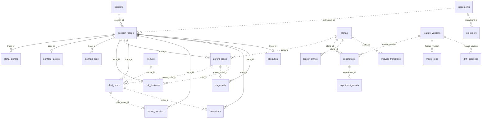

# Data model — `schemas/sql/iap_v1.sql` and `iap.store`

## 1. Purpose

The platform's decisions and research results live in flat files that are
the **source of truth**: the Parquet feature store (`data/features/`), the
JSON goldens (`tests/golden/`), the research JSON documents
(`research/alpha_reports/*.json`, `research/experiments.json`,
`research/experiments/<id>/`, `research/models/<run>/manifest.json`,
`research/baselines/*.json`, `research/tca/tca_orders.json`) and the JSONL
audits (`research/lifecycle_log.jsonl`, `research/lifecycle_transitions.jsonl`,
the paper-trading `risk_audit.jsonl`, the decision-trace JSONL a session's
`JsonlTraceSink` writes). They are deterministic, checksummed, reviewed and
archived; nothing in this document changes that.

The store is a **derived, rebuildable index** over those artefacts: one
relational schema (`schemas/sql/iap_v1.sql`, x-version 1) that every contract
of `iap.contracts` maps into, so that the questions the spec's observability
section asks — *why did we trade?*, *why was order X rejected?*, *what is the
multiple-testing denominator?*, *is live IC drifting from research IC?* —
are one query rather than one script each. Dropping the database loses
nothing: `python -m iap.store build` recreates it from the files in about a
second, and a rebuild from unchanged files is byte-identical
(`Store.export_jsonl`).

Design pins:

* **Contracts in, contracts out.** Every typed write is
  `validate_typed(instance)` first (JSON-schema validation, x-version check);
  every typed read is `T.from_dict(row)`, so a row that no longer satisfies
  its contract is an error, not a value.
* **Idempotent writes.** Every insert is an upsert by primary key inside one
  transaction per call; a decision trace is rewritten as a unit
  (delete-then-insert of every stage row that carries its `trace_id`).
  Importing twice leaves the counts unchanged.
* **No wall clock.** Every `*_ts` column is event or ledger time supplied by
  the writer (int64 ns). The DDL has no `NOW()`/`CURRENT_TIMESTAMP`, the
  Store has no `datetime.now()`.
* **Portable DDL.** The same file runs unchanged on SQLite 3 and
  PostgreSQL ≥ 13 (section 5).

## 2. Entity-relationship diagram

Source: [`diagrams/data_model.mmd`](diagrams/data_model.mmd) (also embedded
in [DIAGRAMS.md §7](DIAGRAMS.md)). Solid edges are declared foreign keys
(every normalized stage row of a decision trace references
`decision_traces`); dotted edges are logical references between
independently imported artefacts (an index over a subset of the artefacts
must never fail to load). Column lists in the diagram are abridged; the
tables below are complete.



## 3. Tables

Types are the portable three: `BIGINT` (int64, u32, u16, enum-as-int, 0/1
booleans), `DOUBLE PRECISION`, `TEXT` (ids, sha256 hashes, enum names, JSON
documents in `canonical_json` form — sorted keys, no whitespace, ASCII).
`NN` = `NOT NULL`. Enum columns carry `CHECK (x IN (...))`; the contract
invariants that are expressible in SQL are `CHECK`s too, so a hand-written
`INSERT` cannot store what the contract would reject.

### 3.1 Reference and session data

| table | PK | columns | stores |
|---|---|---|---|
| `schema_version` | `x_version` | `x_version BIGINT ≥1`, `description TEXT` | one row, `1` — the DDL's x-version |
| `instruments` | `instrument_id` | `symbol TEXT UNIQUE`, `asset_class ∈ {EQUITY, ETF, FX}`, `currency`, `base_currency` (FX), `tick_size >0`, `lot_size ≥1`, `ref_price >0`, `adv ≥0`, `pip` (FX), `venues_json` (array of venue names), `underlying_json` (ETF constituents) | `configs/instruments/instruments.json` |
| `venues` | `venue_id` (1..65535) | `venue TEXT UNIQUE` (display name used by `explain`), `asset_class`, `taker_fee_per_share`, `maker_rebate_per_share`, `commission_per_million`, `latency_mean_ns ≥0`, `latency_jitter_ns ≥0`, `supports_json` | `configs/venues/venues.json` |
| `sessions` | `session_id` | `data_version`, `config_version` (sha256 hex), `seed ≥0`, `start_ts`, `end_ts ≥ start_ts`, `n_events ≥0` | one row per replay / paper / backtest session, written by the runner (`Store.insert_session`) |
| `feature_versions` | `feature_version` | `registry_hash`, `x_version ≥1`, `n_features ≥0`, `registry_json` (the feature list) | `data/reference/feature_registry.json`; `feature_version` is the hash `iap.experiment.tracker.feature_version()` stamps on every `FeatureVector` |
| `alphas` | `alpha_id` | `asset_class ∈ {EQUITY, FX}`, `family` (the alpha's pinned name, e.g. `ofi_multilevel`), `horizon`, `economic_rationale` (the class docstring section, `iap.alpha`), `current_state ∈ LifecycleState names` | `research/alpha_reports/<ID>.json` + `iap.alpha.ALPHA_CLASSES`; state from `research/alpha_registry.json` / `lifecycle_transitions.jsonl` |

### 3.2 Research

| table | PK | columns | stores |
|---|---|---|---|
| `experiments` | `experiment_id` | `alpha_id`, `dataset_version`, `feature_version`, `model_version` (NULL = unfitted), `configuration_json`, `train_start_ts ≤ train_end_ts ≤ validation_start_ts ≤ validation_end_ts ≤ test_start_ts ≤ test_end_ts` (chained CHECKs), `seed ≥0`, `horizon` | `ExperimentSpec` (`schemas/research/experiment_spec.schema.json`) |
| `experiment_results` | `experiment_id` | `alpha_id`, `dataset_version`, `feature_version`, `model_version`, `ic`, `rank_ic`, `t_stat`, `nw_lags ≥0`, `hit_rate ∈[0,1]`, `turnover ≥0`, `gross_return_bps`, `transaction_cost_bps ≥0`, `net_return_bps`, `max_drawdown_bps ≥0`, `sharpe`, `fold_consistency ∈[0,1]`, `n_folds ≥0`, `leakage_passed ∈{0,1}`, `leakage_detail_json`, `hypothesis_sign_confirmed ∈{0,1,NULL}`, `verdict ∈ {PROMOTE, ITERATE, REJECT}`, `n_experiments_in_ledger ≥0`, `git_commit`, `created_ts ≥0`; `CHECK (leakage_passed = 1 OR verdict = 'REJECT')` | `ExperimentResult` (`schemas/research/experiment_result.schema.json`); `net = gross − cost` is enforced by the contract on write |
| `ledger_entries` | `ledger_key` (sha256 of alpha/kind/config) | `alpha_id` (`ALL` for program-wide scans), `kind`, `config_json`, `count ≥1` (looks this key represents), `n ≥0` (ledger position at registration), `reruns ≥0`, `oos_ic`, `nw_tstat`, `verdict` (promotion entries; NULL otherwise), `result_json` | `research/experiments.json` `entries[]` — the multiple-testing ledger (spec §13). `SUM(count)` = `total_experiments`, `COUNT(*)` = `distinct_experiments` |
| `lifecycle_transitions` | `(alpha_id, policy, event_ts, from_state, to_state, source)` | `from_state`, `to_state` ∈ state names, `from ≠ to`, `source ∈ {lifecycle_log, lifecycle_transitions, api}`, `reason`, `gates_json` ({name: GateResult}), `actor ∈ {SYSTEM, HUMAN}`, `eval_index` (lifecycle_log only) | `LifecycleTransition` (`schemas/alpha/lifecycle_transition.schema.json`). `source` says which artefact the row came from: the research policy comparison, the lifecycle service's ledger, or a live write |
| `model_runs` | `run_id` (= manifest `experiment_id`) | `name`, `model_version`, `data_version`, `feature_version`, `git_commit`, `git_dirty ∈{0,1,NULL}`, `train_start_ts ≤ train_end_ts`, `test_start_ts ≤ test_end_ts`, `hyperparams_json`, `hardware_json`, `manifest_json` (whole manifest), `metrics_json` (whole metrics document), lifted scalars `mean_ic`, `mean_rank_ic`, `ic_tstat`, `pooled_ic`, `auc_test`, `brier_test` | `research/models/ledger.json` + `<run_id>/manifest.json` (+ `metrics.json`) — docs/governance/REPRODUCIBILITY.md |
| `drift_baselines` | `name` | `alpha_id`, `kind ∈ {feature, signal, ic}`, `x_version`, `feature_version`, `source`; histogram baselines: `n`, `n_buckets`, `mean`, `std`, `min_value`, `max_value`, `psi_eps`, `edges_json`, `expected_frac_json`; IC baselines: `horizon`, `baseline_kind`, `bucket_ns`, `ic_mean`, `ic_std`, `n_buckets_baseline` | `research/baselines/*.json` (API_ADAPTIVE PSI / rolling-IC baselines) |
| `tca_orders` | `order_id` | `instrument_id`, `side ∈ {BUY, SELL}`, `qty_target >0`, `qty_filled ≥0`, `fill_rate`, `n_fills`, `decision_mid`, `arrival_mid`, `end_mid`, `fill_vwap` (NULL if unfilled), Perold `total_is_bps`, `delay_bps`, `trading_bps`, `opportunity_bps` and their currency twins, `spread_cost`, `impact_cost`, `timing_cost`, `arrival_slippage_bps`, `vwap_slippage_bps`, `twap_slippage_bps`, `execution_alpha_vs_vwap_bps` (nullable markouts), `adverse_selection_json` | `research/tca/tca_orders.json` — the TCA_REPORT.md research harness. **Not** `TCAResult` rows: the harness records neither an algo nor latency and its prices are research-layer doubles in real price units, so mapping it into the contract would have meant inventing values |

### 3.3 Decision traces (the observability chain)

| table | PK | columns | stores |
|---|---|---|---|
| `decision_traces` | `trace_id` (32 hex, `make_trace_id`) | `session_id`, `instrument_id ≥0`, `event_ts`, `sequence ≥0`, `data_version`, `feature_version`, `model_version`, `config_version`, `stages_json` (canonical JSON of `TraceStages`) | the validated `DecisionTrace` document (`schemas/trace/decision_trace.schema.json`); `get_trace` rebuilds it from the header columns + `stages_json` |
| `alpha_signals` | `(trace_id FK, signal_index)` | `timestamp`, `instrument_id`, `expected_return`, `confidence ∈[0,1]`, `horizon_ns`, `direction ∈{-1,0,1}`, `model_version` | `AlphaSignal` — position `signal_index` in `stages.signal` |
| `portfolio_targets` | `trace_id FK` | `strategy_id`, `timestamp_ns`, `portfolio_version`, `feature_version`, `model_version`, `solver_status ∈ {OPTIMAL, INFEASIBLE, MAX_ITER}`, `objective_value`, `turnover ≥0`, `targets_json` | `PortfolioTarget` (at most one per trace) |
| `portfolio_legs` | `(trace_id FK, instrument_id)` | `target_qty`, `target_weight`, `expected_return_bps`, `prev_qty` | `PortfolioLeg` — one row per target |
| `risk_decisions` | `(trace_id FK, risk_index)` | `order_id`, `strategy_id`, `instrument_id`, `timestamp_ns`, `decision ∈ {1 ALLOW, 2 REJECT, 3 KILL}`, `rule_id`, `rule_index ∈[-1, 65535]`, `reason`; `CHECK ((decision = 1 AND rule_index = -1) OR (decision <> 1 AND rule_index >= 0))` | `RiskDecision` |
| `parent_orders` | `parent_order_id` | `trace_id FK`, `strategy_id`, `alpha_id`, `instrument_id`, `side ∈{0 BID, 1 ASK}`, `qty ≥1`, `algo ∈ {TWAP, VWAP, POV, IS}`, `decision_ts ≤ arrival_ts ≤ end_ts`, `urgency ∈[0,1]`, `limit_price_ticks ≥0`, `params_json` | `ParentOrder` |
| `child_orders` | `child_order_id` | `trace_id FK`, `parent_order_id`, `instrument_id`, `venue_id` (0 = SOR decides), `side`, `qty ≥1`, `price_ticks ≥0`, `order_type ∈[1,6]`, `submit_ts`, `expire_ts` (0 = parent end), `slice_index`; `CHECK (expire_ts = 0 OR expire_ts >= submit_ts)`, `CHECK (order_type <> 1 OR price_ticks = 0)` | `ChildOrder` |
| `venue_decisions` | `child_order_id` | `trace_id FK`, `venue_id` (0 = NO_ROUTE), `reason`, `candidates_json` (array of `VenueScore`) | `VenueDecision` |
| `executions` | `execution_id` | `trace_id FK`, `order_id` (the child), `parent_order_id` (resolved through the trace's child orders; NULL if unknown), `status ∈[1,6]`, `filled_qty ≥0`, `fill_price_ticks ≥0`, `venue_id`, `exchange_ts ≤ receive_ts`, `fees` (negative = rebate); `CHECK` fill status ⇔ `filled_qty > 0` | `ExecutionReport` |
| `tca_results` | `parent_order_id` | `trace_id FK`, `instrument_id`, `side`, `qty ≥1`, `filled_qty ≥0`, `fill_rate ∈[0,1]`, `arrival_price_ticks`, `avg_fill_price`, `interval_vwap`, `interval_twap`, `implementation_shortfall_bps`, `delay_cost_bps`, `trading_cost_bps`, `opportunity_cost_bps`, `spread_cost_bps`, `impact_bps`, `fees_bps`, `timing_cost_bps`, `slippage_bps`, `participation_rate ∈[0,1]`, `n_fills`, `venue_contribution_json` ({decimal venue id: bps}), `algo`, `latency_min_ns ≤ latency_p50_ns ≤ latency_p99_ns ≤ latency_max_ns`, `latency_mean_ns` | `TCAResult` (`LatencyStats` flattened into the five `latency_*` columns; the Perold identities are enforced by the contract on write) |
| `attribution` | `trace_id FK` | `parent_order_id` (first parent order of the trace), `alpha_bps`, `spread_bps`, `impact_bps`, `fees_bps`, `timing_bps`, `total_bps` | `Attribution` (`total == sum` enforced by the contract) |

Indexes cover the query paths of section 7: traces by `(session_id,
event_ts, sequence)` and `(instrument_id, event_ts)`; orders by `trace_id`,
`(alpha_id, decision_ts)` and `algo`; children by `(parent_order_id,
slice_index)`; risk decisions by `(order_id, timestamp_ns)` and `(decision,
rule_id)`; executions by `(order_id, exchange_ts)` and `parent_order_id`;
TCA by `(algo, instrument_id)`; results by `(alpha_id, created_ts)`; ledger
entries by `(alpha_id, kind)`; transitions by `(alpha_id, event_ts)`;
baselines by `(alpha_id, kind)`; model runs by `(model_version,
data_version)`.

Nested record types (`MarketEventRef`, `BookSnapshotRef`, `FeatureVectorRef`,
`PortfolioLeg`, `VenueScore`, `LatencyStats`, `Period`, `GateResult`,
`TraceStages`) have no table of their own: they are embedded (flattened
columns or JSON) in their parent's row.

## 4. Views

| view | one row per | joins |
|---|---|---|
| `v_order_chain` | parent order | `parent_orders` → `decision_traces` header → the trace's first `alpha_signals` row for the order's instrument (`signal_expected_return`, `signal_confidence`, `signal_model_version`) → `portfolio_targets`/`portfolio_legs` (`portfolio_solver_status`, `portfolio_target_qty`) → the last `risk_decisions` row for the order (`risk_decision`, `risk_rule_id`, `risk_reason`) → counts over `child_orders` / `venue_decisions` (`n_child_orders`, `n_venues_routed`) → `executions` (`n_fills`, `filled_qty`, `fees`) → `tca_results` (`tca_fill_rate`, `implementation_shortfall_bps`, the cost split) → `attribution` (`attribution_*_bps`). This is the spec's observability chain *signal → portfolio → risk → order → children → fills → TCA → attribution* as one row; `Store.explain(order_id)` renders the same chain as text |
| `v_alpha_scorecard` | alpha | `alphas` → its latest `experiment_results` row (max `created_ts`, ties broken by the greatest `experiment_id`) → ledger share (`ledger_entries`, `ledger_count` = Σ `count`) → `n_results`, `n_transitions` |
| `v_experiment_ledger_summary` | ledger `kind` | `n_entries`, `n_alphas`, `total_count`, `total_reruns`, `n_promote` / `n_iterate` / `n_reject`, `max_nw_tstat`, `max_oos_ic`. `SUM(total_count)` over the view is the Bonferroni denominator |

Views use only correlated scalar subqueries, `COALESCE`, `CASE` and standard
joins, so they read identically on both engines.

## 5. SQLite ↔ PostgreSQL portability rules

`schemas/sql/iap_v1.sql` runs unchanged on SQLite 3 and PostgreSQL ≥ 13.
Since CI has no PostgreSQL, `tests/test_store.py::test_ddl_is_portable_by_whitelist`
parses the DDL and enforces this subset:

| rule | why |
|---|---|
| Column types are exactly `BIGINT`, `DOUBLE PRECISION`, `TEXT` | SQLite maps `BIGINT` to INTEGER affinity (64-bit) and the other two to REAL / TEXT affinity; PostgreSQL has them natively. No `INTEGER` (32-bit on PostgreSQL), `REAL`/`FLOAT`, `VARCHAR(n)`, `BOOLEAN`, `TIMESTAMP`, `JSON`/`JSONB` |
| Booleans are `BIGINT CHECK (x IN (0, 1))` | SQLite has no boolean type; PostgreSQL's `BOOLEAN` rejects integer literals |
| Ids come from the platform — no `AUTOINCREMENT`, `SERIAL`, `IDENTITY` | order-id sequences, content hashes and `make_trace_id` are deterministic; a database-allocated id would not be |
| Statement forms: `CREATE TABLE IF NOT EXISTS`, `CREATE INDEX IF NOT EXISTS`, `DROP VIEW IF EXISTS` + `CREATE VIEW`, `INSERT INTO … SELECT … WHERE NOT EXISTS` | idempotent on both engines; `CREATE OR REPLACE VIEW` is not SQLite, `CREATE VIEW IF NOT EXISTS` is not PostgreSQL, `INSERT OR REPLACE` is SQLite-only and `ON CONFLICT` syntax differs |
| Constraints: `PRIMARY KEY`, `UNIQUE`, `REFERENCES`, `CHECK`, `NOT NULL` | standard SQL; PostgreSQL enforces FKs always, the Python Store turns on `PRAGMA foreign_keys` so SQLite does too |
| No `::casts`, `ILIKE`, `LATERAL`, `DISTINCT ON`, `NULLS FIRST/LAST`, `IIF()`, `STRFTIME`, `WITHOUT ROWID`, `PRAGMA`, backticks, double-quoted identifiers, `NOW()` / `CURRENT_TIMESTAMP` | engine-specific or wall clock |
| Comments are `--` lines; every statement ends with `;`; no `;` inside string literals | the splitter in `iap.store.ddl` is a few lines and the same on every port |

Engine-specific code stays in the writer, not the DDL: the Python `Store`
upserts with `INSERT OR REPLACE`; a PostgreSQL writer would use `INSERT …
ON CONFLICT (pk) DO UPDATE`. The u64 contract fields (`event_id`,
`order_id`, `sequence`) fit `BIGINT` because the platform never allocates
above 2⁶³−1 (the reserved synthetic-id range `≥ 0xFFFF000000000000` never
reaches a contract).

## 6. How the store relates to the flat-file artefacts

The files are the truth; the store is an index of them. Concretely:

| artefact | importer | into | notes |
|---|---|---|---|
| `configs/instruments/instruments.json`, `configs/venues/venues.json`, `data/reference/feature_registry.json` | `import_reference` | `instruments`, `venues`, `feature_versions` | |
| `research/experiments.json` | `import_experiments_ledger` | `ledger_entries` | one row per distinct key; a non-finite `oos_ic`/`nw_tstat` stores NULL with a warning |
| `research/alpha_reports/<ID>.json` | `import_alpha_reports` | `alphas`, `experiments`, `experiment_results` | the pinned mapping below; a report with a non-finite metric still registers its alpha but its experiment rows are skipped and reported in `ImportReport.warnings` — the importer never raises on data |
| `research/experiments/<id>/spec.json`, `result.json` | `import_experiment_documents` | `experiments`, `experiment_results` | the ExperimentRunner's own contract documents, validated on read |
| `research/lifecycle_log.jsonl` | `import_lifecycle_log` | `lifecycle_transitions` (`source = lifecycle_log`) | the ACTIVE/WATCH/RETIRED sub-machine's policy comparison (`iap.adaptive.lifecycle`), one simulated deployment per policy; **never** changes `alphas.current_state` |
| `research/lifecycle_transitions.jsonl` | `import_lifecycle_transitions` | `lifecycle_transitions` (`source = lifecycle_transitions`), `alphas.current_state` | the lifecycle service's ledger; the latest `to_state` per alpha becomes the state. Absent file = a warning |
| `research/alpha_registry.json` | `import_alpha_registry` | `alphas.current_state` | the service's authoritative state, applied last |
| `research/tca/tca_orders.json` | `import_tca_orders` | `tca_orders` | research harness rows, real price units |
| `research/models/ledger.json` + `<run>/manifest.json`, `metrics.json` | `import_model_runs` | `model_runs` | a run without a manifest is skipped with a warning |
| `research/baselines/*.json` | `import_baselines` | `drift_baselines` | |
| a session's trace JSONL / live `TraceSink` | `Store.insert_trace` / `iap.trace.StoreTraceSink` | `decision_traces` + the stage tables | the JSONL file (and its `TraceDigest`) is the durable record; the store rows are its index |

`import_all` runs them in that order (alpha rows must exist before the
state writers run). Each importer returns an `ImportReport(inserted={table:
n}, warnings=(…))`.

**Alpha report → `ExperimentSpec` / `ExperimentResult` (pinned).** The report
format predates the contracts and records neither the dataset hash, the
feature hash, a seed nor a git commit, so the mapping is explicit about
what it derives and what it cannot know:

| result field | from the report |
|---|---|
| `ic`, `rank_ic`, `t_stat`, `nw_lags`, `hit_rate`, `turnover` | `oos_ic`, `oos_rank_ic`, `nw_tstat`, `nw_lags`, `oos_hit_rate`, `turnover_flips_per_hour` |
| `fold_consistency`, `n_folds`, `leakage_passed`, `leakage_detail`, `hypothesis_sign_confirmed`, `verdict` | `fold_sign_consistency`, `n_folds_run`, `leakage.passed`, `leakage`, `hypothesis_confirmed`, `verdict` |
| `net_return_bps`, `transaction_cost_bps`, `gross_return_bps` | `stress.cost.x1.total_pnl` and `total_costs` in USD, expressed in **bps of the report's total `capacity_usd_by_instrument`** (`gross = net + cost`; the basis is recorded as `configuration.pnl_basis`) |
| `max_drawdown_bps`, `sharpe` | **not recorded** by the report: stored as `0.0` and listed in `configuration.unrecorded` |
| `n_experiments_in_ledger` | the ledger position `n` of the alpha's `promotion_pipeline` entry (0 without a ledger) |
| `git_commit`, `created_ts` | `unversioned-workspace` (the platform's pinned sentinel); the last fold's `test_end` |
| spec `dataset_version`, `feature_version` | explicit arguments, else the working tree (`iap.experiment.tracker`), else — for the dataset — the newest model manifest; the source used is recorded in `configuration.version_sources`; if none is available the experiment rows are skipped with a warning |
| spec `model_version`, `seed`, periods | `None`, `0` and empty train/validation periods (the per-fold windows live in `configuration.folds`; `test_period` spans the first fold's `test_start` to the last fold's `test_end`) |
| `experiment_id` | `content_hash(spec without id)[:16]` — the research/experiments/README.md convention |

**Lifecycle log → `LifecycleTransition` (pinned).** A move to a lower state
(WATCH → ACTIVE, RETIRED → WATCH) *passed* the `reactivate_ic` gate
(threshold `reactivate_ic_gate` = 0.005); a move to a higher state (ACTIVE →
WATCH, WATCH → RETIRED) *failed* the `watch_ic` gate (threshold
`watch_ic_gate` = 0.0); the gate value is the row's `rolling_ic`; `actor` is
`SYSTEM`; `eval_index` is kept in its own column.

## 7. Query cookbook

All five run against the store `python -m iap.store build` produces
(`python -m iap.store sql --db data/store/iap.sqlite "<query>"` prints one
canonical JSON line per row). Queries 2 and 3 need decision traces in the
store — a paper/backtest session's `StoreTraceSink`, or, to try them,
`Store.insert_trace(iap.contracts.examples.example_trace())`.

**1. Alpha scorecard** — every flagship alpha with its latest result, verdict,
lifecycle state and share of the ledger:

```sql
SELECT alpha_id, current_state, verdict, ROUND(ic, 4) AS ic,
       ROUND(t_stat, 2) AS t_stat, leakage_passed, ledger_count
FROM v_alpha_scorecard
ORDER BY alpha_id;
-- {"alpha_id":"EQ03","current_state":"CANDIDATE","ic":0.0185,"ledger_count":67,...,"verdict":"ITERATE"}
```

**2. Why was order X rejected?** — the risk decision(s) taken on a parent
order, with the order's context; `Store.explain(12346)` renders the same
chain as text (`Risk: REJECT  rule = FAT_FINGER_NOTIONAL  reason = …`):

```sql
SELECT r.order_id, r.decision, r.rule_id, r.rule_index, r.reason,
       po.alpha_id, po.qty, po.algo
FROM risk_decisions r
JOIN parent_orders po ON po.parent_order_id = r.order_id AND po.trace_id = r.trace_id
WHERE r.order_id = 12346
ORDER BY r.timestamp_ns, r.risk_index;
-- {"alpha_id":"EQ03","decision":2,"order_id":12346,"qty":20000,"reason":"notional 2,000,000 > limit 1,000,000","rule_id":"FAT_FINGER_NOTIONAL","rule_index":13,...}
```

**3. Implementation shortfall by algo** — the TCA cost split per execution
algorithm over every traced parent order:

```sql
SELECT algo, COUNT(*) AS n_orders,
       ROUND(AVG(implementation_shortfall_bps), 3) AS avg_is_bps,
       ROUND(AVG(spread_cost_bps), 3) AS avg_spread_bps,
       ROUND(AVG(impact_bps), 3) AS avg_impact_bps,
       ROUND(AVG(fill_rate), 3) AS avg_fill_rate
FROM tca_results
GROUP BY algo
ORDER BY algo;
-- {"algo":"POV","avg_fill_rate":0.9,"avg_impact_bps":0.5,"avg_is_bps":2.1,"avg_spread_bps":0.8,"n_orders":1}
```

**4. Drift: research IC vs the deployed baseline** — the rolling-IC baseline
the live monitor compares against (`alpha_rolling_ic`), next to the latest
research IC:

```sql
SELECT b.alpha_id, b.horizon, ROUND(b.ic_mean, 4) AS baseline_ic,
       ROUND(b.ic_std, 4) AS baseline_ic_std, ROUND(s.ic, 4) AS research_ic,
       ROUND(s.ic - b.ic_mean, 4) AS gap
FROM drift_baselines b
JOIN v_alpha_scorecard s ON s.alpha_id = b.alpha_id
WHERE b.kind = 'ic'
ORDER BY b.alpha_id;
-- {"alpha_id":"EQ03","baseline_ic":0.038,"baseline_ic_std":0.0139,"gap":-0.0195,"horizon":"5s","research_ic":0.0185}
```

**5. The multiple-testing denominator** — what every promotion claim is
Bonferroni-corrected against (`research/experiments.json` `total_experiments`
/ `distinct_experiments`, reproduced from the rows):

```sql
SELECT COUNT(*) AS distinct_experiments, SUM(count) AS total_experiments,
       ROUND(0.05 / SUM(count), 8) AS bonferroni_p
FROM ledger_entries;
-- {"bonferroni_p":5.78e-05,"distinct_experiments":70,"total_experiments":865}   (snapshot; the ledger only grows)

SELECT kind, n_entries, n_alphas, total_count, n_promote, n_iterate, n_reject
FROM v_experiment_ledger_summary ORDER BY kind;
```

## 8. Python API and CLI

```python
from iap.store import Store, import_all
store = Store.open("data/store/iap.sqlite")   # or ":memory:"
store.init()                                  # applies the DDL, checks x-version
import_all(store, repo_root)                  # {step: ImportReport}
store.insert_trace(trace)                     # document + decomposition, one transaction
store.get_trace(trace_id)                     # DecisionTrace (from_dict-validated)
store.explain(parent_order_id)                # iap.contracts.types.explain with venue names
store.fetch(ParentOrder, alpha_id="EQ03")     # typed rows, ordered by primary key
store.query("SELECT ... ORDER BY ...")        # list of dict rows
store.export_jsonl("ledger_entries", path)    # canonical lines, ordered by PK, byte-deterministic
store.counts()                                # {table: rows}, sorted
```

```
python -m iap.store build   [--db data/store/iap.sqlite] [--repo-root .]   # count table on stdout, warnings on stderr
python -m iap.store explain [--db ...] <parent_order_id>
python -m iap.store sql     [--db ...] "<query>"                           # one canonical JSON line per row
```

`data/store/` is git-ignored: the database is never committed, only rebuilt.

## 9. Versioning

The DDL carries `schema_version.x_version = 1` and `iap.store.ddl.DDL_X_VERSION`
pins it; `Store.init()` refuses a database whose version row differs. A
column change is a new `iap_vN.sql`, a bump of the constant, a
`schemas/MIGRATIONS.md` entry and a migration statement list — never an
edit of `iap_v1.sql` in place, because a store built from the files is
disposable but the DDL a port reads is a contract.
