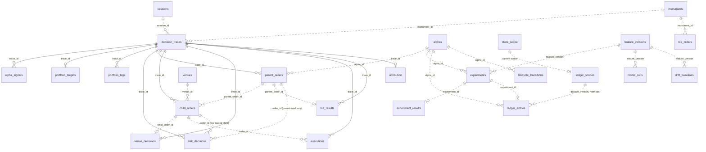

# Data model — `schemas/sql/iap_v2.sql` and `iap.store`

## 1. Purpose

The platform's decisions and research results live in flat files that are
the **source of truth**: the Parquet feature store (`data/features/`), the
JSON goldens (`tests/golden/`), the research JSON documents
(`research/alpha_reports/*.json`, `research/experiments.json`,
`research/experiments/<id>/`, `research/models/<run>/manifest.json`,
`research/baselines/*.json`, `research/tca/tca_orders.json`) and the JSONL
audits (`research/lifecycle_log.jsonl`, `research/lifecycle_transitions.jsonl`,
the paper-trading `risk_audit.jsonl`, the decision-trace JSONL a session's
`JsonlTraceSink` writes). They are deterministic, checksummed, reviewed and
archived; nothing in this document changes that.

The store is a **derived, rebuildable index** over those artefacts: one
relational schema (`schemas/sql/iap_v2.sql`, x-version 2) that every contract
of `iap.contracts` maps into, so that the questions the spec's observability
section asks — *why did we trade?*, *why was order X rejected?*, *what is the
multiple-testing denominator?*, *is live IC drifting from research IC?* —
are one query rather than one script each. Dropping the database loses
nothing: `python -m iap.store build` recreates it from the files in about a
second, and a rebuild from unchanged files is byte-identical
(`Store.export_jsonl`).

Design pins:

* **Contracts in, contracts out.** Every typed write is
  `validate_typed(instance)` first (JSON-schema validation, x-version check);
  every typed read is `T.from_dict(row)`, so a row that no longer satisfies
  its contract is an error, not a value.
* **Idempotent writes.** Every insert is an upsert by primary key inside one
  transaction per call; a decision trace is rewritten as a unit
  (delete-then-insert of every stage row that carries its `trace_id`).
  Importing twice leaves the counts unchanged.
* **No wall clock.** Every `*_ts` column is event or ledger time supplied by
  the writer (int64 ns). The DDL has no `NOW()`/`CURRENT_TIMESTAMP`, the
  Store has no `datetime.now()`.
* **Portable DDL.** The same file runs unchanged on SQLite 3 and
  PostgreSQL ≥ 13 (section 5).
* **Scope is a column, never an assumption** (x-version 2, v1.5.0). A
  research number belongs to the dataset it was computed on
  (`dataset_version`, the content hash) and the method bundle it was computed
  under (`methods`: `v2`, `legacy_v1` — `iap.validation.methods`). Since
  v1.4.0 the multiple-testing ledger is dataset-scoped and since v1.5.0 the
  bundle is part of an experiment's identity, so `experiments`,
  `experiment_results`, `ledger_entries` and `lifecycle_transitions` carry
  both, the scorecard and ledger views are grouped by them, and one row of
  `store_scope` names the **current** scope that the `*_current` views filter
  to. A synthetic dataset, an earlier dataset, the legacy bundle and an
  ingested real dataset are four scopes and four sets of rows; nothing is
  pooled across them (section 4.1).

## 2. Entity-relationship diagram

Source: [`diagrams/data_model.mmd`](diagrams/data_model.mmd) (also embedded
in [DIAGRAMS.md §7](DIAGRAMS.md)). Solid edges are declared foreign keys
(every normalized stage row of a decision trace references
`decision_traces`); dotted edges are logical references between
independently imported artefacts (an index over a subset of the artefacts
must never fail to load). Column lists in the diagram are abridged; the
tables below are complete.


```mermaid
erDiagram
    decision_traces ||--o{ alpha_signals : "trace_id"
    decision_traces ||--o| portfolio_targets : "trace_id"
    decision_traces ||--o{ portfolio_legs : "trace_id"
    decision_traces ||--o{ risk_decisions : "trace_id"
    decision_traces ||--o{ parent_orders : "trace_id"
    decision_traces ||--o{ child_orders : "trace_id"
    decision_traces ||--o{ venue_decisions : "trace_id"
    decision_traces ||--o{ executions : "trace_id"
    decision_traces ||--o{ tca_results : "trace_id"
    decision_traces ||--o| attribution : "trace_id"
    parent_orders ||..o{ child_orders : "parent_order_id"
    child_orders ||..o| venue_decisions : "child_order_id"
    child_orders ||..o{ executions : "order_id"
    parent_orders ||..o| tca_results : "parent_order_id"
    child_orders ||..o{ risk_decisions : "order_id (per routed child)"
    parent_orders ||..o{ risk_decisions : "order_id (parent-level loop)"
    sessions ||..o{ decision_traces : "session_id"
    instruments ||..o{ decision_traces : "instrument_id"
    venues ||..o{ child_orders : "venue_id"
    alphas ||..o{ parent_orders : "alpha_id"
    alphas ||..o{ experiments : "alpha_id"
    alphas ||..o{ ledger_entries : "alpha_id"
    alphas ||..o{ lifecycle_transitions : "alpha_id"
    experiments ||..o| experiment_results : "experiment_id"
    experiments ||..o| ledger_entries : "experiment_id"
    ledger_scopes ||..o{ ledger_entries : "dataset_version, methods"
    store_scope ||..o| ledger_scopes : "current scope"
    feature_versions ||..o{ experiments : "feature_version"
    feature_versions ||..o{ model_runs : "feature_version"
    feature_versions ||..o{ drift_baselines : "feature_version"
    instruments ||..o{ tca_orders : "instrument_id"
```

## 3. Tables

Types are the portable three: `BIGINT` (int64, u32, u16, enum-as-int, 0/1
booleans), `DOUBLE PRECISION`, `TEXT` (ids, sha256 hashes, enum names, JSON
documents in `canonical_json` form — sorted keys, no whitespace, ASCII).
`NN` = `NOT NULL`. Enum columns carry `CHECK (x IN (...))`; the contract
invariants that are expressible in SQL are `CHECK`s too, so a hand-written
`INSERT` cannot store what the contract would reject.

### 3.1 Reference and session data

| table | PK | columns | stores |
|---|---|---|---|
| `schema_version` | `x_version` | `x_version BIGINT ≥1`, `description TEXT` | one row, `2` — the DDL's x-version |
| `store_scope` | `scope` (always `current`) | `dataset_version`, `methods` | the CURRENT research scope, written by `build`: the `data_version` of `configs/strategies/alpha_params.json` and the default bundle (`iap.validation.methods.DEFAULT_METHODS`), or what `build --dataset-version / --methods` name. The `*_current` views filter to it; an empty table leaves them empty |
| `instruments` | `instrument_id` | `symbol TEXT UNIQUE`, `asset_class ∈ {EQUITY, ETF, FX}`, `currency`, `base_currency` (FX), `tick_size >0`, `lot_size ≥1`, `ref_price >0`, `adv ≥0`, `pip` (FX), `venues_json` (array of venue names), `underlying_json` (ETF constituents) | `configs/instruments/instruments.json` |
| `venues` | `venue_id` (1..65535) | `venue TEXT UNIQUE` (display name used by `explain`), `asset_class`, `taker_fee_per_share`, `maker_rebate_per_share`, `commission_per_million`, `latency_mean_ns ≥0`, `latency_jitter_ns ≥0`, `supports_json` | `configs/venues/venues.json` |
| `sessions` | `session_id` | `data_version`, `config_version` (sha256 hex), `seed ≥0`, `start_ts`, `end_ts ≥ start_ts`, `n_events ≥0` | one row per replay / paper / backtest session, written by the runner (`Store.insert_session`) |
| `feature_versions` | `feature_version` | `registry_hash`, `x_version ≥1`, `n_features ≥0`, `registry_json` (the feature list) | `data/reference/feature_registry.json`; `feature_version` is the hash `iap.experiment.tracker.feature_version()` stamps on every `FeatureVector` |
| `alphas` | `alpha_id` | `asset_class ∈ {EQUITY, FX}`, `family` (the alpha's pinned name, e.g. `ofi_multilevel`), `horizon`, `economic_rationale` (the class docstring section, `iap.alpha`), `current_state ∈ LifecycleState names` | `research/alpha_reports/<ID>.json` + `iap.alpha.ALPHA_CLASSES`; state from `research/alpha_registry.json` / `lifecycle_transitions.jsonl` |

### 3.2 Research

| table | PK | columns | stores |
|---|---|---|---|
| `experiments` | `experiment_id` | `alpha_id`, `dataset_version`, `feature_version`, `model_version` (NULL = unfitted), `configuration_json`, `train_start_ts ≤ train_end_ts ≤ validation_start_ts ≤ validation_end_ts ≤ test_start_ts ≤ test_end_ts` (chained CHECKs), `seed ≥0`, `horizon`, `methods NN` (the bundle: `configuration["methods"]` for a runner spec, the bundle of its ledger entry for an alpha report, `legacy_v1` for a spec that names none) | `ExperimentSpec` (`schemas/research/experiment_spec.schema.json`) |
| `experiment_results` | `experiment_id` | `alpha_id`, `dataset_version`, `feature_version`, `model_version`, `ic`, `rank_ic`, `t_stat`, `nw_lags ≥0`, `hit_rate ∈[0,1]`, `turnover ≥0`, `gross_return_bps`, `transaction_cost_bps ≥0`, `net_return_bps`, `max_drawdown_bps ≥0`, `sharpe`, `fold_consistency ∈[0,1]`, `n_folds ≥0`, `leakage_passed ∈{0,1}`, `leakage_detail_json`, `hypothesis_sign_confirmed ∈{0,1,NULL}`, `verdict ∈ {PROMOTE, ITERATE, REJECT}`, `n_experiments_in_ledger ≥0`, `git_commit`, `created_ts ≥0`, `methods NN` (the bundle of the experiment's spec — the contract does not carry it, so `Store.insert_experiment_result` takes it from the stored spec or from `methods=` and refuses a result with neither); `CHECK (leakage_passed = 1 OR verdict = 'REJECT')` | `ExperimentResult` (`schemas/research/experiment_result.schema.json`); `net = gross − cost` is enforced by the contract on write |
| `ledger_entries` | `ledger_key` (sha256 of alpha/kind/config, plus the dataset version for entries written since the ledger became dataset-scoped in v1.4.0) | `alpha_id` (`ALL` for program-wide scans), `kind`, `dataset_version NN` (the entry's stamp, else the one inside its config for `experiment_runner`, else `unstamped`), `methods NN` (`config.methods`, else `config.configuration.methods`, else `legacy_v1`: an entry recorded before v1.5.0 names no bundle), `experiment_id` (the `experiments` row the entry is the ledger record of: `key[:16]` for `promotion_pipeline`, the config's id for `experiment_runner`, else NULL), `gate_looks` (the ledger look count the entry's PROMOTE threshold was derived from; NULL = not recorded), `promote_t_threshold` (the \|t\| the entry was judged at: `max(3.0, Bonferroni \|t\| at gate_looks)`; the fixed 3.0 for a pipeline / runner entry of a fixed-threshold bundle; else NULL), `config_json`, `count ≥1` (looks this key represents), `n ≥0` (ledger position at registration), `reruns ≥0`, `oos_ic`, `nw_tstat`, `verdict` (promotion entries; NULL otherwise), `result_json` | `research/experiments.json` `entries[]` — the multiple-testing ledger (spec §13) — and any further ledger passed to `build --ledger` (the one an ingested dataset keeps in its own directory). `SUM(count)` = `total_experiments`, `COUNT(*)` = `distinct_experiments`; within one `(dataset_version, methods)` they are that scope's |
| `ledger_scopes` | `(dataset_version, methods)` | `n_entries ≥1`, `looks ≥1` (Σ `count` in the scope), `bonferroni_t_threshold` (the two-sided Bonferroni \|t\| at `looks`, α = 0.05) | a summary of `ledger_entries`, rewritten whole by the ledger importer. The threshold is stored because the inverse normal is not portable SQL. It is what the scope ALONE would demand; the threshold an entry was actually judged at counts every look the ledger held at the time and is the entry's `promote_t_threshold` |
| `lifecycle_transitions` | `(alpha_id, policy, event_ts, from_state, to_state, source)` | `from_state`, `to_state` ∈ state names, `from ≠ to`, `source ∈ {lifecycle_log, lifecycle_transitions, archive/<file>, api}`, `reason`, `gates_json` ({name: GateResult}), `actor ∈ {SYSTEM, HUMAN}`, `eval_index` (lifecycle_log only), `dataset_version`, `methods` (the scope the transition was decided in; NULL = not recorded by the writer) | `LifecycleTransition` (`schemas/alpha/lifecycle_transition.schema.json`). `source` says which artefact the row came from: the research policy comparison, the lifecycle service's ledger, an archived ledger of an earlier dataset or bundle (`research/archive`), or a live write |
| `model_runs` | `run_id` (= manifest `experiment_id`) | `name`, `model_version`, `data_version`, `feature_version`, `git_commit`, `git_dirty ∈{0,1,NULL}`, `train_start_ts ≤ train_end_ts`, `test_start_ts ≤ test_end_ts`, `hyperparams_json`, `hardware_json`, `manifest_json` (whole manifest), `metrics_json` (whole metrics document), lifted scalars `mean_ic`, `mean_rank_ic`, `ic_tstat`, `pooled_ic`, `auc_test`, `brier_test` | `research/models/ledger.json` + `<run_id>/manifest.json` (+ `metrics.json`) — docs/governance/REPRODUCIBILITY.md |
| `drift_baselines` | `name` | `alpha_id`, `kind ∈ {feature, signal, ic}`, `x_version`, `feature_version`, `source`; histogram baselines: `n`, `n_buckets`, `mean`, `std`, `min_value`, `max_value`, `psi_eps`, `edges_json`, `expected_frac_json`; IC baselines: `horizon`, `baseline_kind`, `bucket_ns`, `ic_mean`, `ic_std`, `n_buckets_baseline` | `research/baselines/*.json` (API_ADAPTIVE PSI / rolling-IC baselines) |
| `tca_orders` | `order_id` | `instrument_id`, `side ∈ {BUY, SELL}`, `qty_target >0`, `qty_filled ≥0`, `fill_rate`, `n_fills`, `decision_mid`, `arrival_mid`, `end_mid`, `fill_vwap` (NULL if unfilled), Perold `total_is_bps`, `delay_bps`, `trading_bps`, `opportunity_bps` and their currency twins, `spread_cost`, `impact_cost`, `timing_cost`, `arrival_slippage_bps`, `vwap_slippage_bps`, `twap_slippage_bps`, `execution_alpha_vs_vwap_bps` (nullable markouts), `adverse_selection_json` | `research/tca/tca_orders.json` — the TCA_REPORT.md research harness. **Not** `TCAResult` rows: the harness records neither an algo nor latency and its prices are research-layer doubles in real price units, so mapping it into the contract would have meant inventing values |

### 3.3 Decision traces (the observability chain)

| table | PK | columns | stores |
|---|---|---|---|
| `decision_traces` | `trace_id` (32 hex, `make_trace_id`) | `session_id`, `instrument_id ≥0`, `event_ts`, `sequence ≥0`, `data_version`, `feature_version`, `model_version`, `config_version`, `stages_json` (canonical JSON of `TraceStages`) | the validated `DecisionTrace` document (`schemas/trace/decision_trace.schema.json`); `get_trace` rebuilds it from the header columns + `stages_json` |
| `alpha_signals` | `(trace_id FK, signal_index)` | `timestamp`, `instrument_id`, `expected_return`, `confidence ∈[0,1]`, `horizon_ns`, `direction ∈{-1,0,1}`, `model_version` | `AlphaSignal` — position `signal_index` in `stages.signal` |
| `portfolio_targets` | `trace_id FK` | `strategy_id`, `timestamp_ns`, `portfolio_version`, `feature_version`, `model_version`, `solver_status ∈ {OPTIMAL, INFEASIBLE, MAX_ITER}`, `objective_value`, `turnover ≥0`, `targets_json` | `PortfolioTarget` (at most one per trace) |
| `portfolio_legs` | `(trace_id FK, instrument_id)` | `target_qty`, `target_weight`, `expected_return_bps`, `prev_qty` | `PortfolioLeg` — one row per target |
| `risk_decisions` | `(trace_id FK, risk_index)` | `order_id`, `strategy_id`, `instrument_id`, `timestamp_ns`, `decision ∈ {1 ALLOW, 2 REJECT, 3 KILL}`, `rule_id`, `rule_index ∈[-1, 65535]`, `reason`; `CHECK ((decision = 1 AND rule_index = -1) OR (decision <> 1 AND rule_index >= 0))` | `RiskDecision` |
| `parent_orders` | `parent_order_id` | `trace_id FK`, `strategy_id`, `alpha_id`, `instrument_id`, `side ∈{0 BID, 1 ASK}`, `qty ≥1`, `algo ∈ {TWAP, VWAP, POV, IS}`, `decision_ts ≤ arrival_ts ≤ end_ts`, `urgency ∈[0,1]`, `limit_price_ticks ≥0`, `params_json` | `ParentOrder` |
| `child_orders` | `child_order_id` | `trace_id FK`, `parent_order_id`, `instrument_id`, `venue_id` (0 = SOR decides), `side`, `qty ≥1`, `price_ticks ≥0`, `order_type ∈[1,6]`, `submit_ts`, `expire_ts` (0 = parent end), `slice_index`; `CHECK (expire_ts = 0 OR expire_ts >= submit_ts)`, `CHECK (order_type <> 1 OR price_ticks = 0)` | `ChildOrder` |
| `venue_decisions` | `child_order_id` | `trace_id FK`, `venue_id` (0 = NO_ROUTE), `reason`, `candidates_json` (array of `VenueScore`) | `VenueDecision` |
| `executions` | `execution_id` | `trace_id FK`, `order_id` (the child), `parent_order_id` (resolved through the trace's child orders; NULL if unknown), `status ∈[1,6]`, `filled_qty ≥0`, `fill_price_ticks ≥0`, `venue_id`, `exchange_ts ≤ receive_ts`, `fees` (negative = rebate); `CHECK` fill status ⇔ `filled_qty > 0` | `ExecutionReport` |
| `tca_results` | `parent_order_id` | `trace_id FK`, `instrument_id`, `side`, `qty ≥1`, `filled_qty ≥0`, `fill_rate ∈[0,1]`, `arrival_price_ticks`, `avg_fill_price`, `interval_vwap`, `interval_twap`, `implementation_shortfall_bps`, `delay_cost_bps`, `trading_cost_bps`, `opportunity_cost_bps`, `spread_cost_bps`, `impact_bps`, `fees_bps`, `timing_cost_bps`, `slippage_bps`, `participation_rate ∈[0,1]`, `n_fills`, `venue_contribution_json` ({decimal venue id: bps}), `algo`, `latency_min_ns ≤ latency_p50_ns ≤ latency_p99_ns ≤ latency_max_ns`, `latency_mean_ns` | `TCAResult` (`LatencyStats` flattened into the five `latency_*` columns; the Perold identities are enforced by the contract on write) |
| `attribution` | `trace_id FK` | `parent_order_id` (first parent order of the trace), `alpha_bps`, `spread_bps`, `impact_bps`, `fees_bps`, `timing_bps`, `total_bps` | `Attribution` (`total == sum` enforced by the contract) |

Indexes cover the query paths of section 7: traces by `(session_id,
event_ts, sequence)` and `(instrument_id, event_ts)`; orders by `trace_id`,
`(alpha_id, decision_ts)` and `algo`; children by `(parent_order_id,
slice_index)`; risk decisions by `(order_id, timestamp_ns)` and `(decision,
rule_id)`; executions by `(order_id, exchange_ts)` and `parent_order_id`;
TCA by `(algo, instrument_id)`; results by `(alpha_id, created_ts)`; ledger
entries by `(alpha_id, kind)`; transitions by `(alpha_id, event_ts)`;
baselines by `(alpha_id, kind)`; model runs by `(model_version,
data_version)`.

Nested record types (`MarketEventRef`, `BookSnapshotRef`, `FeatureVectorRef`,
`PortfolioLeg`, `VenueScore`, `LatencyStats`, `Period`, `GateResult`,
`TraceStages`) have no table of their own: they are embedded (flattened
columns or JSON) in their parent's row.

## 4. Views

| view | one row per | joins |
|---|---|---|
| `v_order_chain` | parent order | `parent_orders` → `decision_traces` header → the trace's first `alpha_signals` row for the order's instrument (`signal_expected_return`, `signal_confidence`, `signal_model_version`) → `portfolio_targets`/`portfolio_legs` (`portfolio_solver_status`, `portfolio_target_qty`) → the `risk_decisions` rows of the order's **children** (risk is decided per routed child, conventions §11.4; the parent id itself also matches, for a loop without a child stage such as the Java paper loop) aggregated as `risk_decision` = `MAX(decision)` (REJECT/KILL if any child was rejected/killed, else ALLOW; NULL when nothing was checked), `risk_rule_id` / `risk_reason` = the first rejecting row (lowest `risk_index`), else the first row (`rule_id` is `''` on ALLOW), `n_children_allowed`, `n_children_rejected` → counts over `child_orders` / `venue_decisions` (`n_child_orders` — submitted children only, a control-blocked child never enters the trace; `n_venues_routed`) → `executions` (`n_fills` = PARTIAL/FILLED reports only, `filled_qty`, `fees`) → `tca_results` (`tca_fill_rate`, `implementation_shortfall_bps`, the cost split) → `attribution` (`attribution_*_bps`). This is the spec's observability chain *signal → portfolio → risk → order → children → fills → TCA → attribution* as one row; `Store.explain(order_id)` renders the same chain as text |
| `v_alpha_scopes` | alpha and scope | every `(alpha_id, dataset_version, methods)` the store knows: a scope with an experiment result, a scope with a ledger entry of a registered alpha, and the current scope for every registered alpha (so the current scorecard lists an alpha with no result yet). `UNION` of the three |
| `v_alpha_scorecard` | alpha **and scope** `(dataset_version, methods)` | `v_alpha_scopes` → `alphas` → the latest `experiment_results` row **of that scope** (max `created_ts`, ties broken by the greatest `experiment_id`) with the `gate_looks` and `promote_t_threshold` of its ledger entry → the alpha's ledger share in the scope (`ledger_entries`, `ledger_count` = Σ `count`) → the scope's `scope_looks` and `scope_bonferroni_t` (`ledger_scopes`) → the scope's latest `promotion_pipeline` ledger entry (`pipeline_verdict`, `pipeline_oos_ic`, `pipeline_nw_tstat`, `pipeline_gate_looks`, `pipeline_t_threshold` — the report pipeline's verdict, and the only record of a scope whose reports are no longer on disk) → `n_results`, `n_transitions` in the scope. `is_current` = 1 on the `store_scope` scope; `current_state` is the registry state on that scope and NULL on every other (an earlier scope has no live state) |
| `v_alpha_scorecard_current` | alpha | `v_alpha_scorecard WHERE is_current = 1`: one row per registered alpha, never a number of another dataset or bundle |
| `v_experiment_ledger_summary` | scope and ledger `kind` | `dataset_version`, `methods`, `is_current`, `n_entries`, `n_alphas`, `total_count`, `total_reruns`, `n_promote` / `n_iterate` / `n_reject`, `max_nw_tstat`, `max_oos_ic`, `max_gate_looks`, `max_promote_t_threshold`, `scope_looks`, `scope_bonferroni_t`. `SUM(total_count)` over the view is the Bonferroni denominator of the whole ledger; within one scope it is `scope_looks` |
| `v_experiment_ledger_summary_current` | ledger `kind` | `v_experiment_ledger_summary WHERE is_current = 1` |

Views use only correlated scalar subqueries (`IN (SELECT …)` / `EXISTS`
subqueries included), `COALESCE`, `CASE`, `COUNT`/`SUM`/`MIN`/`MAX`, `UNION`
and standard joins, so they read identically on both engines. A view that
reads another view is dropped before it and created after it (PostgreSQL
refuses to drop a view another depends on).

### 4.1 Scope: what the scorecard shows, and what it never does

The v1 scorecard had one row per alpha and chose "the latest result" over
every dataset and bundle in the store, and its `ledger_count` summed every
look ever recorded for the alpha: for EQ03 it read `ic 0.0271`, `432` — a
legacy-rules result of the current dataset next to a count pooled over two
datasets and two bundles. From x-version 2 the same alpha is three rows:

| scope | `ic` | `t_stat` | judged at | `ledger_count` | `scope_looks` |
|---|---|---|---|---|---|
| `116b7787…` / `v2` (**current**) | 0.0132 | 2.41 | \|t\| ≥ 4.370 at a look count of 4,020 | 256 | 3,236 |
| `116b7787…` / `legacy_v1` | 0.0271 | 4.84 | the fixed 3.0 | 88 | 852 |
| `203c8f54…` / `legacy_v1` | 0.0165 | 4.25 | the fixed 3.0 | 88 | 1,068 |

(v1.5.0 snapshot; 256 + 88 + 88 = the 432 the v1 view printed.) Rules:

* **Which looks apply.** `ledger_count` is the alpha's looks in the scope;
  `scope_looks` every look made in the scope; `scope_bonferroni_t` the
  Bonferroni \|t\| at `scope_looks`. The threshold a result was *judged* at is
  `promote_t_threshold` (`pipeline_t_threshold` for the report pipeline's
  entry): under the `v2` bundle it is `max(3.0, Bonferroni |t| at gate_looks)`
  where `gate_looks` is the whole ledger's count when the run was recorded —
  the denominator only grows, across datasets too — and under `legacy_v1` it
  is the fixed 3.0 those results were judged at. A reader who wants "the
  scope alone" compares `t_stat` with `scope_bonferroni_t`; nothing is
  re-judged by the view.
* **`verdict` and `pipeline_verdict`.** `verdict` is that of the latest
  experiment result in the scope (max `created_ts`, then the greatest
  `experiment_id`), which for the three alphas that have `ExperimentRunner`
  experiments is one of those, not the alpha report; `pipeline_verdict`
  is the alpha-report pipeline's ledger verdict in the scope, the one the
  headline "11 ITERATE / 13 REJECT" counts.
* **The current scope** is one row of `store_scope`: the dataset of
  `configs/strategies/alpha_params.json` and the default bundle. `build
  --dataset-version / --methods` name another one; the read commands select
  a scope per call (section 8).
* **Legacy and archived records** import under their own scope and stay out
  of the current numbers: the ledger entries of the pre-v1.4.0 dataset and
  of the legacy bundle; the runner experiments recorded under either; and
  the archived lifecycle ledgers under `research/archive`
  (`lifecycle_transitions.dataset-<hash prefix>[.methods-<bundle>].jsonl`,
  `source = archive/<file>`), which never set `alphas.current_state`.
* **An ingested dataset** keeps its ledger in its own directory;
  `build --ledger <path>` indexes it. Its `dataset_version` is its own, so
  its rows form their own scopes and are never added to a synthetic
  dataset's counts.

## 5. SQLite ↔ PostgreSQL portability rules

`schemas/sql/iap_v2.sql` runs unchanged on SQLite 3 and PostgreSQL ≥ 13.
Since CI has no PostgreSQL, `tests/test_store.py::test_ddl_is_portable_by_whitelist`
parses the DDL and enforces this subset:

| rule | why |
|---|---|
| Column types are exactly `BIGINT`, `DOUBLE PRECISION`, `TEXT` | SQLite maps `BIGINT` to INTEGER affinity (64-bit) and the other two to REAL / TEXT affinity; PostgreSQL has them natively. No `INTEGER` (32-bit on PostgreSQL), `REAL`/`FLOAT`, `VARCHAR(n)`, `BOOLEAN`, `TIMESTAMP`, `JSON`/`JSONB` |
| Booleans are `BIGINT CHECK (x IN (0, 1))` | SQLite has no boolean type; PostgreSQL's `BOOLEAN` rejects integer literals |
| Ids come from the platform — no `AUTOINCREMENT`, `SERIAL`, `IDENTITY` | order-id sequences, content hashes and `make_trace_id` are deterministic; a database-allocated id would not be |
| Statement forms: `CREATE TABLE IF NOT EXISTS`, `CREATE INDEX IF NOT EXISTS`, `DROP VIEW IF EXISTS` + `CREATE VIEW`, `INSERT INTO … SELECT … WHERE NOT EXISTS` | idempotent on both engines; `CREATE OR REPLACE VIEW` is not SQLite, `CREATE VIEW IF NOT EXISTS` is not PostgreSQL, `INSERT OR REPLACE` is SQLite-only and `ON CONFLICT` syntax differs |
| Constraints: `PRIMARY KEY`, `UNIQUE`, `REFERENCES`, `CHECK`, `NOT NULL` | standard SQL; PostgreSQL enforces FKs always, the Python Store turns on `PRAGMA foreign_keys` so SQLite does too |
| No `::casts`, `ILIKE`, `LATERAL`, `DISTINCT ON`, `NULLS FIRST/LAST`, `IIF()`, `STRFTIME`, `WITHOUT ROWID`, `PRAGMA`, backticks, double-quoted identifiers, `NOW()` / `CURRENT_TIMESTAMP` | engine-specific or wall clock |
| Comments are `--` lines; every statement ends with `;`; no `;` inside string literals | the splitter in `iap.store.ddl` is a few lines and the same on every port |

Engine-specific code stays in the writer, not the DDL: the Python `Store`
upserts with `INSERT OR REPLACE`; a PostgreSQL writer would use `INSERT …
ON CONFLICT (pk) DO UPDATE`. The u64 contract fields (`event_id`,
`order_id`, `sequence`) fit `BIGINT` because the platform never allocates
above 2⁶³−1 (the reserved synthetic-id range `≥ 0xFFFF000000000000` never
reaches a contract).

## 6. How the store relates to the flat-file artefacts

The files are the truth; the store is an index of them. Concretely:

| artefact | importer | into | notes |
|---|---|---|---|
| `configs/instruments/instruments.json`, `configs/venues/venues.json`, `data/reference/feature_registry.json` | `import_reference` | `instruments`, `venues`, `feature_versions` | |
| `configs/strategies/alpha_params.json` (`data_version`) + `iap.validation.methods.DEFAULT_METHODS` | `resolve_current_scope` (first step of `import_all`) | `store_scope` | the current scope; `build --dataset-version / --methods` override either part |
| `research/experiments.json`, and each `build --ledger <path>` | `import_experiments_ledger` | `ledger_entries`, `ledger_scopes` | one row per distinct key, filed under its scope (`ledger_entry_scope`); a non-finite `oos_ic`/`nw_tstat` stores NULL with a warning; `ledger_scopes` is rebuilt over every entry in the store |
| `research/alpha_reports/<ID>.json` | `import_alpha_reports` | `alphas`, `experiments`, `experiment_results` | the pinned mapping below, filed under the dataset of `alpha_params.json` and the bundle of the report's ledger entry (the entry of that dataset under the default bundle is preferred, as in the registry); a report with a non-finite metric still registers its alpha but its experiment rows are skipped and reported in `ImportReport.warnings` — the importer never raises on data |
| `research/experiments/<id>/spec.json`, `result.json` | `import_experiment_documents` | `experiments`, `experiment_results` | the ExperimentRunner's own contract documents, validated on read; filed under the spec's `dataset_version` and `configuration["methods"]` (`legacy_v1` when it names none) |
| `research/lifecycle_log.jsonl` | `import_lifecycle_log` | `lifecycle_transitions` (`source = lifecycle_log`) | the ACTIVE/WATCH/RETIRED sub-machine's policy comparison (`iap.adaptive.lifecycle`), one simulated deployment per policy, filed under the current scope; **never** changes `alphas.current_state` |
| `research/lifecycle_transitions.jsonl` | `import_lifecycle_transitions` | `lifecycle_transitions` (`source = lifecycle_transitions`), `alphas.current_state` | the lifecycle service's ledger, filed under the current scope; the latest `to_state` per alpha becomes the state. Absent file = a warning |
| `research/archive/lifecycle_transitions.dataset-<prefix>[.methods-<bundle>].jsonl` | `import_lifecycle_archive` | `lifecycle_transitions` (`source = archive/<file>`) | the lifecycle ledgers of earlier datasets and bundles, filed under the scope the file name states (the prefix is resolved against the ledger's datasets; no `methods` part = `legacy_v1`); **never** changes `alphas.current_state` |
| `research/alpha_registry.json` | `import_alpha_registry` | `alphas.current_state` | the service's authoritative state, applied last |
| `research/tca/tca_orders.json` | `import_tca_orders` | `tca_orders` | research harness rows, real price units |
| `research/models/ledger.json` + `<run>/manifest.json`, `metrics.json` | `import_model_runs` | `model_runs` | a run without a manifest is skipped with a warning |
| `research/baselines/*.json` | `import_baselines` | `drift_baselines` | |
| a session's trace JSONL / live `TraceSink` | `Store.insert_trace` / `iap.trace.StoreTraceSink` | `decision_traces` + the stage tables | the JSONL file (and its `TraceDigest`) is the durable record; the store rows are its index |

`import_all` runs them in that order (alpha rows must exist before the
state writers run). Each importer returns an `ImportReport(inserted={table:
n}, warnings=(…))`.

**Alpha report → `ExperimentSpec` / `ExperimentResult` (pinned, shared with
the registry).** The report format predates the contracts and records neither
the dataset hash, the feature hash, a seed nor a git commit, so the mapping is
explicit about what it derives and what it cannot know. There is **one**
mapping: `iap.lifecycle.bootstrap.research_evidence` (the result) +
`alpha_report_spec` (the spec), which `python -m iap.lifecycle bootstrap`
builds the registry from and `import_alpha_reports` calls — so the registry's
`experiment_id` / gate values and the store's `experiment_results` row of an
alpha are the same numbers (`test_store_rows_equal_the_registry_evidence_for_every_alpha`
asserts it for all 24; docs/LIFECYCLE.md §6):

| result field | from the report |
|---|---|
| `ic` | `gate_ic` — the pooled uncrossed IC the PROMOTE gate reads (`oos_ic_uncrossed` when finite, else `oos_ic`) |
| `t_stat` | `gate_tstat` — the t the PROMOTE gate read: the HAC t of the pooled slope under the default methods (v1.5.0). A report written before v1.5.0 has no such key: `nw_tstat_uncrossed` when finite, else `nw_tstat` |
| `rank_ic`, `nw_lags`, `hit_rate`, `turnover` | `oos_rank_ic`, `nw_lags`, `oos_hit_rate`, `turnover_flips_per_hour` |
| `fold_consistency`, `n_folds`, `leakage_passed`, `leakage_detail`, `hypothesis_sign_confirmed`, `verdict` | `fold_sign_consistency`, `n_folds_run`, `leakage.passed`, `leakage`, `hypothesis_confirmed`, `verdict` |
| `net_return_bps`, `transaction_cost_bps`, `gross_return_bps` | `stress.cost.x1.total_pnl` and `total_costs` in USD, expressed in **bps of the 1e6 USD reference notional** (`REFERENCE_NOTIONAL_USD`; `gross = net + cost`; only the sign is gated; the basis is recorded as `configuration.pnl_basis`) |
| `max_drawdown_bps`, `sharpe` | **not recorded** by the report: stored as `0.0` and listed in `configuration.unrecorded` |
| `experiment_id`, `n_experiments_in_ledger` | the alpha's `promotion_pipeline` ledger entry on the dataset `alpha_params.json` names, under the default methods: `key[:16]` and `n` (`<ID>-unledgered` / `0` without one) |
| `dataset_version`, `feature_version`, `git_commit`, `model_version` | `configs/strategies/alpha_params.json`: `data_version`, `feature_version`, `git_commit`, `content_hash(params[ID])` (explicit `dataset_version` / `feature_version` arguments to `import_alpha_reports` override the document, for a tree without it) |
| `created_ts` | the last fold's `test_end` |
| spec `configuration` | `source`, `protocol`, `gates`, `n_folds`, `folds` (the per-fold windows), `universe`, `capacity_usd` (Σ `capacity_usd_by_instrument`: the edge-breakeven capacity under the default methods), `pnl_basis`, `ic_source`, `t_stat_source`, `experiment_id_source`, `version_sources`, `unrecorded` |
| spec `seed`, periods | `0` and empty train/validation periods; `test_period` spans the first fold's `test_start` to the last fold's `test_end` |

An `ExperimentRunner` document (`research/experiments/<id>/`) keeps its own
`experiment_id = content_hash(spec without id)[:16]` (research/experiments/README.md);
a report-mapped row is identified by its ledger key so the two artefacts of an
alpha can be joined.

**Lifecycle log → `LifecycleTransition` (pinned).** A move to a lower state
(WATCH → ACTIVE, RETIRED → WATCH) *passed* the `reactivate_ic` gate
(threshold `reactivate_ic_gate` = 0.005); a move to a higher state (ACTIVE →
WATCH, WATCH → RETIRED) *failed* the `watch_ic` gate (threshold
`watch_ic_gate` = 0.0); the gate value is the row's `rolling_ic`; `actor` is
`SYSTEM`; `eval_index` is kept in its own column.

## 7. Query cookbook

All five run against the store `python -m iap.store build` produces
(`python -m iap.store sql --db data/store/iap.sqlite "<query>"` prints one
canonical JSON line per row). Queries 2 and 3 need decision traces in the
store — a paper/backtest session's `StoreTraceSink`, or, to try them,
`Store.insert_trace(iap.contracts.examples.example_trace())`.

**1. Alpha scorecard** — every flagship alpha in the CURRENT scope with its
latest result, the threshold it was judged at, its lifecycle state and its
share of the scope's looks; then one alpha across every scope:

```sql
SELECT alpha_id, current_state, verdict, ROUND(ic, 4) AS ic,
       ROUND(t_stat, 2) AS t_stat, ROUND(promote_t_threshold, 3) AS t_threshold,
       gate_looks, leakage_passed, ledger_count, scope_looks
FROM v_alpha_scorecard_current
ORDER BY alpha_id;
-- {"alpha_id":"EQ01","current_state":"CANDIDATE","gate_looks":4104,"ic":-0.0019,"leakage_passed":1,"ledger_count":172,"scope_looks":3236,"t_stat":-0.22,"t_threshold":4.374,"verdict":"REJECT"}
-- {"alpha_id":"EQ02","current_state":"CANDIDATE","gate_looks":3936,"ic":0.0251,"leakage_passed":1,"ledger_count":84,"scope_looks":3236,"t_stat":7.17,"t_threshold":4.365,"verdict":"ITERATE"}
-- {"alpha_id":"EQ03","current_state":"CANDIDATE","gate_looks":4020,"ic":0.0132,"leakage_passed":1,"ledger_count":256,"scope_looks":3236,"t_stat":2.41,"t_threshold":4.37,"verdict":"ITERATE"}
-- ...  (24 rows; v1.5.0 snapshot)

SELECT alpha_id, substr(dataset_version, 1, 8) AS dataset, methods, is_current, verdict,
       ROUND(ic, 4) AS ic, ROUND(t_stat, 2) AS t_stat,
       ROUND(promote_t_threshold, 3) AS t_threshold, ledger_count, scope_looks
FROM v_alpha_scorecard
WHERE alpha_id = 'EQ03'
ORDER BY dataset_version, methods;
-- {"alpha_id":"EQ03","dataset":"116b7787","ic":0.0271,"is_current":0,"ledger_count":88,"methods":"legacy_v1","scope_looks":852,"t_stat":4.84,"t_threshold":3.0,"verdict":"ITERATE"}
-- {"alpha_id":"EQ03","dataset":"116b7787","ic":0.0132,"is_current":1,"ledger_count":256,"methods":"v2","scope_looks":3236,"t_stat":2.41,"t_threshold":4.37,"verdict":"ITERATE"}
-- {"alpha_id":"EQ03","dataset":"203c8f54","ic":0.0165,"is_current":0,"ledger_count":88,"methods":"legacy_v1","scope_looks":1068,"t_stat":4.25,"t_threshold":3.0,"verdict":"ITERATE"}
-- (v1.5.0 snapshot. Each row is one scope: the result, the threshold it was judged at and the looks of that
--  scope alone. EQ01, EQ03 and EQ06 also have ExperimentRunner experiments, and their "latest result" in
--  a scope (max created_ts, then the greatest experiment_id) is one of those — for EQ03 in the current
--  scope 838e0c2d75de4db6, judged at a look count of 4,020. The alpha-report pipeline's own verdict is
--  pipeline_verdict / pipeline_nw_tstat / pipeline_t_threshold: for EQ03 ITERATE, t 5.93 against 4.365 at
--  a look count of 3,936. EQ03's ledger_count of 256 in the current scope is 84 for the report, 2 x 84 for its two v2 runner
--  experiments and 4 adaptive deployments.)
```

**2. Why was order X rejected?** — the risk verdict of a parent order
aggregated over its routed children (risk is decided per child, §11.4), then
the per-child rows; `Store.explain(12345)` renders the same chain as text
(`Risk: ALLOW …` / `Risk: REJECT  rule = RATE_THROTTLE  reason = …`):

```sql
SELECT parent_order_id, alpha_id, qty, algo, risk_decision, risk_rule_id,
       risk_reason, n_children_allowed, n_children_rejected, n_child_orders, n_fills
FROM v_order_chain
WHERE parent_order_id = 12345;
-- {"algo":"POV","alpha_id":"EQ03","n_child_orders":3,"n_children_allowed":1,"n_children_rejected":0,"n_fills":3,"parent_order_id":12345,"qty":20000,"risk_decision":1,"risk_reason":"all checks passed","risk_rule_id":""}

SELECT r.order_id, r.decision, r.rule_id, r.rule_index, r.reason
FROM risk_decisions r
JOIN parent_orders po ON po.trace_id = r.trace_id
WHERE po.parent_order_id = 12345
ORDER BY r.risk_index;
-- one row per risk decision of the order's trace — per routed child in the MVP, on the parent id in a loop
-- without a child stage (the example trace: {"decision":1,"order_id":12345,"reason":"all checks passed","rule_id":"","rule_index":-1});
-- every child of the bundled MVP run is ALLOWed (risk_rejected = 0); a REJECTed one reads decision 2 with its rule_id / rule_index
```

**3. Implementation shortfall by algo** — the TCA cost split per execution
algorithm over every traced parent order:

```sql
SELECT algo, COUNT(*) AS n_orders,
       ROUND(AVG(implementation_shortfall_bps), 3) AS avg_is_bps,
       ROUND(AVG(spread_cost_bps), 3) AS avg_spread_bps,
       ROUND(AVG(impact_bps), 3) AS avg_impact_bps,
       ROUND(AVG(fill_rate), 3) AS avg_fill_rate
FROM tca_results
GROUP BY algo
ORDER BY algo;
-- {"algo":"POV","avg_fill_rate":0.9,"avg_impact_bps":0.5,"avg_is_bps":2.1,"avg_spread_bps":0.8,"n_orders":1}
```

**4. Drift: research IC vs the deployed baseline** — the rolling-IC baseline
the live monitor compares against (`alpha_rolling_ic`), next to the latest
research IC:

```sql
SELECT b.alpha_id, b.horizon, ROUND(b.ic_mean, 4) AS baseline_ic,
       ROUND(b.ic_std, 4) AS baseline_ic_std, ROUND(s.ic, 4) AS research_ic,
       ROUND(s.ic - b.ic_mean, 4) AS gap
FROM drift_baselines b
JOIN v_alpha_scorecard_current s ON s.alpha_id = b.alpha_id
WHERE b.kind = 'ic'
ORDER BY b.alpha_id;
-- {"alpha_id":"EQ03","baseline_ic":0.0161,"baseline_ic_std":0.0604,"gap":-0.0029,"horizon":"5s","research_ic":0.0132}   (v1.5.0 snapshot; research_ic is the current-scope scorecard row described under query 1)
```

**5. The multiple-testing denominator** — what every promotion claim is
Bonferroni-corrected against (`research/experiments.json` `total_experiments`
/ `distinct_experiments`, reproduced from the rows):

```sql
SELECT COUNT(*) AS distinct_experiments, SUM(count) AS total_experiments,
       ROUND(0.05 / SUM(count), 8) AS bonferroni_p
FROM ledger_entries;
-- {"bonferroni_p":9.7e-06,"distinct_experiments":216,"total_experiments":5156}   (v1.5.0 snapshot; the ledger only grows: v1.4.0 read 139 / 1920)

SELECT substr(dataset_version, 1, 8) AS dataset, methods, n_entries, looks,
       ROUND(bonferroni_t_threshold, 3) AS bonferroni_t
FROM ledger_scopes ORDER BY dataset_version, methods;
-- {"bonferroni_t":4.018,"dataset":"116b7787","looks":852,"methods":"legacy_v1","n_entries":69}
-- {"bonferroni_t":4.322,"dataset":"116b7787","looks":3236,"methods":"v2","n_entries":77}
-- {"bonferroni_t":4.071,"dataset":"203c8f54","looks":1068,"methods":"legacy_v1","n_entries":70}
-- (v1.5.0 snapshot: the 5,156 looks, by scope. bonferroni_t is the |t| each scope alone would demand.)

SELECT kind, n_entries, n_alphas, total_count, n_promote, n_iterate, n_reject,
       max_gate_looks, ROUND(max_promote_t_threshold, 3) AS max_t_threshold
FROM v_experiment_ledger_summary_current ORDER BY kind;
-- {"kind":"adaptive_deployment","max_gate_looks":null,"max_t_threshold":null,"n_alphas":10,"n_entries":40,"n_iterate":0,"n_promote":0,"n_reject":0,"total_count":40}
-- {"kind":"combination","max_gate_looks":5156,"max_t_threshold":4.424,"n_alphas":2,"n_entries":8,"n_iterate":8,"n_promote":0,"n_reject":0,"total_count":760}
-- {"kind":"experiment_runner","max_gate_looks":4356,"max_t_threshold":4.387,"n_alphas":3,"n_entries":5,"n_iterate":3,"n_promote":0,"n_reject":2,"total_count":420}
-- {"kind":"promotion_pipeline","max_gate_looks":3936,"max_t_threshold":4.365,"n_alphas":24,"n_entries":24,"n_iterate":11,"n_promote":0,"n_reject":13,"total_count":2016}
-- (v1.5.0 snapshot, the current scope: 24 alphas x 84 looks judged at |t| >= 4.365, 11 ITERATE / 13 REJECT —
--  the headline. v_experiment_ledger_summary has the same columns per (dataset_version, methods, kind) for
--  every scope: the legacy bundle on this dataset reads 10 / 14 at 28 looks each, the earlier dataset 11 / 13.)
```

## 8. Python API and CLI

```python
from iap.store import Store, import_all
store = Store.open("data/store/iap.sqlite")   # or ":memory:"
store.init()                                  # applies the DDL; StoreVersionError on another x-version
import_all(store, repo_root)                  # {step: ImportReport}; sets the current scope first
import_all(store, repo_root, extra_ledgers=[dataset_dir / "experiments.json"])   # + an ingested dataset's ledger
store.current_scope()                         # (dataset_version, methods) or None
store.set_current_scope(dataset_version, "v2")
store.insert_experiment_spec(spec)            # methods = configuration["methods"], or methods=...
store.insert_experiment_result(result)        # methods from the stored spec, or methods=...
store.insert_trace(trace)                     # document + decomposition, one transaction
store.get_trace(trace_id)                     # DecisionTrace (from_dict-validated)
store.explain(parent_order_id)                # iap.contracts.types.explain with venue names
store.fetch(ParentOrder, alpha_id="EQ03")     # typed rows, ordered by primary key
store.query("SELECT ... ORDER BY ...")        # list of dict rows; a mapping binds :named parameters
store.export_jsonl("ledger_entries", path)    # canonical lines, ordered by PK, byte-deterministic
store.counts()                                # {table: rows}, sorted
```

```
python -m iap.store build     [--db data/store/iap.sqlite] [--repo-root .]   # count table on stdout, warnings on stderr
                              [--rebuild]                                    # delete the file first: the migration from another x-version
                              [--dataset-version V] [--methods M]            # name the current scope
                              [--ledger PATH ...]                            # index a further ledger (an ingested dataset's)
python -m iap.store scorecard [--db ...] [--dataset-version V] [--methods M] [--all-scopes]
python -m iap.store explain   [--db ...] <parent_order_id>
python -m iap.store sql       [--db ...] [--dataset-version V] [--methods M] "<query>"   # one canonical JSON line per row; READ-ONLY (mode=ro)
```

`scorecard` prints `v_alpha_scorecard` for one scope — the current one by
default, the one `--dataset-version` / `--methods` select (either alone keeps
the current value of the other; a dataset may be a unique prefix of its
hash), or every scope with `--all-scopes`. `sql` binds the named parameters
`:dataset_version` and `:methods` to the selected scope, so one query text
can be pointed at another scope from the command line:

```bash
python -m iap.store scorecard --methods legacy_v1                 # the same dataset under the legacy bundle
python -m iap.store scorecard --dataset-version 203c8f54 --methods legacy_v1   # the earlier dataset
python -m iap.store sql --methods legacy_v1 "SELECT pipeline_verdict, COUNT(*) AS n FROM v_alpha_scorecard WHERE dataset_version = :dataset_version AND methods = :methods GROUP BY pipeline_verdict ORDER BY pipeline_verdict"
# {"n":10,"pipeline_verdict":"ITERATE"}
# {"n":14,"pipeline_verdict":"REJECT"}
```

`explain`, `scorecard` and `sql` open the database read-only (`file:…?mode=ro`,
`Store.open(path, read_only=True)`): a statement that writes fails with exit
code 1 and the index changes only through `build`. Every command refuses a
database of another x-version with exit code 2 and leaves it untouched
(section 9).

`data/store/` is git-ignored: the database is never committed, only rebuilt.
The MVP writes its own store per run (`data/mvp/<run_id>/iap.sqlite`, every
trace of the session plus the MVP reference data — `python -m iap.mvp
explain` reads it; docs/MVP.md §6, COOKBOOK recipe 24). The pinned rules
for the store are `PLATFORM_CONVENTIONS.md` §13.5; the trace record it
indexes is `docs/DECISION_TRACE.md`; the lifecycle artefacts it imports are
`docs/LIFECYCLE.md` §5.

## 9. Versioning

The DDL carries `schema_version.x_version = 2` and `iap.store.ddl.DDL_X_VERSION`
pins it. A column change is a new `iap_vN.sql`, a bump of the constant and a
`schemas/MIGRATIONS.md` entry — never an edit of a published `iap_vN.sql` in
place, because a store built from the files is disposable but the DDL a
port reads is a contract.

**Migration rule (pinned): rebuild, never migrate in place.** The store is
derived from the flat files, so a database written under another x-version
holds nothing that cannot be recreated, and an `ALTER TABLE` path would be
code that exists only to preserve a cache:

* `Store.init()` checks the version **before** it runs any DDL statement and
  raises `StoreVersionError` on a mismatch, so a version-1 file is left byte
  for byte as it was (`IF NOT EXISTS` would otherwise keep the old tables
  under the new views);
* `python -m iap.store build`, `sql`, `scorecard` and `explain` exit 2 on
  such a file with a message naming the fix;
* `python -m iap.store build --rebuild` deletes the file and builds it again
  — that is the migration, and it takes about a second.

`schemas/sql/iap_v1.sql` stays in the repository as the record of the
version-1 layout (a file built with it remains readable by any SQLite
client); `iap.store` reads and writes `iap_v2.sql` only.

| x-version | file | since | change |
|---|---|---|---|
| 1 | `iap_v1.sql` | 2026-09-19 | 24 tables, 3 views |
| 2 | `iap_v2.sql` | v1.5.0 | scope: `methods` on `experiments` / `experiment_results`; `dataset_version`, `methods`, `experiment_id`, `gate_looks`, `promote_t_threshold` on `ledger_entries`; `dataset_version`, `methods` on `lifecycle_transitions`; new tables `store_scope`, `ledger_scopes`; `v_alpha_scorecard` and `v_experiment_ledger_summary` per scope; new views `v_alpha_scopes`, `v_alpha_scorecard_current`, `v_experiment_ledger_summary_current` — 26 tables, 6 views |
