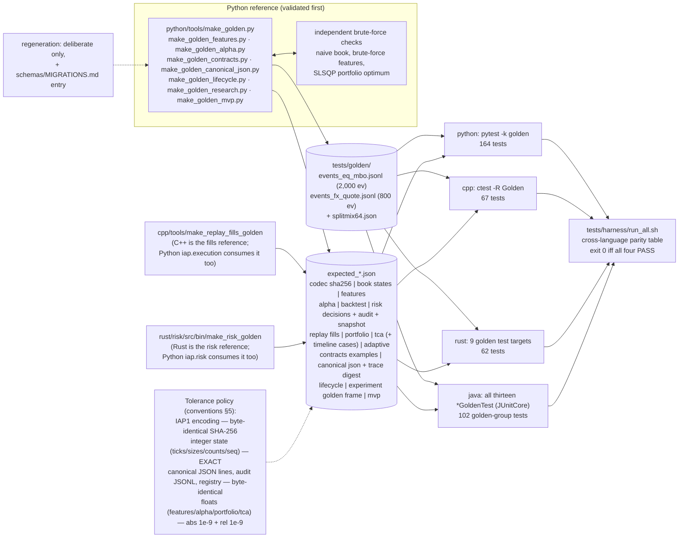
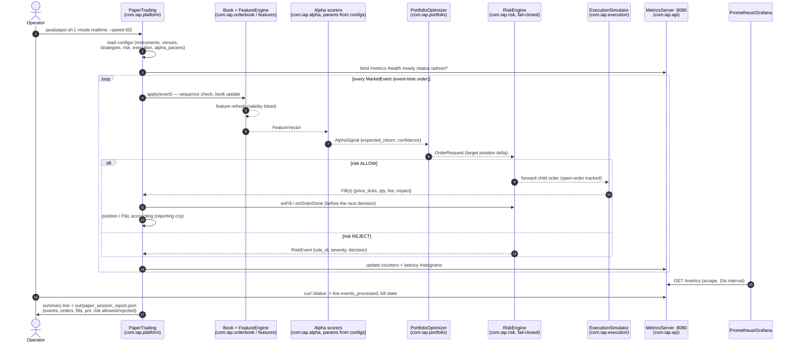
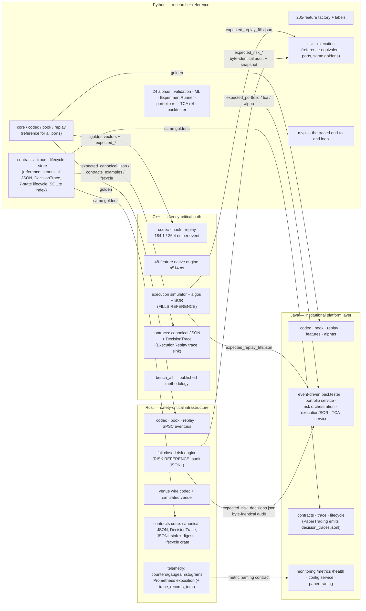
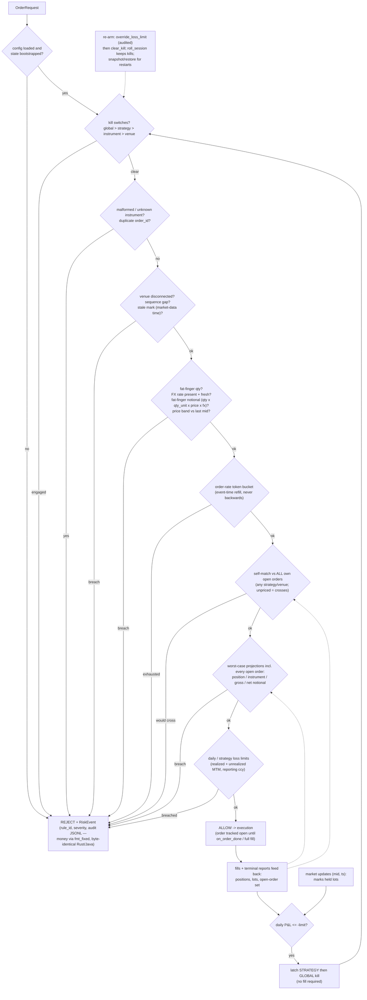
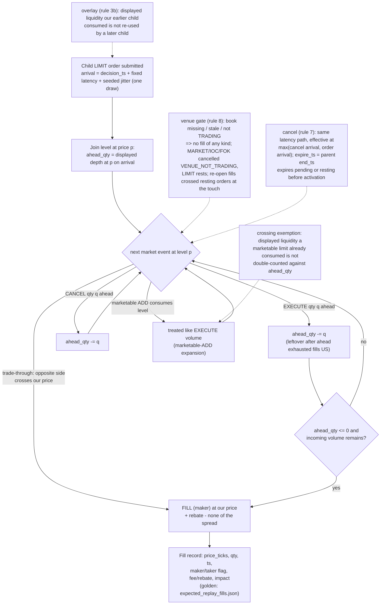
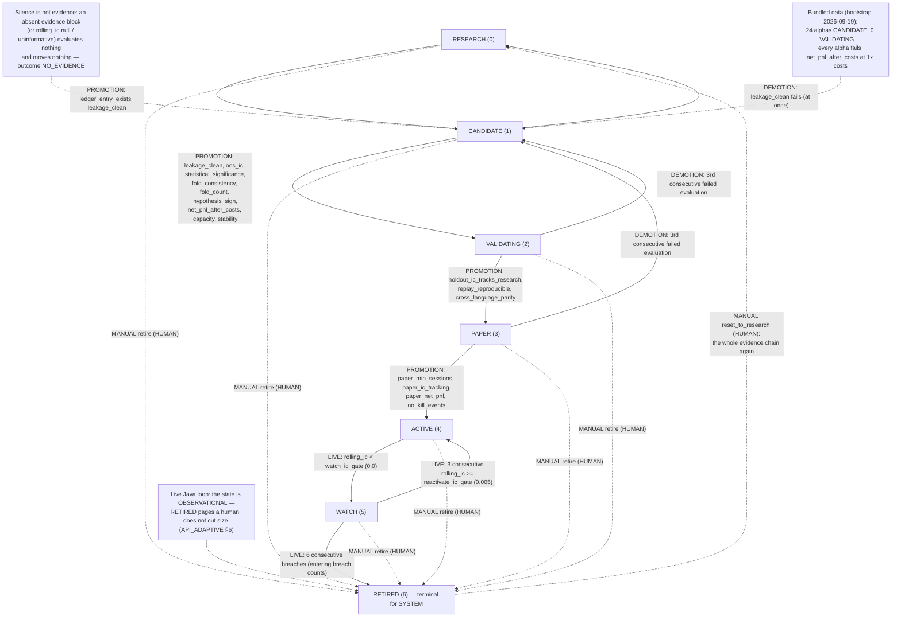

# Architecture diagrams

Every diagram on this page renders natively on GitHub. Raw sources live in
[`docs/diagrams/`](diagrams/); the first three are also embedded in
[ARCHITECTURE.md](ARCHITECTURE.md) and every embedded block is kept
byte-identical to its `.mmd` source (`tests/harness/check_headline_numbers.py`
`mermaid_sources_in_sync`). Numbers shown (event counts, test counts, seeds,
golden-run figures) are the repository's actual values, re-derived by the same
script.

## 1. End-to-end pipeline (spec §4, realized)

The full path from synthetic venues to the research feedback loop. Solid arrows are
data flow; the dashed arrow is the research-to-production promotion loop.

```mermaid
flowchart TD
    subgraph GEN["Synthetic venues — seeded generator (SplitMix64, seed 20260829)"]
        V1["Equity MBO streams<br/>11 instruments @ venue XV1<br/>regimes, self-exciting flow, halt, auctions"]
        V2["FX QUOTE+TRADE streams<br/>8 G10 pairs @ LP1/LP2/PRI<br/>venue latency profiles"]
    end
    V1 --> RAW["data/raw/*.jsonl<br/>immutable raw feed files"]
    V2 --> RAW
    RAW --> NORM["Normalization + sequence validation<br/>python iap.marketdata.normalize<br/>gaps / dups / late / resets / ts-regressions / invalid counted -> qc_report.json"]
    NORM --> CANON["Canonical event stream<br/>JSONL + IAP1 v2 binary (72-byte LE records + CRC-32 trailer)<br/>+ Parquet research dataset — schemas x-version 1"]
    CANON --> BOOK["Order-book reconstruction<br/>Python ref / C++ / Rust / Java<br/>MBO FIFO, status-gated matching, synthetic ids, dup-drop,<br/>gap->stale, reorder window, sequence resets, SNAPSHOT recovery"]
    BOOK --> FEAT["Feature engine<br/>205-feature registry (hash = feature_version)<br/>native 40 in C++/Rust/Java — validity bitset, NaN never valid"]
    FEAT --> LBL["Event-time labels (Python-owned)<br/>11 horizons, mid-to-mid + cost-adjusted<br/>at-or-before rule, no lookahead"]
    FEAT --> ALPHA["Alpha ensemble<br/>24 flagship alphas (EQ01-FX12)<br/>linear_z_v1 scoring; 6 golden alphas ported"]
    ALPHA --> PORT["Portfolio construction<br/>PGD + prox, 7 constraint families, EWMA cov<br/>Python reference, Java production service"]
    PORT --> RISK["Hard risk engine — FAIL-CLOSED<br/>Rust reference, Java orchestration, Python reference port<br/>limits, throttles, gap/stale gates, kill switches"]
    RISK --> EXEC["Execution algos + event-driven simulator<br/>VWAP / TWAP / POV / IS; deterministic queue model<br/>C++ reference, Java + Python ports"]
    EXEC --> SOR["SOR / venue adapters<br/>cpp/sor, rust venue protocol + sim"]
    SOR --> FILLS["Executions (fills, fees, rebates, impact)"]
    FILLS --> TCA["TCA + attribution<br/>Perold IS = delay + trading + opportunity (exact)<br/>Python reference, Java service"]
    TCA --> TRACE["Decision trace — one DecisionTrace per decision<br/>signal · portfolio · risk · orders · routing · fills · TCA · attribution<br/>canonical JSONL + stream digest + SQLite index (iap.store); explain()"]
    LBL --> RESEARCH
    TRACE --> RESEARCH["Research feedback / alpha factory<br/>ExperimentRunner -> research/experiments/ID/ + the ledger (865 looks / 70 configs)<br/>REPORT.md, ML_REPORT.md, model manifests"]
    RESEARCH --> LIFE["Alpha promotion lifecycle (iap.lifecycle)<br/>RESEARCH -> CANDIDATE -> VALIDATING -> PAPER -> ACTIVE <-> WATCH -> RETIRED<br/>18 gates, 17 edges; bundled data: 24 CANDIDATE / 0 beyond"]
    LIFE -. "gated, ledgered transitions<br/>(research/alpha_registry.json)" .-> ALPHA
```

## 2. Cross-language golden-test topology

How one validated Python reference pins four implementations. The parity table is
printed by `tests/harness/run_all.sh` (python 1362 · cpp 266 · rust 298 · java 475
tests; 164/67/62/102 in the golden groups — the Java gate runs all thirteen
`*GoldenTest` classes, the Rust gate nine golden targets). Two goldens are
owned by a port language and consumed by Python as well: the fills golden
(C++) by `iap.execution`, the risk goldens (Rust) by `iap.risk`.

## 3. Paper-trading session (Java platform vertical)

The live loop behind `java/paper.sh`: every subsystem the platform ships, wired
end-to-end with metrics served on `:8080`.

## 4. Polyglot responsibility matrix, realized (spec §3)

Which language owns which subsystem in this repository, and which direction the
reference/port relationships run.

## 5. Hard-risk decision flow (fail-closed)

The pinned check order shared by the Rust reference, the Java port and the Python
reference port (`iap.risk`, proven by the same goldens). Any missing or malformed
limit configuration rejects (CONFIG_MISSING) — the engine never "fails open."

## 6. Passive queue-position model (execution simulator)

The deterministic rule set (C++ reference headers `cpp/include/iap/execution/*.hpp`,
mirrored by Java and by the Python reference port `iap.execution`, which reproduces
`expected_replay_fills.json` bit for bit) that decides when a resting passive order
fills during replay.

## 7. Platform data model (`schemas/sql/iap_v1.sql`)

The relational index over every contract and research artefact, as built by
`python -m iap.store build` (SQLite; the same DDL runs on PostgreSQL). Solid
edges are declared foreign keys — every normalized stage row of a decision
trace hangs off `decision_traces`; dotted edges are logical references between
independently imported artefacts. Column lists are abridged; the full model,
the views and the query cookbook are in [DATA_MODEL.md](DATA_MODEL.md).

```mermaid
erDiagram
    %% schemas/sql/iap_v1.sql — x-version 1. Solid lines are declared foreign
    %% keys (every stage row of a decision trace); dotted lines are logical
    %% references between independently imported artefacts.

    instruments {
        BIGINT instrument_id PK
        TEXT symbol
        TEXT asset_class
        TEXT currency
        DOUBLE_PRECISION tick_size
        BIGINT lot_size
        DOUBLE_PRECISION adv
        TEXT venues_json
    }
    venues {
        BIGINT venue_id PK
        TEXT venue
        TEXT asset_class
        DOUBLE_PRECISION taker_fee_per_share
        DOUBLE_PRECISION maker_rebate_per_share
        DOUBLE_PRECISION commission_per_million
        BIGINT latency_mean_ns
        TEXT supports_json
    }
    sessions {
        TEXT session_id PK
        TEXT data_version
        TEXT config_version
        BIGINT seed
        BIGINT start_ts
        BIGINT end_ts
        BIGINT n_events
    }
    feature_versions {
        TEXT feature_version PK
        TEXT registry_hash
        BIGINT x_version
        BIGINT n_features
        TEXT registry_json
    }
    alphas {
        TEXT alpha_id PK
        TEXT asset_class
        TEXT family
        TEXT horizon
        TEXT economic_rationale
        TEXT current_state
    }
    experiments {
        TEXT experiment_id PK
        TEXT alpha_id
        TEXT dataset_version
        TEXT feature_version
        TEXT model_version
        TEXT configuration_json
        BIGINT test_start_ts
        BIGINT test_end_ts
        BIGINT seed
        TEXT horizon
    }
    experiment_results {
        TEXT experiment_id PK
        TEXT alpha_id
        DOUBLE_PRECISION ic
        DOUBLE_PRECISION t_stat
        DOUBLE_PRECISION net_return_bps
        BIGINT leakage_passed
        TEXT verdict
        BIGINT n_experiments_in_ledger
        BIGINT created_ts
    }
    ledger_entries {
        TEXT ledger_key PK
        TEXT alpha_id
        TEXT kind
        TEXT config_json
        BIGINT count
        BIGINT n
        DOUBLE_PRECISION oos_ic
        DOUBLE_PRECISION nw_tstat
        TEXT verdict
    }
    lifecycle_transitions {
        TEXT alpha_id PK
        TEXT policy PK
        BIGINT event_ts PK
        TEXT from_state PK
        TEXT to_state PK
        TEXT source PK
        TEXT reason
        TEXT gates_json
        TEXT actor
    }
    decision_traces {
        TEXT trace_id PK
        TEXT session_id
        BIGINT instrument_id
        BIGINT event_ts
        BIGINT sequence
        TEXT data_version
        TEXT feature_version
        TEXT model_version
        TEXT config_version
        TEXT stages_json
    }
    alpha_signals {
        TEXT trace_id PK, FK
        BIGINT signal_index PK
        BIGINT timestamp
        BIGINT instrument_id
        DOUBLE_PRECISION expected_return
        DOUBLE_PRECISION confidence
        TEXT model_version
    }
    portfolio_targets {
        TEXT trace_id PK, FK
        TEXT strategy_id
        TEXT portfolio_version
        TEXT solver_status
        DOUBLE_PRECISION turnover
        TEXT targets_json
    }
    portfolio_legs {
        TEXT trace_id PK, FK
        BIGINT instrument_id PK
        BIGINT target_qty
        DOUBLE_PRECISION target_weight
    }
    risk_decisions {
        TEXT trace_id PK, FK
        BIGINT risk_index PK
        BIGINT order_id
        BIGINT decision
        TEXT rule_id
        BIGINT rule_index
        TEXT reason
    }
    parent_orders {
        BIGINT parent_order_id PK
        TEXT trace_id FK
        TEXT strategy_id
        TEXT alpha_id
        BIGINT instrument_id
        BIGINT side
        BIGINT qty
        TEXT algo
        DOUBLE_PRECISION urgency
        TEXT params_json
    }
    child_orders {
        BIGINT child_order_id PK
        TEXT trace_id FK
        BIGINT parent_order_id
        BIGINT venue_id
        BIGINT qty
        BIGINT price_ticks
        BIGINT order_type
        BIGINT slice_index
    }
    venue_decisions {
        BIGINT child_order_id PK
        TEXT trace_id FK
        BIGINT venue_id
        TEXT reason
        TEXT candidates_json
    }
    executions {
        BIGINT execution_id PK
        TEXT trace_id FK
        BIGINT order_id
        BIGINT parent_order_id
        BIGINT status
        BIGINT filled_qty
        BIGINT fill_price_ticks
        BIGINT venue_id
        DOUBLE_PRECISION fees
    }
    tca_results {
        BIGINT parent_order_id PK
        TEXT trace_id FK
        DOUBLE_PRECISION implementation_shortfall_bps
        DOUBLE_PRECISION spread_cost_bps
        DOUBLE_PRECISION impact_bps
        DOUBLE_PRECISION fees_bps
        DOUBLE_PRECISION timing_cost_bps
        TEXT venue_contribution_json
        TEXT algo
        BIGINT latency_p99_ns
    }
    attribution {
        TEXT trace_id PK, FK
        BIGINT parent_order_id
        DOUBLE_PRECISION alpha_bps
        DOUBLE_PRECISION spread_bps
        DOUBLE_PRECISION impact_bps
        DOUBLE_PRECISION fees_bps
        DOUBLE_PRECISION timing_bps
        DOUBLE_PRECISION total_bps
    }
    tca_orders {
        BIGINT order_id PK
        BIGINT instrument_id
        TEXT side
        DOUBLE_PRECISION total_is_bps
        DOUBLE_PRECISION delay_bps
        DOUBLE_PRECISION trading_bps
        DOUBLE_PRECISION opportunity_bps
    }
    model_runs {
        TEXT run_id PK
        TEXT name
        TEXT model_version
        TEXT data_version
        TEXT feature_version
        TEXT git_commit
        TEXT manifest_json
        TEXT metrics_json
        DOUBLE_PRECISION mean_ic
    }
    drift_baselines {
        TEXT name PK
        TEXT alpha_id
        TEXT kind
        TEXT feature_version
        TEXT edges_json
        TEXT expected_frac_json
        DOUBLE_PRECISION ic_mean
    }

    decision_traces ||--o{ alpha_signals : "trace_id"
    decision_traces ||--o| portfolio_targets : "trace_id"
    decision_traces ||--o{ portfolio_legs : "trace_id"
    decision_traces ||--o{ risk_decisions : "trace_id"
    decision_traces ||--o{ parent_orders : "trace_id"
    decision_traces ||--o{ child_orders : "trace_id"
    decision_traces ||--o{ venue_decisions : "trace_id"
    decision_traces ||--o{ executions : "trace_id"
    decision_traces ||--o{ tca_results : "trace_id"
    decision_traces ||--o| attribution : "trace_id"

    parent_orders ||..o{ child_orders : "parent_order_id"
    child_orders ||..o| venue_decisions : "child_order_id"
    child_orders ||..o{ executions : "order_id"
    parent_orders ||..o| tca_results : "parent_order_id"
    child_orders ||..o{ risk_decisions : "order_id (per routed child)"
    parent_orders ||..o{ risk_decisions : "order_id (parent-level loop)"
    sessions ||..o{ decision_traces : "session_id"
    instruments ||..o{ decision_traces : "instrument_id"
    venues ||..o{ child_orders : "venue_id"
    venues ||..o{ executions : "venue_id"
    alphas ||..o{ parent_orders : "alpha_id"
    alphas ||..o{ experiments : "alpha_id"
    alphas ||..o{ ledger_entries : "alpha_id"
    alphas ||..o{ lifecycle_transitions : "alpha_id"
    experiments ||..o| experiment_results : "experiment_id"
    feature_versions ||..o{ experiments : "feature_version"
    feature_versions ||..o{ model_runs : "feature_version"
    feature_versions ||..o{ drift_baselines : "feature_version"
    instruments ||..o{ tca_orders : "instrument_id"
```

## 8. Alpha promotion lifecycle (`iap.lifecycle`, 7 states / 17 edges)

The full promotion machine RESEARCH → CANDIDATE → VALIDATING → PAPER → ACTIVE ⇄
WATCH → RETIRED, table-driven (`machine.ALLOWED_TRANSITIONS`, pinned as
`transition_table` in `tests/golden/expected_lifecycle.json`), with the gate
names of every SYSTEM edge and the HUMAN-only manual edges. The ACTIVE/WATCH/
RETIRED sub-machine is the unchanged `iap.adaptive.lifecycle.LifecycleTracker`
(API_ADAPTIVE.md §6); the full table, thresholds and evidence blocks are in
[LIFECYCLE.md](LIFECYCLE.md). Ports: `com.iap.lifecycle`, `rust/lifecycle`.

## 9. The decision trace (`iap.trace`, `schemas/trace/decision_trace.schema.json`)

One validated `DecisionTrace` per decision cycle: the header (ids and the four
version hashes) plus nine stage lists in loop order, serialised as one
canonical-JSON line, digested per stream, indexed by the store and rendered by
`explain()`. The pinned rules (trace id, canonical JSON, digest, emission points
per language, the incident replay flow) are in
[DECISION_TRACE.md](DECISION_TRACE.md).

```mermaid
flowchart LR
    %% One DecisionTrace per decision cycle (schemas/trace/decision_trace.schema.json).
    %% trace_id = sha256("session_id|instrument_id|event_ts|sequence")[:32];
    %% the line is canonical JSON; the stream digest is sha256 over line + "\n" per trace.
    EV["MarketEvent<br/>(event_ts, sequence)"] --> HDR["DecisionTrace header<br/>trace_id · session_id · instrument_id<br/>data / feature / model / config_version"]
    HDR --> SIG["stages.signal<br/>AlphaSignal[] — signal[0] is the acting signal,<br/>members follow, labelled by model_version"]
    SIG --> PORT["stages.portfolio<br/>PortfolioTarget (solver_status, legs)<br/>null = stage did not run"]
    PORT --> RISK["stages.risk<br/>RiskDecision[] — ALLOW ⇔ rule_index -1;<br/>REJECT/KILL carry rule_id + reason"]
    RISK --> PAR["stages.parent_orders<br/>ParentOrder[] (algo TWAP/VWAP/POV/IS)"]
    PAR --> CHI["stages.child_orders<br/>ChildOrder[] (venue_id 0 = SOR)"]
    CHI --> ROUTE["stages.routing<br/>VenueDecision[] — every candidate scored,<br/>venue_id 0 = NO_ROUTE"]
    ROUTE --> FILL["stages.fills<br/>ExecutionReport[] (one per fill,<br/>PARTIAL / FILLED / CANCELED …)"]
    FILL --> TCA["stages.tca<br/>TCAResult[] — IS = delay + trading + opportunity,<br/>trading = spread + impact + timing (1e-9)"]
    TCA --> ATTR["stages.attribution<br/>Attribution — alpha + spread + impact + fees + timing = total"]
    ATTR --> LINE["canonical_json(trace)<br/>sorted keys · compact · ASCII · Python float repr"]
    LINE --> SINKS["sinks: JsonlTraceSink (durable record)<br/>StoreTraceSink (SQLite index: decision_traces + 10 stage tables)<br/>MemoryTraceSink"]
    LINE --> DIG["TraceDigest<br/>sha256 over line + LF per trace<br/>same seed ⇒ same digest"]
    SINKS --> EXPL["explain(trace) / python -m iap.store explain<br/>v_order_chain — one row per parent order"]
    subgraph EMIT["emission points"]
        E1["Python: iap.mvp (TraceBuilder per decision)"]
        E2["Java: PaperTrading → decision_traces.jsonl<br/>(one per pre-trade risk decision)"]
        E3["C++: ExecutionReplay::set_trace_sink<br/>(one per parent order, after the run)"]
        E4["Rust: contracts::trace JsonlTraceSink<br/>(telemetry re-export, trace_records_total)"]
    end
    EMIT -.-> HDR
```

## 10. The MVP loop (`python -m iap.mvp run`)

The per-event order of `iap.mvp.engine.MvpEngine.on_event` (docs/MVP.md §3),
the artefacts one run writes and the two determinism checks. The figures in the
last node are the golden run pinned by `tests/golden/expected_mvp.json`
(seed 12345, `run_id 58a10f2194a3c81c`): cost-negative, stated as such.

```mermaid
flowchart TD
    %% python -m iap.mvp run — docs/MVP.md §3; per-event order of MvpEngine.on_event.
    CFG["configs/mvp/{mvp,instruments,venues,generator}.json<br/>seed 12345 → run_id = content_hash(config, seed)[:16]"] --> FEED["iap.mvp.feed: generator + normaliser (unmodified)<br/>events.jsonl + events.iap1 + feed.json<br/>data_version = sha256(IAP1 stream)"]
    FEED --> SIM["1. ExecutionSimulator.on_market_event<br/>expiries, activations, queue tracking, fills"]
    SIM --> ACC["2. fills → Account + RiskEngine.on_fill<br/>terminal reports → on_order_done<br/>§12.1 identity asserted after every fill"]
    ACC --> VOL["3. session volume (EXECUTE + TRADE)"]
    VOL --> MARK["4. risk wiring: stale transitions → on_sequence_gap / on_feed_recovered<br/>reference mid over NON-STALE venue books → on_market"]
    MARK --> TL["5. TCA MarketTimeline (crossed skipped + counted)"]
    TL --> FIN["6. parent finalisation → TCAResult + Attribution"]
    FIN --> FEAT["7. FeatureEngine.apply (1 s cadence) + label mid series<br/>→ EQ01 / EQ03 / EQ06 LinearZAlpha + AlphaEnsemble<br/>→ SingleStockPortfolio (PGD + EWMA) → PortfolioTarget<br/>→ delta → one ParentOrder (TWAP / POV / IS by urgency)"]
    FEAT --> CHILD["8. per child: AlgoScheduler → SorAdapter.route (3 venues)<br/>→ controls (slice interval, latency budget, participation)<br/>→ RiskEngineAdapter.evaluate (RiskDecision) → submit<br/>a REJECT is never submitted"]
    CHILD --> TRACE["9. TraceBuilder per decision → JsonlTraceSink + StoreTraceSink + TraceDigest"]
    TRACE --> OUT["data/mvp/RUN_ID/: traces.jsonl · iap.sqlite · risk_audit.jsonl<br/>report.json / report.md · paper_evidence.json · config.json"]
    OUT --> VERIFY["python -m iap.mvp verify — run twice, identical bytes<br/>python -m iap.mvp replay --run … — same digest from the captured stream<br/>golden: tests/golden/expected_mvp.json (16,578 events, 355 decisions,<br/>66 parents, 55 fills, P&L −22.68 USD, digest 059c30df…)"]
    SIM -. "next event" .-> SIM
```

## 11. Where to go deeper

| topic | document |
|---|---|
| Full architecture narrative, per-language engineering notes | [ARCHITECTURE.md](ARCHITECTURE.md) |
| Governing institutional specification (verbatim) | [SPECIFICATION.md](SPECIFICATION.md) |
| Teaching walkthrough of every subsystem | [../LEARN.md](../LEARN.md) |
| 26 runnable recipes | [../COOKBOOK.md](../COOKBOOK.md) |
| Data model, views, SQLite/PostgreSQL portability, query cookbook | [DATA_MODEL.md](DATA_MODEL.md) |
| The 7-state promotion lifecycle: gates, evidence, registry, bootstrap result | [LIFECYCLE.md](LIFECYCLE.md) |
| The decision trace: record, ids, canonical JSON, digest, sinks, replay | [DECISION_TRACE.md](DECISION_TRACE.md) |
| The executable MVP and its honest golden run | [MVP.md](MVP.md) |
| Typed contracts, Protocols, schema index, validation | [../API_CONTRACTS.md](../API_CONTRACTS.md) |
| Python risk / execution reference ports and their golden parity | [../API_TRADING.md](../API_TRADING.md) |
| Roadmap: what exists, with evidence; what is backlog | [ROADMAP.md](ROADMAP.md) |
| Six research papers from the platform's own numbers | [papers/INDEX.md](papers/INDEX.md) |
| Benchmark methodology + results | [../benchmarks/RESULTS.md](../benchmarks/RESULTS.md) |
