# Architecture diagrams

Every diagram on this page renders natively on GitHub. Raw sources live in
[`docs/diagrams/`](diagrams/); the first three are also embedded in
[ARCHITECTURE.md](ARCHITECTURE.md) and every embedded block is kept
byte-identical to its `.mmd` source (`tests/harness/check_headline_numbers.py`
`mermaid_sources_in_sync`). Numbers shown (event counts, test counts, seeds,
golden-run figures) are the repository's actual values, re-derived by the same
script.

## 1. End-to-end pipeline (spec §4, realized)

The full path from synthetic venues to the research feedback loop. Solid arrows are
data flow; the dashed arrow is the research-to-production promotion loop.

```mermaid
flowchart TD
    subgraph GEN["Synthetic venues — seeded generator (SplitMix64, seed 20260829)"]
        V1["Equity MBO streams<br/>11 instruments @ venue XV1<br/>regimes, self-exciting flow, halt, auctions"]
        V2["FX QUOTE+TRADE streams<br/>8 G10 pairs @ LP1/LP2/PRI<br/>venue latency profiles"]
    end
    V1 --> RAW["data/raw/*.jsonl<br/>immutable raw feed files"]
    V2 --> RAW
    RAW --> NORM["Normalization + sequence validation<br/>python iap.marketdata.normalize<br/>gaps / dups / late / resets / ts-regressions / invalid counted -> qc_report.json"]
    NORM --> CANON["Canonical event stream<br/>JSONL + IAP1 v2 binary (72-byte LE records + CRC-32 trailer)<br/>+ Parquet research dataset — schemas x-version 1"]
    CANON --> BOOK["Order-book reconstruction<br/>Python ref / C++ / Rust / Java<br/>MBO FIFO, status-gated matching, synthetic ids, dup-drop,<br/>gap->stale, reorder window, sequence resets, SNAPSHOT recovery"]
    BOOK --> FEAT["Feature engine<br/>205-feature registry (hash = feature_version)<br/>native 40 in C++/Rust/Java — validity bitset, NaN never valid"]
    FEAT --> LBL["Event-time labels (Python-owned)<br/>11 horizons, mid-to-mid + cost-adjusted<br/>at-or-before rule, no lookahead"]
    FEAT --> ALPHA["Alpha ensemble<br/>24 flagship alphas (EQ01-FX12)<br/>linear_z_v1 scoring; 6 golden alphas ported"]
    ALPHA --> PORT["Portfolio construction<br/>PGD + prox, 7 constraint families, EWMA cov<br/>Python reference, Java production service"]
    PORT --> RISK["Hard risk engine — FAIL-CLOSED<br/>Rust reference, Java orchestration, Python reference port<br/>limits, throttles, gap/stale gates, kill switches"]
    RISK --> EXEC["Execution algos + event-driven simulator<br/>VWAP / TWAP / POV / IS; deterministic queue model<br/>C++ reference, Java + Python ports"]
    EXEC --> SOR["SOR / venue adapters<br/>cpp/sor, rust venue protocol + sim"]
    SOR --> FILLS["Executions (fills, fees, rebates, impact)"]
    FILLS --> TCA["TCA + attribution<br/>Perold IS = delay + trading + opportunity (exact)<br/>Python reference, Java service"]
    TCA --> TRACE["Decision trace — one DecisionTrace per decision<br/>signal · portfolio · risk · orders · routing · fills · TCA · attribution<br/>canonical JSONL + stream digest + SQLite index (iap.store); explain()"]
    LBL --> RESEARCH
    TRACE --> RESEARCH["Research feedback / alpha factory<br/>ExperimentRunner -> research/experiments/ID/ + the ledger (4,396 looks / 208 configs, two datasets, two method bundles)<br/>REPORT.md, ML_REPORT.md, model manifests"]
    RESEARCH --> LIFE["Alpha promotion lifecycle (iap.lifecycle)<br/>RESEARCH -> CANDIDATE -> VALIDATING -> PAPER -> ACTIVE <-> WATCH -> RETIRED<br/>18 gates, 17 edges; bundled data: 24 CANDIDATE / 0 beyond"]
    LIFE -. "gated, ledgered transitions<br/>(research/alpha_registry.json)" .-> ALPHA
```

## 2. Cross-language golden-test topology

How one validated Python reference pins four implementations. The parity table is
printed by `tests/harness/run_all.sh` (python 1752 · cpp 302 · rust 330 · java 535
tests; 180/72/66/115 in the golden groups — the Java gate runs all fifteen
`*GoldenTest` classes, the Rust gate nine golden targets). Two goldens are
owned by a port language and consumed by Python as well: the fills golden
(C++) by `iap.execution`, the risk goldens (Rust) by `iap.risk`.

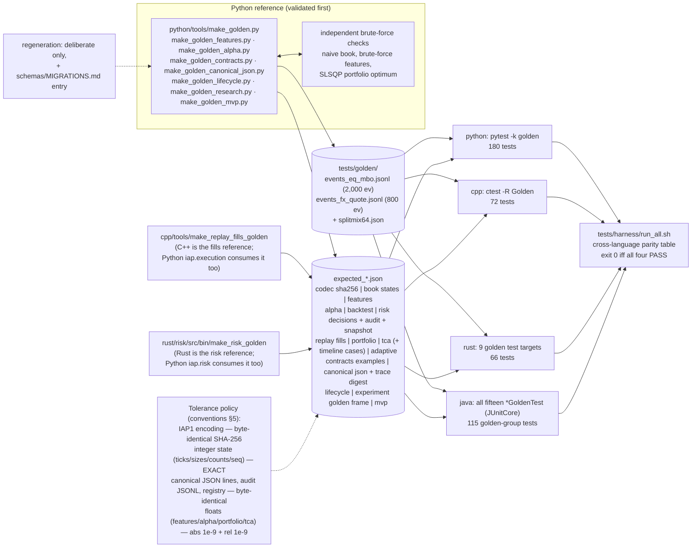
```mermaid
flowchart LR
    subgraph REF["Python reference (validated first)"]
        MG["python/tools/make_golden.py<br/>make_golden_features.py · make_golden_alpha.py<br/>make_golden_contracts.py · make_golden_canonical_json.py<br/>make_golden_lifecycle.py · make_golden_research.py · make_golden_mvp.py"]
        BF["independent brute-force checks<br/>naive book, brute-force features,<br/>SLSQP portfolio optimum"]
        MG <--> BF
    end
    MG --> GV[("tests/golden/<br/>events_eq_mbo.jsonl (2,000 ev)<br/>events_fx_quote.jsonl (800 ev)<br/>+ splitmix64.json")]
    MG --> EXP[("expected_*.json<br/>codec sha256 | book states | features<br/>alpha | backtest | risk decisions + audit + snapshot<br/>replay fills | portfolio | tca (+ timeline cases) | adaptive<br/>contracts examples | canonical json + trace digest<br/>lifecycle | experiment golden frame | mvp")]
    CPPTOOL["cpp/tools/make_replay_fills_golden<br/>(C++ is the fills reference;<br/>Python iap.execution consumes it too)"] --> EXP
    RSTOOL["rust/risk/src/bin/make_risk_golden<br/>(Rust is the risk reference;<br/>Python iap.risk consumes it too)"] --> EXP
    GV --> PY["python: pytest -k golden<br/>180 tests"]
    GV --> CPP["cpp: ctest -R Golden<br/>72 tests"]
    GV --> RS["rust: 9 golden test targets<br/>66 tests"]
    GV --> JV["java: all fifteen *GoldenTest (JUnitCore)<br/>115 golden-group tests"]
    EXP --> PY
    EXP --> CPP
    EXP --> RS
    EXP --> JV
    PY --> TAB["tests/harness/run_all.sh<br/>cross-language parity table<br/>exit 0 iff all four PASS"]
    CPP --> TAB
    RS --> TAB
    JV --> TAB
    TOL["Tolerance policy (conventions §5):<br/>IAP1 encoding — byte-identical SHA-256<br/>integer state (ticks/sizes/counts/seq) — EXACT<br/>canonical JSON lines, audit JSONL, registry — byte-identical<br/>floats (features/alpha/portfolio/tca) — abs 1e-9 + rel 1e-9"] -.-> EXP
    MIG["regeneration: deliberate only,<br/>+ schemas/MIGRATIONS.md entry"] -.-> MG
```

## 3. Paper-trading session (Java platform vertical)

The live loop behind `java/paper.sh`: every subsystem the platform ships, wired
end-to-end with metrics served on `:8080`.

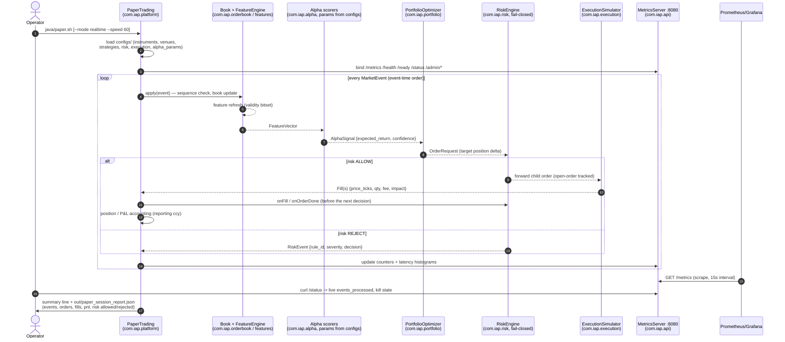
```mermaid
sequenceDiagram
    autonumber
    actor Op as Operator
    participant PT as PaperTrading<br/>(com.iap.platform)
    participant BK as Book + FeatureEngine<br/>(com.iap.orderbook / features)
    participant AL as Alpha scorers<br/>(com.iap.alpha, params from configs)
    participant PF as PortfolioOptimizer<br/>(com.iap.portfolio)
    participant RK as RiskEngine<br/>(com.iap.risk, fail-closed)
    participant EX as ExecutionSimulator<br/>(com.iap.execution)
    participant MX as MetricsServer :8080<br/>(com.iap.api)
    participant PR as Prometheus/Grafana

    Op->>PT: java/paper.sh [--mode realtime --speed 60]
    PT->>PT: load configs/ (instruments, venues,<br/>strategies, risk, execution, alpha_params)
    PT->>MX: bind /metrics /health /ready /status /admin/*

    loop every MarketEvent (event-time order)
        PT->>BK: apply(event) — sequence check, book update
        BK-->>BK: feature refresh (validity bitset)
        BK-->>AL: FeatureVector
        AL-->>PF: AlphaSignal {expected_return, confidence}
        PF-->>RK: OrderRequest (target position delta)
        alt risk ALLOW
            RK-->>EX: forward child order (open-order tracked)
            EX-->>PT: Fill(s) {price_ticks, qty, fee, impact}
            PT->>RK: onFill / onOrderDone (before the next decision)
            PT->>PT: position / P&L accounting (reporting ccy)
        else risk REJECT
            RK-->>PT: RiskEvent {rule_id, severity, decision}
        end
        PT->>MX: update counters + latency histograms
    end

    PR->>MX: GET /metrics (scrape, 15s interval)
    Op->>MX: curl /status -> live events_processed, kill state
    PT->>Op: summary line + out/paper_session_report.json<br/>(events, orders, fills, pnl, risk allowed/rejected)
```

## 4. Polyglot responsibility matrix, realized (spec §3)

Which language owns which subsystem in this repository, and which direction the
reference/port relationships run.

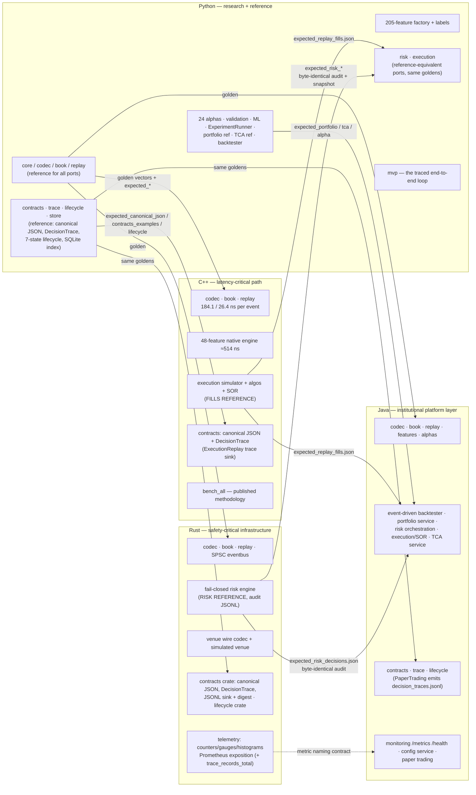
```mermaid
flowchart LR
    subgraph PYL["Python — research + reference"]
        pcore["core / codec / book / replay<br/>(reference for all ports)"]
        pfeat["205-feature factory + labels"]
        presearch["24 alphas · validation · ML · ExperimentRunner ·<br/>portfolio ref · TCA ref · backtester"]
        pcontracts["contracts · trace · lifecycle · store<br/>(reference: canonical JSON, DecisionTrace,<br/>7-state lifecycle, SQLite index)"]
        pports["risk · execution<br/>(reference-equivalent ports, same goldens)"]
        pmvp["mvp — the traced end-to-end loop"]
    end
    subgraph CPPL["C++ — latency-critical path"]
        ccore["codec · book · replay<br/>184.1 / 26.4 ns per event"]
        cfeat["48-feature native engine ≈514 ns"]
        cexec["execution simulator + algos + SOR<br/>(FILLS REFERENCE)"]
        ccontracts["contracts: canonical JSON + DecisionTrace<br/>(ExecutionReplay trace sink)"]
        cbench["bench_all — published methodology"]
    end
    subgraph RSL["Rust — safety-critical infrastructure"]
        rcore["codec · book · replay · SPSC eventbus"]
        rrisk["fail-closed risk engine<br/>(RISK REFERENCE, audit JSONL)"]
        rven["venue wire codec + simulated venue"]
        rcontracts["contracts crate: canonical JSON, DecisionTrace,<br/>JSONL sink + digest · lifecycle crate"]
        rtel["telemetry: counters/gauges/histograms<br/>Prometheus exposition (+ trace_records_total)"]
    end
    subgraph JVL["Java — institutional platform layer"]
        jcore["codec · book · replay · features · alphas"]
        jplat["event-driven backtester · portfolio service ·<br/>risk orchestration · execution/SOR · TCA service"]
        jcontracts["contracts · trace · lifecycle<br/>(PaperTrading emits decision_traces.jsonl)"]
        jops["monitoring /metrics /health · config service ·<br/>paper trading"]
    end
    pcore -->|"golden vectors + expected_*"| ccore
    pcore -->|"golden"| rcore
    pcore -->|"golden"| jcore
    cexec -->|"expected_replay_fills.json"| jplat
    cexec -->|"expected_replay_fills.json"| pports
    rrisk -->|"expected_risk_decisions.json<br/>byte-identical audit"| jplat
    rrisk -->|"expected_risk_*<br/>byte-identical audit + snapshot"| pports
    presearch -->|"expected_portfolio / tca / alpha"| jplat
    pcontracts -->|"expected_canonical_json / contracts_examples / lifecycle"| ccontracts
    pcontracts -->|"same goldens"| rcontracts
    pcontracts -->|"same goldens"| jcontracts
    rtel -.->|"metric naming contract"| jops
```

## 5. Hard-risk decision flow (fail-closed)

The pinned check order shared by the Rust reference, the Java port and the Python
reference port (`iap.risk`, proven by the same goldens). Any missing or malformed
limit configuration rejects (CONFIG_MISSING) — the engine never "fails open."
This is the overview; diagram 11 places the fail-closed branches added in v1.3.0
(future-stamped marks, NaN, overflow, venue-0 orders) in the same order.

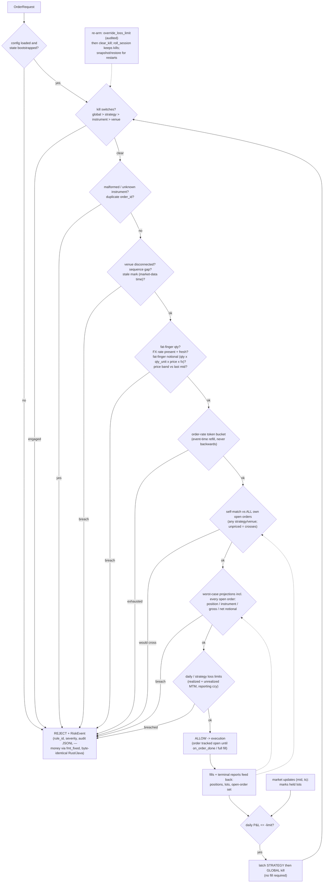
```mermaid
flowchart TD
    OR["OrderRequest"] --> BS{"config loaded and<br/>state bootstrapped?"}
    BS -- no --> REJ["REJECT + RiskEvent<br/>(rule_id, severity, audit JSONL —<br/>money via fmt_fixed, byte-identical Rust/Java)"]
    BS -- yes --> KG{"kill switches?<br/>global > strategy > instrument > venue"}
    KG -- engaged --> REJ
    KG -- clear --> MAL{"malformed / unknown instrument?<br/>duplicate order_id?"}
    MAL -- yes --> REJ
    MAL -- no --> PB{"venue disconnected? sequence gap?<br/>stale mark (market-data time)?"}
    PB -- breach --> REJ
    PB -- ok --> FF{"fat-finger qty?<br/>FX rate present + fresh?<br/>fat-finger notional (qty x qty_unit x price x fx)?<br/>price band vs last mid?"}
    FF -- breach --> REJ
    FF -- ok --> RT{"order-rate token bucket<br/>(event-time refill, never backwards)"}
    RT -- exhausted --> REJ
    RT -- ok --> SM{"self-match vs ALL own open orders<br/>(any strategy/venue; unpriced = crosses)"}
    SM -- would cross --> REJ
    SM -- ok --> LIM{"worst-case projections incl. every open order:<br/>position / instrument / gross / net notional"}
    LIM -- breach --> REJ
    LIM -- ok --> PNL{"daily / strategy loss limits<br/>(realized + unrealized MTM, reporting ccy)"}
    PNL -- breached --> REJ
    PNL -- ok --> ALLOW["ALLOW -> execution<br/>(order tracked open until on_order_done / full fill)"]
    ALLOW --> FILLS["fills + terminal reports feed back:<br/>positions, lots, open-order set"]
    MK["market updates (mid, ts):<br/>marks held lots"] --> LATCH{"daily P&L <= -limit?"}
    FILLS --> LATCH
    LATCH -- yes --> KILL["latch STRATEGY then GLOBAL kill<br/>(no fill required)"]
    KILL --> KG
    RE["re-arm: override_loss_limit (audited)<br/>then clear_kill; roll_session keeps kills;<br/>snapshot/restore for restarts"] -.-> KG
    FILLS -.-> SM
    FILLS -.-> LIM
```

## 6. Passive queue-position model (execution simulator)

The deterministic rule set (C++ reference headers `cpp/include/iap/execution/*.hpp`,
mirrored by Java and by the Python reference port `iap.execution`, which reproduces
`expected_replay_fills.json` bit for bit) that decides when a resting passive order
fills during replay. The v1.3.0 corrections are in the labels: only events the
book applied are tracked, an execute is capped at the book order's remaining size,
a cancel advances us only when the cancelled order is known to be ahead, and a
crossing display is bounded by what has not already been consumed. Diagram 12
shows the same rules as one event's processing order.

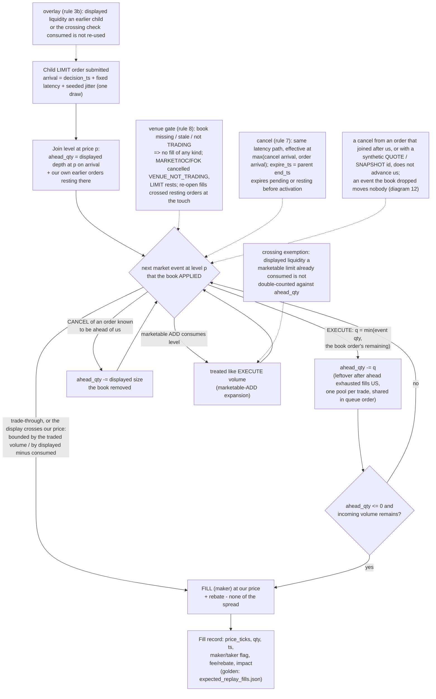
```mermaid
flowchart TD
    SUB["Child LIMIT order submitted<br/>arrival = decision_ts + fixed latency + seeded jitter (one draw)"] --> JOIN["Join level at price p:<br/>ahead_qty = displayed depth at p on arrival<br/>+ our own earlier orders resting there"]
    JOIN --> OBS{"next market event at level p<br/>that the book APPLIED"}
    OBS -->|"EXECUTE: q = min(event qty,<br/>the book order's remaining)"| DEC1["ahead_qty -= q<br/>(leftover after ahead exhausted fills US,<br/>one pool per trade, shared in queue order)"]
    OBS -->|"CANCEL of an order known<br/>to be ahead of us"| DEC2["ahead_qty -= displayed size<br/>the book removed"]
    OBS -->|"marketable ADD consumes level"| DEC3["treated like EXECUTE volume<br/>(marketable-ADD expansion)"]
    OBS -->|"trade-through, or the display crosses our price:<br/>bounded by the traded volume / by displayed minus consumed"| FILL["FILL (maker) at our price<br/>+ rebate - none of the spread"]
    DEC1 --> CHK{"ahead_qty <= 0 and<br/>incoming volume remains?"}
    DEC2 --> OBS
    DEC3 --> OBS
    CHK -- yes --> FILL
    CHK -- no --> OBS
    FILL --> ACC["Fill record: price_ticks, qty, ts,<br/>maker/taker flag, fee/rebate, impact<br/>(golden: expected_replay_fills.json)"]
    CROSS["crossing exemption: displayed liquidity a<br/>marketable limit already consumed is not<br/>double-counted against ahead_qty"] -.-> DEC3
    GATE["venue gate (rule 8): book missing / stale / not TRADING<br/>=> no fill of any kind; MARKET/IOC/FOK cancelled VENUE_NOT_TRADING,<br/>LIMIT rests; re-open fills crossed resting orders at the touch"] -.-> OBS
    TIF["cancel (rule 7): same latency path, effective at<br/>max(cancel arrival, order arrival); expire_ts = parent end_ts<br/>expires pending or resting before activation"] -.-> OBS
    OVL["overlay (rule 3b): displayed liquidity an earlier child<br/>or the crossing check consumed is not re-used"] -.-> SUB
    BEHIND["a cancel from an order that joined after us, or with a<br/>synthetic QUOTE / SNAPSHOT id, does not advance us;<br/>an event the book dropped moves nobody (diagram 12)"] -.-> OBS
```

## 7. Platform data model (`schemas/sql/iap_v2.sql`)

The relational index over every contract and research artefact, as built by
`python -m iap.store build` (SQLite; the same DDL runs on PostgreSQL). Solid
edges are declared foreign keys — every normalized stage row of a decision
trace hangs off `decision_traces`; dotted edges are logical references between
independently imported artefacts. Column lists are abridged; the full model,
the views and the query cookbook are in [DATA_MODEL.md](DATA_MODEL.md).

```mermaid
erDiagram
    %% schemas/sql/iap_v2.sql — x-version 2. Solid lines are declared foreign
    %% keys (every stage row of a decision trace); dotted lines are logical
    %% references between independently imported artefacts. The research
    %% tables carry the scope (dataset_version, methods) a number was computed in.

    instruments {
        BIGINT instrument_id PK
        TEXT symbol
        TEXT asset_class
        TEXT currency
        DOUBLE_PRECISION tick_size
        BIGINT lot_size
        DOUBLE_PRECISION adv
        TEXT venues_json
    }
    venues {
        BIGINT venue_id PK
        TEXT venue
        TEXT asset_class
        DOUBLE_PRECISION taker_fee_per_share
        DOUBLE_PRECISION maker_rebate_per_share
        DOUBLE_PRECISION commission_per_million
        BIGINT latency_mean_ns
        TEXT supports_json
    }
    sessions {
        TEXT session_id PK
        TEXT data_version
        TEXT config_version
        BIGINT seed
        BIGINT start_ts
        BIGINT end_ts
        BIGINT n_events
    }
    feature_versions {
        TEXT feature_version PK
        TEXT registry_hash
        BIGINT x_version
        BIGINT n_features
        TEXT registry_json
    }
    alphas {
        TEXT alpha_id PK
        TEXT asset_class
        TEXT family
        TEXT horizon
        TEXT economic_rationale
        TEXT current_state
    }
    experiments {
        TEXT experiment_id PK
        TEXT alpha_id
        TEXT dataset_version
        TEXT feature_version
        TEXT model_version
        TEXT configuration_json
        BIGINT test_start_ts
        BIGINT test_end_ts
        BIGINT seed
        TEXT horizon
        TEXT methods
    }
    experiment_results {
        TEXT experiment_id PK
        TEXT alpha_id
        TEXT dataset_version
        TEXT methods
        DOUBLE_PRECISION ic
        DOUBLE_PRECISION t_stat
        DOUBLE_PRECISION net_return_bps
        BIGINT leakage_passed
        TEXT verdict
        BIGINT n_experiments_in_ledger
        BIGINT created_ts
    }
    ledger_entries {
        TEXT ledger_key PK
        TEXT alpha_id
        TEXT kind
        TEXT dataset_version
        TEXT methods
        TEXT experiment_id
        BIGINT gate_looks
        DOUBLE_PRECISION promote_t_threshold
        TEXT config_json
        BIGINT count
        BIGINT n
        DOUBLE_PRECISION oos_ic
        DOUBLE_PRECISION nw_tstat
        TEXT verdict
    }
    ledger_scopes {
        TEXT dataset_version PK
        TEXT methods PK
        BIGINT n_entries
        BIGINT looks
        DOUBLE_PRECISION bonferroni_t_threshold
    }
    store_scope {
        TEXT scope PK
        TEXT dataset_version
        TEXT methods
    }
    lifecycle_transitions {
        TEXT alpha_id PK
        TEXT policy PK
        BIGINT event_ts PK
        TEXT from_state PK
        TEXT to_state PK
        TEXT source PK
        TEXT reason
        TEXT gates_json
        TEXT actor
        TEXT dataset_version
        TEXT methods
    }
    decision_traces {
        TEXT trace_id PK
        TEXT session_id
        BIGINT instrument_id
        BIGINT event_ts
        BIGINT sequence
        TEXT data_version
        TEXT feature_version
        TEXT model_version
        TEXT config_version
        TEXT stages_json
    }
    alpha_signals {
        TEXT trace_id PK, FK
        BIGINT signal_index PK
        BIGINT timestamp
        BIGINT instrument_id
        DOUBLE_PRECISION expected_return
        DOUBLE_PRECISION confidence
        TEXT model_version
    }
    portfolio_targets {
        TEXT trace_id PK, FK
        TEXT strategy_id
        TEXT portfolio_version
        TEXT solver_status
        DOUBLE_PRECISION turnover
        TEXT targets_json
    }
    portfolio_legs {
        TEXT trace_id PK, FK
        BIGINT instrument_id PK
        BIGINT target_qty
        DOUBLE_PRECISION target_weight
    }
    risk_decisions {
        TEXT trace_id PK, FK
        BIGINT risk_index PK
        BIGINT order_id
        BIGINT decision
        TEXT rule_id
        BIGINT rule_index
        TEXT reason
    }
    parent_orders {
        BIGINT parent_order_id PK
        TEXT trace_id FK
        TEXT strategy_id
        TEXT alpha_id
        BIGINT instrument_id
        BIGINT side
        BIGINT qty
        TEXT algo
        DOUBLE_PRECISION urgency
        TEXT params_json
    }
    child_orders {
        BIGINT child_order_id PK
        TEXT trace_id FK
        BIGINT parent_order_id
        BIGINT venue_id
        BIGINT qty
        BIGINT price_ticks
        BIGINT order_type
        BIGINT slice_index
    }
    venue_decisions {
        BIGINT child_order_id PK
        TEXT trace_id FK
        BIGINT venue_id
        TEXT reason
        TEXT candidates_json
    }
    executions {
        BIGINT execution_id PK
        TEXT trace_id FK
        BIGINT order_id
        BIGINT parent_order_id
        BIGINT status
        BIGINT filled_qty
        BIGINT fill_price_ticks
        BIGINT venue_id
        DOUBLE_PRECISION fees
    }
    tca_results {
        BIGINT parent_order_id PK
        TEXT trace_id FK
        DOUBLE_PRECISION implementation_shortfall_bps
        DOUBLE_PRECISION spread_cost_bps
        DOUBLE_PRECISION impact_bps
        DOUBLE_PRECISION fees_bps
        DOUBLE_PRECISION timing_cost_bps
        TEXT venue_contribution_json
        TEXT algo
        BIGINT latency_p99_ns
    }
    attribution {
        TEXT trace_id PK, FK
        BIGINT parent_order_id
        DOUBLE_PRECISION alpha_bps
        DOUBLE_PRECISION spread_bps
        DOUBLE_PRECISION impact_bps
        DOUBLE_PRECISION fees_bps
        DOUBLE_PRECISION timing_bps
        DOUBLE_PRECISION total_bps
    }
    tca_orders {
        BIGINT order_id PK
        BIGINT instrument_id
        TEXT side
        DOUBLE_PRECISION total_is_bps
        DOUBLE_PRECISION delay_bps
        DOUBLE_PRECISION trading_bps
        DOUBLE_PRECISION opportunity_bps
    }
    model_runs {
        TEXT run_id PK
        TEXT name
        TEXT model_version
        TEXT data_version
        TEXT feature_version
        TEXT git_commit
        TEXT manifest_json
        TEXT metrics_json
        DOUBLE_PRECISION mean_ic
    }
    drift_baselines {
        TEXT name PK
        TEXT alpha_id
        TEXT kind
        TEXT feature_version
        TEXT edges_json
        TEXT expected_frac_json
        DOUBLE_PRECISION ic_mean
    }

    decision_traces ||--o{ alpha_signals : "trace_id"
    decision_traces ||--o| portfolio_targets : "trace_id"
    decision_traces ||--o{ portfolio_legs : "trace_id"
    decision_traces ||--o{ risk_decisions : "trace_id"
    decision_traces ||--o{ parent_orders : "trace_id"
    decision_traces ||--o{ child_orders : "trace_id"
    decision_traces ||--o{ venue_decisions : "trace_id"
    decision_traces ||--o{ executions : "trace_id"
    decision_traces ||--o{ tca_results : "trace_id"
    decision_traces ||--o| attribution : "trace_id"

    parent_orders ||..o{ child_orders : "parent_order_id"
    child_orders ||..o| venue_decisions : "child_order_id"
    child_orders ||..o{ executions : "order_id"
    parent_orders ||..o| tca_results : "parent_order_id"
    child_orders ||..o{ risk_decisions : "order_id (per routed child)"
    parent_orders ||..o{ risk_decisions : "order_id (parent-level loop)"
    sessions ||..o{ decision_traces : "session_id"
    instruments ||..o{ decision_traces : "instrument_id"
    venues ||..o{ child_orders : "venue_id"
    venues ||..o{ executions : "venue_id"
    alphas ||..o{ parent_orders : "alpha_id"
    alphas ||..o{ experiments : "alpha_id"
    alphas ||..o{ ledger_entries : "alpha_id"
    alphas ||..o{ lifecycle_transitions : "alpha_id"
    experiments ||..o| experiment_results : "experiment_id"
    experiments ||..o| ledger_entries : "experiment_id"
    ledger_scopes ||..o{ ledger_entries : "dataset_version, methods"
    store_scope ||..o| ledger_scopes : "current scope"
    feature_versions ||..o{ experiments : "feature_version"
    feature_versions ||..o{ model_runs : "feature_version"
    feature_versions ||..o{ drift_baselines : "feature_version"
    instruments ||..o{ tca_orders : "instrument_id"
```

## 8. Alpha promotion lifecycle (`iap.lifecycle`, 7 states / 17 edges)

The full promotion machine RESEARCH → CANDIDATE → VALIDATING → PAPER → ACTIVE ⇄
WATCH → RETIRED, table-driven (`machine.ALLOWED_TRANSITIONS`, pinned as
`transition_table` in `tests/golden/expected_lifecycle.json`), with the gate
names of every SYSTEM edge and the HUMAN-only manual edges. The ACTIVE/WATCH/
RETIRED sub-machine is `iap.adaptive.lifecycle.LifecycleTracker`
(API_ADAPTIVE.md §6), whose retirement rule is the CUSUM rule by default
since v1.5.0, with the consecutive-breach rule selectable by name; the full table, thresholds and evidence blocks are in
[LIFECYCLE.md](LIFECYCLE.md). Ports: `com.iap.lifecycle`, `rust/lifecycle`.

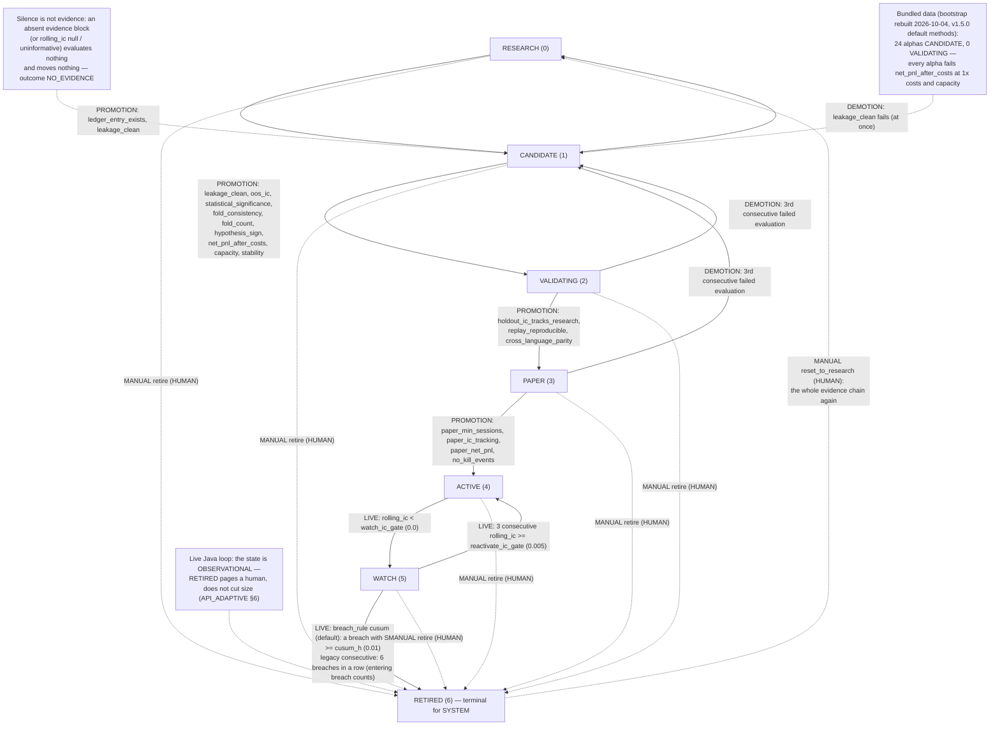
```mermaid
flowchart TD
    %% iap.lifecycle (reference), com.iap.lifecycle, rust/lifecycle — pinned by
    %% tests/golden/expected_lifecycle.json (transition_table: 17 edges, states 0..6).
    %% Solid arrows: SYSTEM edges (PROMOTION / DEMOTION / LIVE) with the gates
    %% evaluated in order; dashed arrows: MANUAL edges (HUMAN actor, non-empty reason).
    RESEARCH["RESEARCH (0)"] -->|"PROMOTION: ledger_entry_exists, leakage_clean"| CANDIDATE["CANDIDATE (1)"]
    CANDIDATE -->|"PROMOTION: leakage_clean, oos_ic, statistical_significance,<br/>fold_consistency, fold_count, hypothesis_sign,<br/>net_pnl_after_costs, capacity, stability"| VALIDATING["VALIDATING (2)"]
    CANDIDATE -->|"DEMOTION: leakage_clean fails (at once)"| RESEARCH
    VALIDATING -->|"PROMOTION: holdout_ic_tracks_research,<br/>replay_reproducible, cross_language_parity"| PAPER["PAPER (3)"]
    VALIDATING -->|"DEMOTION: 3rd consecutive failed evaluation"| CANDIDATE
    PAPER -->|"PROMOTION: paper_min_sessions, paper_ic_tracking,<br/>paper_net_pnl, no_kill_events"| ACTIVE["ACTIVE (4)"]
    PAPER -->|"DEMOTION: 3rd consecutive failed evaluation"| CANDIDATE
    ACTIVE -->|"LIVE: rolling_ic < watch_ic_gate (0.0)"| WATCH["WATCH (5)"]
    WATCH -->|"LIVE: 3 consecutive rolling_ic >= reactivate_ic_gate (0.005)"| ACTIVE
    WATCH -->|"LIVE: breach_rule cusum (default): a breach with S >= cusum_h (0.01)<br/>legacy consecutive: 6 breaches in a row (entering breach counts)"| RETIRED["RETIRED (6) — terminal for SYSTEM"]
    RESEARCH -. "MANUAL retire (HUMAN)" .-> RETIRED
    CANDIDATE -. "MANUAL retire (HUMAN)" .-> RETIRED
    VALIDATING -. "MANUAL retire (HUMAN)" .-> RETIRED
    PAPER -. "MANUAL retire (HUMAN)" .-> RETIRED
    ACTIVE -. "MANUAL retire (HUMAN)" .-> RETIRED
    WATCH -. "MANUAL retire (HUMAN)" .-> RETIRED
    RETIRED -. "MANUAL reset_to_research (HUMAN):<br/>the whole evidence chain again" .-> RESEARCH
    SILENCE["Silence is not evidence: an absent evidence block<br/>(or rolling_ic null / uninformative) evaluates nothing<br/>and moves nothing — outcome NO_EVIDENCE"] -.-> CANDIDATE
    RESULT["Bundled data (bootstrap rebuilt 2026-10-04, v1.5.0 default methods):<br/>24 alphas CANDIDATE, 0 VALIDATING —<br/>every alpha fails net_pnl_after_costs at 1x costs and capacity"] -.-> CANDIDATE
    OBS["Live Java loop: the state is OBSERVATIONAL —<br/>RETIRED pages a human, does not cut size (API_ADAPTIVE §6)"] -.-> RETIRED
```

## 9. The decision trace (`iap.trace`, `schemas/trace/decision_trace.schema.json`)

One validated `DecisionTrace` per decision cycle: the header (ids and the four
version hashes) plus nine stage lists in loop order, serialised as one
canonical-JSON line, digested per stream, indexed by the store and rendered by
`explain()`. The pinned rules (trace id, canonical JSON, digest, emission points
per language, the incident replay flow) are in
[DECISION_TRACE.md](DECISION_TRACE.md).

```mermaid
flowchart LR
    %% One DecisionTrace per decision cycle (schemas/trace/decision_trace.schema.json).
    %% trace_id = sha256("session_id|instrument_id|event_ts|sequence")[:32];
    %% the line is canonical JSON; the stream digest is sha256 over line + "\n" per trace.
    EV["MarketEvent<br/>(event_ts, sequence)"] --> HDR["DecisionTrace header<br/>trace_id · session_id · instrument_id<br/>data / feature / model / config_version"]
    HDR --> SIG["stages.signal<br/>AlphaSignal[] — signal[0] is the acting signal,<br/>members follow, labelled by model_version"]
    SIG --> PORT["stages.portfolio<br/>PortfolioTarget (solver_status, legs)<br/>null = stage did not run"]
    PORT --> RISK["stages.risk<br/>RiskDecision[] — ALLOW ⇔ rule_index -1;<br/>REJECT/KILL carry rule_id + reason"]
    RISK --> PAR["stages.parent_orders<br/>ParentOrder[] (algo TWAP/VWAP/POV/IS)"]
    PAR --> CHI["stages.child_orders<br/>ChildOrder[] (venue_id 0 = SOR)"]
    CHI --> ROUTE["stages.routing<br/>VenueDecision[] — every candidate scored,<br/>venue_id 0 = NO_ROUTE"]
    ROUTE --> FILL["stages.fills<br/>ExecutionReport[] (one per fill,<br/>PARTIAL / FILLED / CANCELED …)"]
    FILL --> TCA["stages.tca<br/>TCAResult[] — IS = delay + trading + opportunity,<br/>trading = spread + impact + timing (1e-9)"]
    TCA --> ATTR["stages.attribution<br/>Attribution — alpha + spread + impact + fees + timing = total"]
    ATTR --> LINE["canonical_json(trace)<br/>sorted keys · compact · ASCII · Python float repr"]
    LINE --> SINKS["sinks: JsonlTraceSink (durable record)<br/>StoreTraceSink (SQLite index: decision_traces + 10 stage tables)<br/>MemoryTraceSink"]
    LINE --> DIG["TraceDigest<br/>sha256 over line + LF per trace<br/>same seed ⇒ same digest"]
    SINKS --> EXPL["explain(trace) / python -m iap.store explain<br/>v_order_chain — one row per parent order"]
    subgraph EMIT["emission points"]
        E1["Python: iap.mvp (TraceBuilder per decision)"]
        E2["Java: PaperTrading → decision_traces.jsonl<br/>(one per pre-trade risk decision)"]
        E3["C++: ExecutionReplay::set_trace_sink<br/>(one per parent order, after the run)"]
        E4["Rust: contracts::trace JsonlTraceSink<br/>(telemetry re-export, trace_records_total)"]
    end
    EMIT -.-> HDR
```

## 10. The MVP loop (`python -m iap.mvp run`)

The per-event order of `iap.mvp.engine.MvpEngine.on_event` (docs/MVP.md §3),
the artefacts one run writes and the two determinism checks. The figures in the
last node are the golden run pinned by `tests/golden/expected_mvp.json`
(seed 12345, `run_id 58a10f2194a3c81c`): cost-negative, stated as such.

```mermaid
flowchart TD
    %% python -m iap.mvp run — docs/MVP.md §3; per-event order of MvpEngine.on_event.
    CFG["configs/mvp/{mvp,instruments,venues,generator}.json<br/>seed 12345 → run_id = content_hash(config, seed)[:16]"] --> FEED["iap.mvp.feed: generator + normaliser (unmodified)<br/>events.jsonl + events.iap1 + feed.json<br/>data_version = sha256(IAP1 stream)"]
    FEED --> SIM["1. ExecutionSimulator.on_market_event<br/>expiries, activations, queue tracking, fills"]
    SIM --> ACC["2. fills → Account + RiskEngine.on_fill<br/>terminal reports → on_order_done<br/>§12.1 identity asserted after every fill"]
    ACC --> VOL["3. session volume (EXECUTE + TRADE)"]
    VOL --> MARK["4. risk wiring: stale transitions → on_sequence_gap / on_feed_recovered<br/>reference mid over NON-STALE venue books → on_market"]
    MARK --> TL["5. TCA MarketTimeline (crossed skipped + counted)"]
    TL --> FIN["6. parent finalisation → TCAResult + Attribution"]
    FIN --> FEAT["7. FeatureEngine.apply (1 s cadence) + label mid series<br/>→ EQ01 / EQ03 / EQ06 LinearZAlpha + AlphaEnsemble<br/>→ SingleStockPortfolio (PGD + EWMA) → PortfolioTarget<br/>→ delta → one ParentOrder (TWAP / POV / IS by urgency)"]
    FEAT --> CHILD["8. per child: AlgoScheduler → SorAdapter.route (3 venues)<br/>→ controls (slice interval, latency budget, participation)<br/>→ RiskEngineAdapter.evaluate (RiskDecision) → submit<br/>a REJECT is never submitted"]
    CHILD --> TRACE["9. TraceBuilder per decision → JsonlTraceSink + StoreTraceSink + TraceDigest"]
    TRACE --> OUT["data/mvp/RUN_ID/: traces.jsonl · iap.sqlite · risk_audit.jsonl<br/>report.json / report.md · paper_evidence.json · config.json"]
    OUT --> VERIFY["python -m iap.mvp verify — run twice, identical bytes<br/>python -m iap.mvp replay --run … — same digest from the captured stream<br/>golden: tests/golden/expected_mvp.json (15,805 events, 800 decisions,<br/>235 parents, 169 fills, P&L −81.53 USD, digest e534ac1f…)"]
    SIM -. "next event" .-> SIM
```

## 11. Hard-risk fail-closed branches (v1.3.0)

Diagram 5 with the branches the 2026-10-03 review added, each marked NEW and
placed where it sits in the pinned check order. All of them reuse existing rule
ids, so the order itself and the main risk golden did not move; the reason
strings are the ones the engines emit (API_TRADING.md §1.4). The right-hand
flow is the fill path: a fill that cannot be booked latches the GLOBAL kill.
Source: [`diagrams/risk_fail_closed_branches.mmd`](diagrams/risk_fail_closed_branches.mmd).

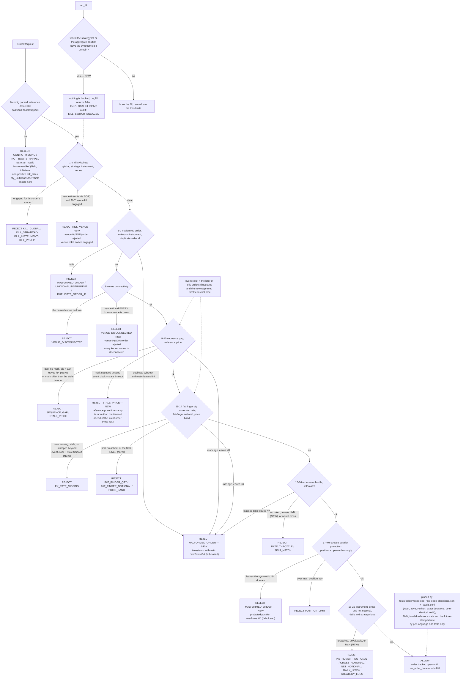
```mermaid
flowchart TD
    %% Hard risk engine, v1.3.0 (2026-10-03): where the fail-closed branches added by the
    %% review sit in the pinned check order (PLATFORM_CONVENTIONS.md 11.1). Every NEW branch
    %% reuses an existing rule id, so the check order and the main risk golden are unchanged.
    OR["OrderRequest"] --> C0{"0 config parsed, reference data valid,<br/>positions bootstrapped?"}
    C0 -- no --> R0["REJECT CONFIG_MISSING / NOT_BOOTSTRAPPED<br/>NEW: an invalid InstrumentRef (NaN, infinite or<br/>non-positive tick_size / qty_unit) lands the whole engine here"]
    C0 -- yes --> C4{"1-4 kill switches:<br/>global, strategy, instrument, venue"}
    C4 -->|"engaged for this order's scope"| R4["REJECT KILL_GLOBAL / KILL_STRATEGY /<br/>KILL_INSTRUMENT / KILL_VENUE"]
    C4 -->|"venue 0 (route via SOR) and ANY venue kill engaged"| R4V["REJECT KILL_VENUE — NEW<br/>venue 0 (SOR) order rejected:<br/>venue N kill switch engaged"]
    C4 -->|"clear"| C7{"5-7 malformed order, unknown instrument,<br/>duplicate order id"}
    C7 -->|"fails"| R7["REJECT MALFORMED_ORDER / UNKNOWN_INSTRUMENT /<br/>DUPLICATE_ORDER_ID"]
    C7 -->|"duplicate-window arithmetic leaves i64"| RTS["REJECT MALFORMED_ORDER — NEW<br/>timestamp arithmetic overflows i64 (fail-closed)"]
    C7 -->|"ok"| C8{"8 venue connectivity"}
    C8 -->|"the named venue is down"| R8["REJECT VENUE_DISCONNECTED"]
    C8 -->|"venue 0 and EVERY known venue is down"| R8V["REJECT VENUE_DISCONNECTED — NEW<br/>venue 0 (SOR) order rejected:<br/>every known venue is disconnected"]
    C8 -->|"ok"| C10{"9-10 sequence gap, reference price"}
    C10 -->|"gap, no mark, bid + ask leaves i64 (NEW),<br/>or mark older than the stale timeout"| R10["REJECT SEQUENCE_GAP / STALE_PRICE"]
    C10 -->|"mark stamped beyond event clock + stale timeout"| R10F["REJECT STALE_PRICE — NEW<br/>reference price timestamp is more than the timeout<br/>ahead of the latest order event time"]
    C10 -->|"mark age leaves i64"| RTS
    C10 -->|"ok"| C12{"11-14 fat-finger qty, conversion rate,<br/>fat-finger notional, price band"}
    C12 -->|"rate missing, stale, or stamped beyond<br/>event clock + stale timeout (NEW)"| R12["REJECT FX_RATE_MISSING"]
    C12 -->|"rate age leaves i64"| RTS
    C12 -->|"limit breached, or the float is NaN (NEW)"| R13["REJECT FAT_FINGER_QTY / FAT_FINGER_NOTIONAL /<br/>PRICE_BAND"]
    C12 -->|"ok"| C15{"15-16 order-rate throttle, self-match"}
    C15 -->|"elapsed time leaves i64"| RTS
    C15 -->|"no token, tokens NaN (NEW), or would cross"| R15["REJECT RATE_THROTTLE / SELF_MATCH"]
    C15 -->|"ok"| C17{"17 worst-case position projection:<br/>position + open orders + qty"}
    C17 -->|"leaves the symmetric i64 domain"| R17O["REJECT MALFORMED_ORDER — NEW<br/>projected position overflows i64 (fail-closed)"]
    C17 -->|"over max_position_qty"| R17["REJECT POSITION_LIMIT"]
    C17 -->|"ok"| C22{"18-22 instrument, gross and net notional,<br/>daily and strategy loss"}
    C22 -->|"breached, unvaluable, or NaN (NEW)"| R22["REJECT INSTRUMENT_NOTIONAL / GROSS_NOTIONAL /<br/>NET_NOTIONAL / DAILY_LOSS / STRATEGY_LOSS"]
    C22 -->|"ok"| ALLOW["ALLOW<br/>order tracked open until on_order_done or a full fill"]
    FILL["on_fill"] --> FO{"would the strategy lot or the aggregate position<br/>leave the symmetric i64 domain?"}
    FO -->|"yes — NEW"| KG["nothing is booked, on_fill returns false,<br/>the GLOBAL kill latches<br/>audit: KILL_SWITCH_ENGAGED"]
    FO -->|"no"| BOOKED["book the fill, re-evaluate the loss limits"]
    KG -.-> C4
    CLK["event clock = the later of this order's timestamp<br/>and the newest primed throttle-bucket time"] -.-> C10
    CLK -.-> C12
    PIN["pinned by tests/golden/expected_risk_edge_decisions.json + _audit.jsonl<br/>(Rust, Java, Python: exact decisions, byte-identical audit);<br/>NaN, invalid reference data and the future-stamped rate<br/>by per-language rule tests only"] -.-> ALLOW
```

## 12. Execution simulator: one event, fills and queue state (v1.3.0)

The processing order of one market event (rule 9 of
`cpp/include/iap/execution/execution.hpp`) after the two liquidity-fabrication
fixes: queue tracking runs after the book update and only for an event the book
applied, and the crossing pool is displayed size minus what the overlay already
consumed. The dotted note at the bottom is what the code did before
(API_TRADING.md §2.4, LEARN.md §22).
Source: [`diagrams/simulator_fill_flow.mmd`](diagrams/simulator_fill_flow.mmd).

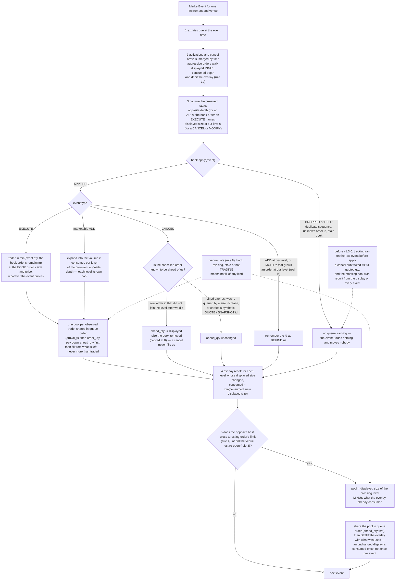
```mermaid
flowchart TD
    %% Execution simulator, one market event (rule 9 processing order after v1.3.0).
    %% C++ reference cpp/include/iap/execution/execution.hpp; Java and Python ports.
    EV["MarketEvent for one instrument and venue"] --> EXP["1 expiries due at the event time"]
    EXP --> ACT["2 activations and cancel arrivals, merged by time<br/>aggressive orders walk displayed MINUS consumed depth<br/>and debit the overlay (rule 3b)"]
    ACT --> PRE["3 capture the pre-event state:<br/>opposite depth (for an ADD), the book order an EXECUTE names,<br/>displayed size at our levels (for a CANCEL or MODIFY)"]
    PRE --> APPLY{"book.apply(event)"}
    APPLY -->|"DROPPED or HELD:<br/>duplicate sequence, unknown order id, stale book"| NOTRACK["no queue tracking —<br/>the event trades nothing and moves nobody"]
    APPLY -->|"APPLIED"| KIND{"event type"}
    KIND -->|"EXECUTE"| EXE["traded = min(event qty, the book order's remaining)<br/>at the BOOK order's side and price,<br/>whatever the event quotes"]
    KIND -->|"marketable ADD"| MADD["expand into the volume it consumes per level<br/>of the pre-event opposite depth — each level its own pool"]
    EXE --> POOL["one pool per observed trade, shared in queue order<br/>(arrival_ts, then order_id): pay down ahead_qty first,<br/>then fill from what is left — never more than traded"]
    MADD --> POOL
    KIND -->|"CANCEL"| CAN{"is the cancelled order<br/>known to be ahead of us?"}
    CAN -->|"real order id that did not join the level after we did"| ADV["ahead_qty -= displayed size the book removed<br/>(floored at 0) — a cancel never fills us"]
    CAN -->|"joined after us, was re-queued by a size increase,<br/>or carries a synthetic QUOTE / SNAPSHOT id"| STAY["ahead_qty unchanged"]
    KIND -->|"ADD at our level, or MODIFY that grows<br/>an order at our level (real id)"| BEH["remember the id as BEHIND us"]
    POOL --> OVR
    ADV --> OVR
    STAY --> OVR
    BEH --> OVR
    NOTRACK --> OVR["4 overlay reset: for each level whose displayed size changed,<br/>consumed = min(consumed, new displayed size)"]
    OVR --> CROSS{"5 does the opposite best cross a resting order's limit<br/>(rule 4), or did the venue just re-open (rule 8)?"}
    CROSS -- no --> DONE["next event"]
    CROSS -- yes --> CP["pool = displayed size of the crossing level<br/>MINUS what the overlay already consumed"]
    CP --> CF["share the pool in queue order (ahead_qty first),<br/>then DEBIT the overlay with what was used —<br/>an unchanged display is consumed once, not once per event"]
    CF --> DONE
    GATE["venue gate (rule 8): book missing, stale or not TRADING<br/>means no fill of any kind"] -.-> POOL
    GATE -.-> CP
    WAS["before v1.3.0: tracking ran on the raw event before apply,<br/>a cancel subtracted its full quoted qty,<br/>and the crossing pool was rebuilt from the display on every event"] -.-> NOTRACK
```

## 13. Paper platform: checkpoint commit point and resume (v1.3.0)

How the Java paper platform makes a checkpoint of two files atomic, and what
`--resume` does with whatever a crash left behind
(`com.iap.platform.SessionStore.commitCheckpoint` /
`readCommittedRiskSnapshot`; PLATFORM_CONVENTIONS.md §12.3, LEARN.md §25). The
last block is the stop path: the shutdown hook raises a flag and the trading
thread writes the checkpoint.
Source: [`diagrams/paper_checkpoint_commit.mmd`](diagrams/paper_checkpoint_commit.mmd).

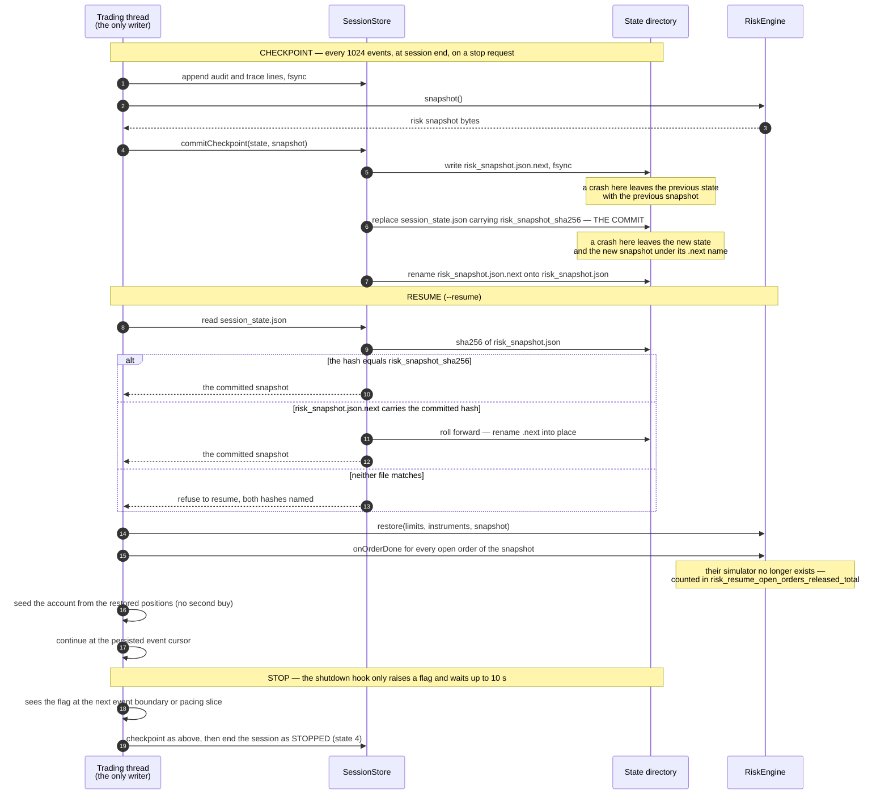
```mermaid
sequenceDiagram
    autonumber
    participant TT as Trading thread<br/>(the only writer)
    participant SS as SessionStore
    participant FS as State directory
    participant RK as RiskEngine

    Note over TT,FS: CHECKPOINT — every 1024 events, at session end, on a stop request
    TT->>SS: append audit and trace lines, fsync
    TT->>RK: snapshot()
    RK-->>TT: risk snapshot bytes
    TT->>SS: commitCheckpoint(state, snapshot)
    SS->>FS: write risk_snapshot.json.next, fsync
    Note over FS: a crash here leaves the previous state<br/>with the previous snapshot
    SS->>FS: replace session_state.json carrying risk_snapshot_sha256 — THE COMMIT
    Note over FS: a crash here leaves the new state<br/>and the new snapshot under its .next name
    SS->>FS: rename risk_snapshot.json.next onto risk_snapshot.json

    Note over TT,RK: RESUME (--resume)
    TT->>SS: read session_state.json
    SS->>FS: sha256 of risk_snapshot.json
    alt the hash equals risk_snapshot_sha256
        SS-->>TT: the committed snapshot
    else risk_snapshot.json.next carries the committed hash
        SS->>FS: roll forward — rename .next into place
        SS-->>TT: the committed snapshot
    else neither file matches
        SS-->>TT: refuse to resume, both hashes named
    end
    TT->>RK: restore(limits, instruments, snapshot)
    TT->>RK: onOrderDone for every open order of the snapshot
    Note over RK: their simulator no longer exists —<br/>counted in risk_resume_open_orders_released_total
    TT->>TT: seed the account from the restored positions (no second buy)
    TT->>TT: continue at the persisted event cursor

    Note over TT,FS: STOP — the shutdown hook only raises a flag and waits up to 10 s
    TT->>TT: sees the flag at the next event boundary or pacing slice
    TT->>SS: checkpoint as above, then end the session as STOPPED (state 4)
```

## 14. Admin kill switch: latch first, record second (v1.3.0)

The path of `POST /admin/kill` through `com.iap.platform.AdminService`. The
kill latches before the request waits for the trading thread, so the outcome of
the wait changes only the response code — `200` applied, or `202` latched — never
whether trading stops (PLATFORM_CONVENTIONS.md §12.5,
`docs/runbooks/RUNBOOK_incident_kill_switch.md` §2).
Source: [`diagrams/admin_kill_latch.mmd`](diagrams/admin_kill_latch.mmd).

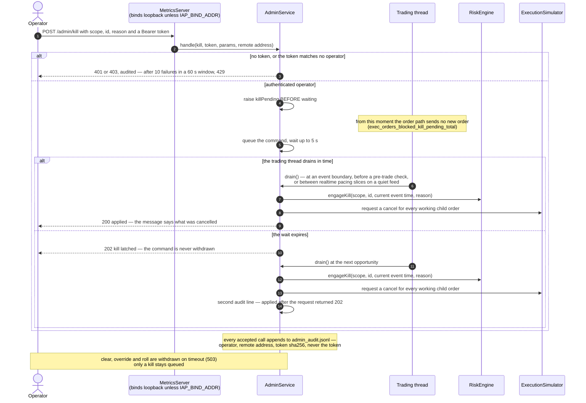
```mermaid
sequenceDiagram
    autonumber
    actor Op as Operator
    participant MX as MetricsServer<br/>(binds loopback unless IAP_BIND_ADDR)
    participant AD as AdminService
    participant TT as Trading thread
    participant RK as RiskEngine
    participant EX as ExecutionSimulator

    Op->>MX: POST /admin/kill with scope, id, reason and a Bearer token
    MX->>AD: handle(kill, token, params, remote address)
    alt no token, or the token matches no operator
        AD-->>Op: 401 or 403, audited — after 10 failures in a 60 s window, 429
    else authenticated operator
        AD->>AD: raise killPending BEFORE waiting
        Note over TT: from this moment the order path sends no new order<br/>(exec_orders_blocked_kill_pending_total)
        AD->>AD: queue the command, wait up to 5 s
        alt the trading thread drains in time
            TT->>AD: drain() — at an event boundary, before a pre-trade check,<br/>or between realtime pacing slices on a quiet feed
            AD->>RK: engageKill(scope, id, current event time, reason)
            AD->>EX: request a cancel for every working child order
            AD-->>Op: 200 applied — the message says what was cancelled
        else the wait expires
            AD-->>Op: 202 kill latched — the command is never withdrawn
            TT->>AD: drain() at the next opportunity
            AD->>RK: engageKill(scope, id, current event time, reason)
            AD->>EX: request a cancel for every working child order
            AD->>AD: second audit line — applied after the request returned 202
        end
    end
    Note over AD: every accepted call appends to admin_audit.jsonl —<br/>operator, remote address, token sha256, never the token
    Note over Op,AD: clear, override and roll are withdrawn on timeout (503)<br/>only a kill stays queued
```

## 15. A research run: ledger lock, staged directory, eligibility (v1.3.0; default methods since v1.5.0)

One `python -m iap.research run`, from the request to the persisted evidence:
where the ledger-derived threshold (the default since v1.5.0; `--methods
legacy_v1` selects the fixed 3.0, and the `--tstat-threshold` flag is gone)
is read, where the looks are
debited — a dry run included — how the experiment directory appears in one
rename, and where gate eligibility is decided (PLATFORM_CONVENTIONS.md §13.6,
docs/RESEARCH_VALIDITY.md §3–§4, LEARN.md §24).
Source: [`diagrams/research_run_sequence.mmd`](diagrams/research_run_sequence.mmd).

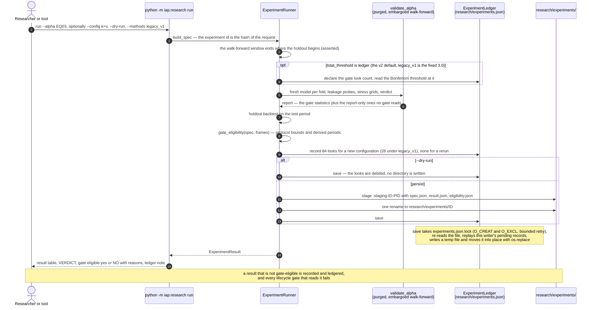
```mermaid
sequenceDiagram
    autonumber
    actor R as Researcher or tool
    participant CLI as python -m iap.research run
    participant RUN as ExperimentRunner
    participant VAL as validate_alpha<br/>(purged, embargoed walk-forward)
    participant LED as ExperimentLedger<br/>(research/experiments.json)
    participant FS as research/experiments/

    R->>CLI: run --alpha EQ03, optionally --config k=v, --dry-run, --methods legacy_v1
    CLI->>RUN: build_spec — the experiment id is the hash of the request
    RUN->>RUN: the walk-forward window ends where the holdout begins (asserted)
    opt tstat_threshold is ledger (the v2 default, legacy_v1 is the fixed 3.0)
        RUN->>LED: declare the gate look count, read the Bonferroni threshold at it
    end
    RUN->>VAL: fresh model per fold, leakage probes, stress grids, verdict
    VAL-->>RUN: report — the gate statistics plus the report-only ones no gate reads
    RUN->>RUN: holdout backtest on the test period
    RUN->>RUN: gate_eligibility(spec, frames) — protocol bounds and derived periods
    RUN->>LED: record 84 looks for a new configuration (28 under legacy_v1), none for a rerun
    alt --dry-run
        RUN->>LED: save — the looks are debited, no directory is written
    else persist
        RUN->>FS: stage .staging-ID-PID with spec.json, result.json, eligibility.json
        RUN->>FS: one rename to research/experiments/ID
        RUN->>LED: save
    end
    Note over LED: save takes experiments.json.lock (O_CREAT and O_EXCL, bounded retry),<br/>re-reads the file, replays this writer's pending records,<br/>writes a temp file and moves it into place with os.replace
    RUN-->>CLI: ExperimentResult
    CLI-->>R: result table, VERDICT, gate eligible yes or NO with reasons, ledger note
    Note over R,FS: a result that is not gate-eligible is recorded and ledgered,<br/>and every lifecycle gate that reads it fails
```

## 16. The planted-signal power study

`python -m iap.research power`: plant an effect of known size in the
generator, run the unmodified pipeline and validation chain on it, and count
how often each statistic flags it. Since v1.5.0 the chain runs under the
default method bundle, so the PROMOTE gate reads the pooled-slope t and the
backtest is cost-aware. The last node quotes the committed
three-seed report, `research/power/POWER_REPORT.md` (LEARN.md §23, COOKBOOK
recipe 27).
Source: [`diagrams/power_study_flow.mmd`](diagrams/power_study_flow.mmd).

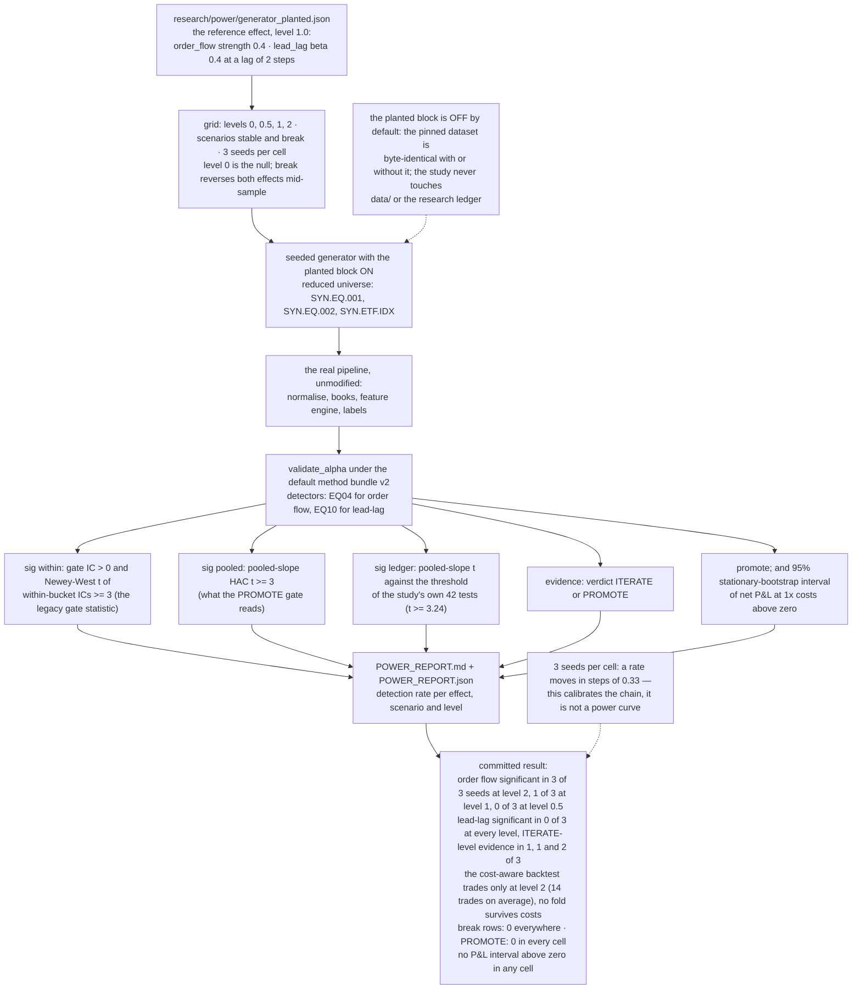
```mermaid
flowchart TD
    %% python -m iap.research power (iap.research.power) — research/power/POWER_REPORT.md.
    %% The figures in the last node are the committed three-seed report.
    CFG["research/power/generator_planted.json<br/>the reference effect, level 1.0:<br/>order_flow strength 0.4 · lead_lag beta 0.4 at a lag of 2 steps"] --> GRID["grid: levels 0, 0.5, 1, 2 · scenarios stable and break · 3 seeds per cell<br/>level 0 is the null; break reverses both effects mid-sample"]
    GRID --> GEN["seeded generator with the planted block ON<br/>reduced universe: SYN.EQ.001, SYN.EQ.002, SYN.ETF.IDX"]
    GEN --> PIPE["the real pipeline, unmodified:<br/>normalise, books, feature engine, labels"]
    PIPE --> VAL["validate_alpha under the default method bundle v2<br/>detectors: EQ04 for order flow, EQ10 for lead-lag"]
    VAL --> S1["sig within: gate IC > 0 and Newey-West t of<br/>within-bucket ICs >= 3 (the legacy gate statistic)"]
    VAL --> S2["sig pooled: pooled-slope HAC t >= 3<br/>(what the PROMOTE gate reads)"]
    VAL --> S3["sig ledger: pooled-slope t against the threshold<br/>of the study's own 42 tests (t >= 3.24)"]
    VAL --> S4["evidence: verdict ITERATE or PROMOTE"]
    VAL --> S5["promote; and 95% stationary-bootstrap interval<br/>of net P&L at 1x costs above zero"]
    S1 --> REP["POWER_REPORT.md + POWER_REPORT.json<br/>detection rate per effect, scenario and level"]
    S2 --> REP
    S3 --> REP
    S4 --> REP
    S5 --> REP
    REP --> READ["committed result:<br/>order flow significant in 3 of 3 seeds at level 2, 1 of 3 at level 1, 0 of 3 at level 0.5<br/>lead-lag significant in 0 of 3 at every level, ITERATE-level evidence in 1, 1 and 2 of 3<br/>the cost-aware backtest trades only at level 2 (14 trades on average), no fold survives costs<br/>break rows: 0 everywhere · PROMOTE: 0 in every cell<br/>no P&L interval above zero in any cell"]
    OFF["the planted block is OFF by default: the pinned dataset is<br/>byte-identical with or without it; the study never touches<br/>data/ or the research ledger"] -.-> GEN
    LIM["3 seeds per cell: a rate moves in steps of 0.33 —<br/>this calibrates the chain, it is not a power curve"] -.-> READ
```

## 17. CI and release pipeline

The three workflows and Dependabot as they stand at v1.5.0: which jobs gate
the image build, which steps are blocking (clippy and ruff are, since the
tree was made lint-clean; `pip-audit` and `cargo audit` report without
failing the run), and what the tag-triggered release does.
v1.4.0 added one job that runs only on a manual dispatch: `regenerate`
runs `tools/regenerate_dataset_artifacts.py` (the dataset and every
committed artefact derived from it) and uploads the changed files, so the
artefacts are produced in the environment that verifies them. It gates
nothing and commits nothing.
v1.5.0 replaced the release guard: `verify-ci` is now
`tests/harness/verify_ci_green.py`, which retries an API error instead of
reading it as "no successful run" (the v1.4.0 release failed on that once
although CI was green), polls a run in progress and stops on a failed or
missing run.
One box says what is not true yet: branch protection is not configured
(`docs/governance/REPO_SETTINGS.md`, LEARN.md §26).
Source: [`diagrams/ci_release_pipeline.mmd`](diagrams/ci_release_pipeline.mmd).

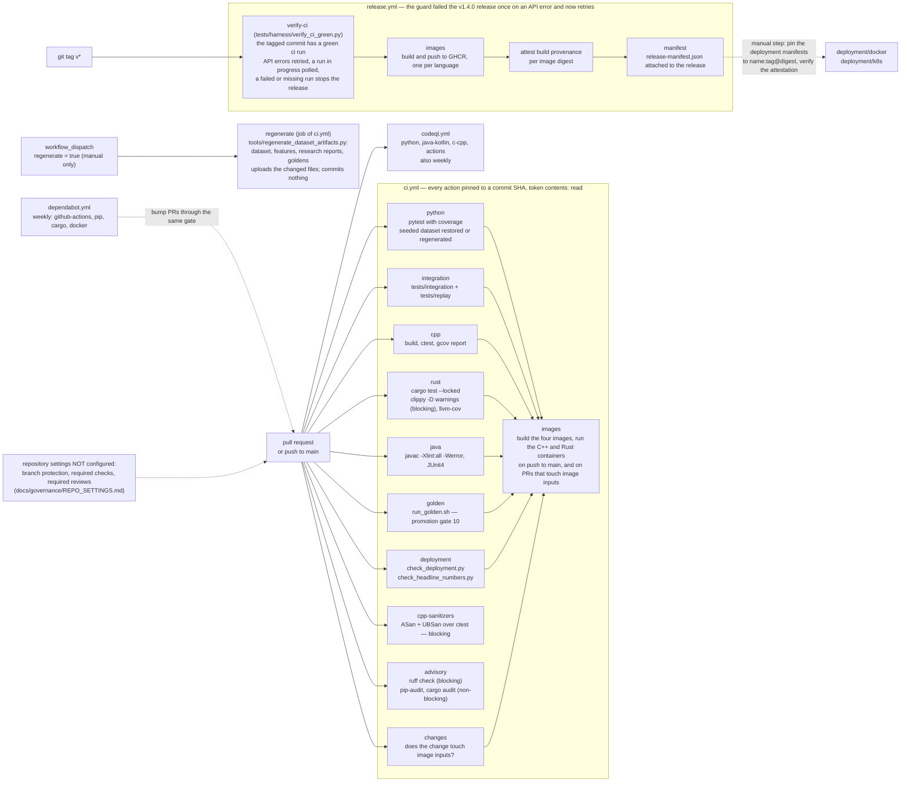
```mermaid
flowchart LR
    %% .github/workflows/{ci,codeql,release}.yml and dependabot.yml as of v1.5.0.
    PR["pull request<br/>or push to main"] --> PY
    PR --> INT
    PR --> CPP
    PR --> RS
    PR --> JV
    PR --> GOLD
    PR --> DEP
    PR --> ASAN
    PR --> ADV
    PR --> CHG
    subgraph CI["ci.yml — every action pinned to a commit SHA, token contents: read"]
        PY["python<br/>pytest with coverage<br/>seeded dataset restored or regenerated"]
        INT["integration<br/>tests/integration + tests/replay"]
        CPP["cpp<br/>build, ctest, gcov report"]
        RS["rust<br/>cargo test --locked<br/>clippy -D warnings (blocking), llvm-cov"]
        JV["java<br/>javac -Xlint:all -Werror, JUnit4"]
        GOLD["golden<br/>run_golden.sh — promotion gate 10"]
        DEP["deployment<br/>check_deployment.py<br/>check_headline_numbers.py"]
        ASAN["cpp-sanitizers<br/>ASan + UBSan over ctest — blocking"]
        ADV["advisory<br/>ruff check (blocking)<br/>pip-audit, cargo audit (non-blocking)"]
        CHG["changes<br/>does the change touch image inputs?"]
        IMG["images<br/>build the four images, run the C++ and Rust containers<br/>on push to main, and on PRs that touch image inputs"]
    end
    PY --> IMG
    INT --> IMG
    CPP --> IMG
    RS --> IMG
    JV --> IMG
    GOLD --> IMG
    DEP --> IMG
    CHG --> IMG
    DISP["workflow_dispatch<br/>regenerate = true (manual only)"] --> REGEN["regenerate (job of ci.yml)<br/>tools/regenerate_dataset_artifacts.py:<br/>dataset, features, research reports, goldens<br/>uploads the changed files; commits nothing"]
    PR --> CQL["codeql.yml<br/>python, java-kotlin, c-cpp, actions<br/>also weekly"]
    DB["dependabot.yml<br/>weekly: github-actions, pip, cargo, docker"] -.->|"bump PRs through the same gate"| PR
    TAG["git tag v*"] --> VER
    subgraph REL["release.yml — the guard failed the v1.4.0 release once on an API error and now retries"]
        VER["verify-ci (tests/harness/verify_ci_green.py)<br/>the tagged commit has a green ci run<br/>API errors retried, a run in progress polled,<br/>a failed or missing run stops the release"]
        BLD["images<br/>build and push to GHCR, one per language"]
        ATT["attest build provenance<br/>per image digest"]
        MAN["manifest<br/>release-manifest.json attached to the release"]
        VER --> BLD
        BLD --> ATT
        ATT --> MAN
    end
    MAN -.->|"manual step: pin the deployment manifests<br/>to name:tag@digest, verify the attestation"| DEPLOY["deployment/docker<br/>deployment/k8s"]
    NOTE["repository settings NOT configured:<br/>branch protection, required checks, required reviews<br/>(docs/governance/REPO_SETTINGS.md)"] -.-> PR
```

## 18. Deployment topology: NetworkPolicies and alert delivery (v1.3.0)

The Kubernetes deployment (`deployment/k8s/`): the workloads, the only flows
the NetworkPolicies allow, and the path of an alert. The webhook receiver is
outside the repository; with the placeholder URL alerts are routed and
delivered nowhere (PLATFORM_CONVENTIONS.md §12.7,
`deployment/grafana/README.md`).
Source: [`diagrams/deployment_topology.mmd`](diagrams/deployment_topology.mmd).

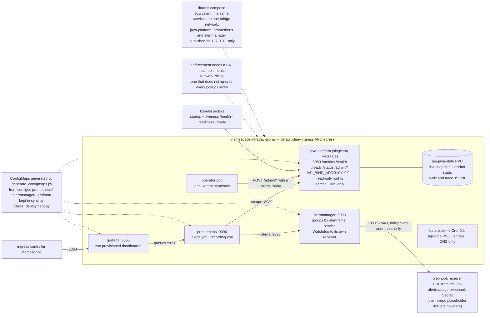
```mermaid
flowchart LR
    %% deployment/k8s as of v1.3.0: workloads, the flows the NetworkPolicies allow, alert delivery.
    subgraph NS["namespace intraday-alpha — default-deny ingress AND egress"]
        JP["java-platform (singleton, Recreate)<br/>:8080 /metrics /health /ready /status /admin/*<br/>IAP_BIND_ADDR=0.0.0.0 · read-only root fs<br/>egress: DNS only"]
        PVC[("iap-java-state PVC<br/>risk snapshot, session state,<br/>audit and trace JSONL")]
        PROM["prometheus :9090<br/>alerts.yml · recording.yml"]
        AM["alertmanager :9093<br/>groups by alertname, service<br/>Watchdog to its own receiver"]
        GRAF["grafana :3000<br/>two provisioned dashboards"]
        CRON["data-pipeline CronJob<br/>iap-data PVC · egress: DNS only"]
        OPP["operator pod<br/>label iap.role=operator"]
    end
    JP --- PVC
    PROM -->|"scrape :8080"| JP
    PROM -->|"alerts :9093"| AM
    GRAF -->|"queries :9090"| PROM
    OPP -->|"POST /admin/* with a token, :8080"| JP
    ING["ingress controller namespace"] -->|":3000"| GRAF
    AM -->|"HTTPS :443, non-private addresses only"| WH["webhook receiver<br/>URL from the iap-alertmanager-webhook Secret<br/>(the in-repo placeholder delivers nowhere)"]
    KUBELET["kubelet probes<br/>startup + liveness /health · readiness /ready"] --> JP
    CM["ConfigMaps generated by generate_configmaps.py<br/>from configs/, prometheus/, alertmanager/, grafana/<br/>kept in sync by check_deployment.py"] -.-> JP
    CM -.-> PROM
    CM -.-> AM
    CM -.-> GRAF
    CNI["enforcement needs a CNI that implements NetworkPolicy;<br/>one that does not ignores every policy silently"] -.-> NS
    COMPOSE["docker-compose equivalent: the same services on one bridge network,<br/>java-platform, prometheus and alertmanager published on 127.0.0.1 only"] -.-> NS
```

## 19. Planned agent layer — PLANNED, BACKLOG, no code exists

**This diagram describes a design, not the repository.** The upper subgraph
is what exists at v1.3.0 and is useful without any agent; the lower one is the
agent layer of backlog epics E24 and E30 ([EPICS.md](EPICS.md)), none of which
has been built. The boundary at the bottom is pinned today (ARCHITECTURE.md
§11, PLATFORM_CONVENTIONS.md §13.7): no LLM or agent on the trading path,
read-only, unable to override risk or send an order.
Source: [`diagrams/agent_layer_planned.mmd`](diagrams/agent_layer_planned.mmd).

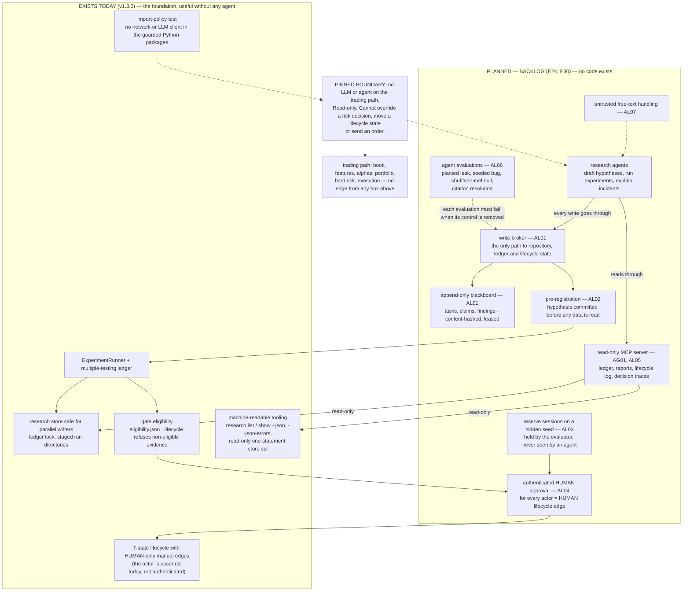
```mermaid
flowchart TD
    %% PLANNED — BACKLOG. Nothing inside the PLAN subgraph exists in this repository.
    %% Epics E24 and E30 of docs/EPICS.md; the boundary is ARCHITECTURE.md 11 and
    %% PLATFORM_CONVENTIONS.md 13.7.
    subgraph TODAY["EXISTS TODAY (v1.3.0) — the foundation, useful without any agent"]
        STORE["research store safe for parallel writers<br/>ledger lock, staged run directories"]
        ELIG["gate eligibility<br/>eligibility.json · lifecycle refuses non-eligible evidence"]
        POL["import-policy test<br/>no network or LLM client in the guarded Python packages"]
        CLIJ["machine-readable tooling<br/>research list / show --json, --json-errors,<br/>read-only one-statement store sql"]
        RUNNER["ExperimentRunner + multiple-testing ledger"]
        LIFE["7-state lifecycle with HUMAN-only manual edges<br/>(the actor is asserted today, not authenticated)"]
    end
    subgraph PLAN["PLANNED — BACKLOG (E24, E30) — no code exists"]
        AG["research agents<br/>draft hypotheses, run experiments, explain incidents"]
        MCP["read-only MCP server — AG01, AL05<br/>ledger, reports, lifecycle log, decision traces"]
        BRK["write broker — AL01<br/>the only path to repository, ledger and lifecycle state"]
        BB["append-only blackboard — AL01<br/>tasks, claims, findings · content-hashed, leased"]
        PRE["pre-registration — AL02<br/>hypothesis committed before any data is read"]
        RES["reserve sessions on a hidden seed — AL03<br/>held by the evaluator, never seen by an agent"]
        HUM["authenticated HUMAN approval — AL04<br/>for every actor = HUMAN lifecycle edge"]
        EVL["agent evaluations — AL06<br/>planted leak, seeded bug, shuffled-label null,<br/>citation resolution"]
        TXT["untrusted free-text handling — AL07"]
    end
    AG -->|"reads through"| MCP
    MCP -->|"read-only"| STORE
    MCP -->|"read-only"| CLIJ
    AG -->|"every write goes through"| BRK
    BRK --> BB
    BRK --> PRE
    PRE --> RUNNER
    RUNNER --> STORE
    RUNNER --> ELIG
    ELIG --> HUM
    RES --> HUM
    HUM --> LIFE
    EVL -.->|"each evaluation must fail when its control is removed"| BRK
    TXT -.-> AG
    POL -.-> WALL
    WALL["PINNED BOUNDARY: no LLM or agent on the trading path.<br/>Read-only. Cannot override a risk decision, move a lifecycle state<br/>or send an order."] -.-> AG
    WALL -.-> TRADE["trading path: book, features, alphas, portfolio,<br/>hard risk, execution — no edge from any box above"]
```

## 20. Where to go deeper

| topic | document |
|---|---|
| Full architecture narrative, per-language engineering notes | [ARCHITECTURE.md](ARCHITECTURE.md) |
| Governing institutional specification (verbatim) | [SPECIFICATION.md](SPECIFICATION.md) |
| Teaching walkthrough of every subsystem | [../LEARN.md](../LEARN.md) |
| How the quant, algo and AI sides work, top-down | [HOW_IT_WORKS.md](HOW_IT_WORKS.md) |
| 37 runnable recipes | [../COOKBOOK.md](../COOKBOOK.md) |
| Data model, views, SQLite/PostgreSQL portability, query cookbook | [DATA_MODEL.md](DATA_MODEL.md) |
| The 7-state promotion lifecycle: gates, evidence, registry, bootstrap result | [LIFECYCLE.md](LIFECYCLE.md) |
| The decision trace: record, ids, canonical JSON, digest, sinks, replay | [DECISION_TRACE.md](DECISION_TRACE.md) |
| The executable MVP and its honest golden run | [MVP.md](MVP.md) |
| Typed contracts, Protocols, schema index, validation | [../API_CONTRACTS.md](../API_CONTRACTS.md) |
| Python risk / execution reference ports and their golden parity | [../API_TRADING.md](../API_TRADING.md) |
| Roadmap: what exists, with evidence; what is backlog | [ROADMAP.md](ROADMAP.md) |
| The research methods (defaults since v1.5.0, with their legacy rules), the safe research store, gate eligibility | [RESEARCH_VALIDITY.md](RESEARCH_VALIDITY.md) |
| Release notes | [../CHANGELOG.md](../CHANGELOG.md) |
| Six research papers from the platform's own numbers | [papers/INDEX.md](papers/INDEX.md) |
| Benchmark methodology + results | [../benchmarks/RESULTS.md](../benchmarks/RESULTS.md) |
